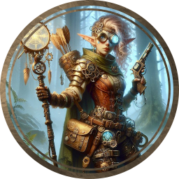
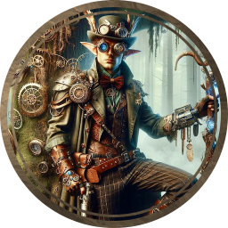
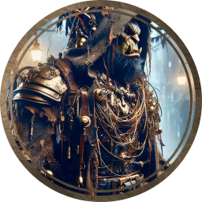
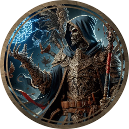
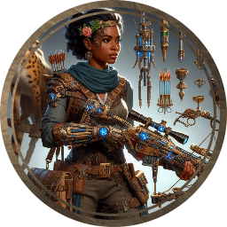
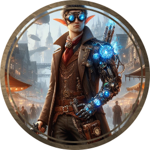
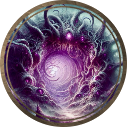
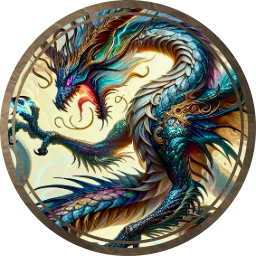
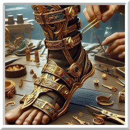
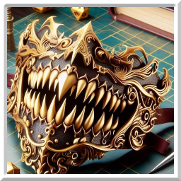

# Nora

Nora is intended to be used as a 5e Ebberon module for dnd. 

This content is independently created and is not affiliated with, nor has it been authorized, sponsored, or otherwise approved by Wizards of the Coast.

>   **Arcane** is a subgenre of fantasy that combines elements of science fiction, magic, and industrialization. It is characterized by its blend of advanced technology and magical abilities, often set in a world where magic is a normal part of everyday life. The term “Arcane” is derived from the words “arcane” and “punk,” and it is often used to describe a world where magic and technology coexist and influence each other.

# Rules

## Challenge Rating

| CR   | Experience | Profficency |
| ---- | ---------- | ----------- |
| 0    | 0 or 10    | +2          |
| 1/8  | 25         | +2          |
| 1/4  | 50         | +2          |
| 1/2  | 100        | +2          |
| 1    | 200        | +2          |
| 2    | 450        | +2          |
| 3    | 700        | +2          |
| 4    | 1,100      | +2          |
| 5    | 1,800      | +3          |
| 6    | 2,300      | +3          |
| 7    | 2,900      | +3          |
| 8    | 3,900      | +3          |
| 9    | 5,00       | +4          |
| 10   | 5,900      | +4          |
| 11   | 7,200      | +4          |
| 12   | 8,400      | +4          |
| 13   | 10,000     | +5          |
| 14   | 11,500     | +5          |
| 15   | 13,000     | +5          |
| 16   | 15,000     | +5          |
| 17   | 18,000     | +6          |
| 18   | 20,000     | +6          |
| 19   | 22,000     | +6          |
| 20   | 25,000     | +6          |
| 21   | 33,000     | +7          |
| 22   | 41,000     | +7          |
| 23   | 50,000     | +7          |
| 24   | 62,000     | +7          |
| 25   | 75,000     | +8          |
| 26   | 90,000     | +8          |
| 27   | 105,000    | +8          |
| 28   | 120,000    | +8          |
| 29   | 135,000    | +9          |
| 30   | 155,000    | +9          |

## Conditions

### Blinded

-   A blinded creature can’t see and automatically fails any [ability check](https://roll20.net/compendium/dnd5e/Rules:Ability Scores?expansion=0#toc_4) that requires sight.
-   [Attack rolls](https://roll20.net/compendium/dnd5e/Rules:Combat?expansion=0#toc_32) against the creature have [advantage](https://roll20.net/compendium/dnd5e/Rules:Ability Scores?expansion=0#toc_2), and the creature’s attack rolls have [disadvantage](https://roll20.net/compendium/dnd5e/Rules:Ability Scores?expansion=0#toc_2).

### Charmed

-   A charmed creature can’t [attack](https://roll20.net/compendium/dnd5e/Rules:Combat?expansion=0#toc_21) the charmer or target the charmer with harmful abilities or magical effects.
-   The charmer has [advantage](https://roll20.net/compendium/dnd5e/Rules:Ability Scores?expansion=0#toc_2) on any [ability check](https://roll20.net/compendium/dnd5e/Rules:Ability Scores?expansion=0#toc_4) to interact socially with the creature.

### Deafened

-   A deafened creature can’t hear and automatically fails any [ability check](https://roll20.net/compendium/dnd5e/Rules:Ability Scores?expansion=0#toc_4) that requires hearing.

### Frightened

-   A frightened creature has [disadvantage](https://roll20.net/compendium/dnd5e/Rules:Ability Scores?expansion=0#toc_2) on [ability checks](https://roll20.net/compendium/dnd5e/Rules:Ability Scores?expansion=0#toc_4) and [attack rolls](https://roll20.net/compendium/dnd5e/Rules:Combat?expansion=0#toc_32) while the source of its fear is within line of sight.
-   The creature can’t willingly [move](https://roll20.net/compendium/dnd5e/Rules:Combat?expansion=0#toc_9) closer to the source of its fear.

### Grappled

-   A grappled creature’s [speed](https://roll20.net/compendium/dnd5e/Rules:Movement?expansion=0#toc_1) becomes 0, and it can’t benefit from any bonus to its speed.
-   The condition ends if the grappler is [incapacitated](https://roll20.net/compendium/dnd5e/Rules:Conditions?expansion=0#toc_6) (see the condition).
-   The condition also ends if an effect removes the grappled creature from the reach of the grappler or grappling effect, such as when a creature is hurled away by the *[thunderwave](https://roll20.net/compendium/dnd5e/Thunderwave?expansion=0#content)* spell.

### Incapacitated

-   An incapacitated creature can’t take [actions](https://roll20.net/compendium/dnd5e/Rules:Combat?expansion=0#toc_20) or [reactions](https://roll20.net/compendium/dnd5e/Rules:Combat?expansion=0#toc_8).

### Invisible

-   An invisible creature is impossible to see without the aid of magic or a special sense. For the purpose of [hiding](https://roll20.net/compendium/dnd5e/Ability Scores?expansion=0#toc_22), the creature is heavily obscured. The creature’s location can be detected by any noise it makes or any tracks it leaves.
-   [Attack rolls](https://roll20.net/compendium/dnd5e/Rules:Combat?expansion=0#toc_32) against the creature have [disadvantage](https://roll20.net/compendium/dnd5e/Rules:Ability Scores?expansion=0#toc_2), and the creature’s attack rolls have [advantage](https://roll20.net/compendium/dnd5e/Rules:Ability Scores?expansion=0#toc_2).

### Paralyzed

-   A paralyzed creature is [incapacitated](https://roll20.net/compendium/dnd5e/Rules:Conditions?expansion=0#toc_6) (see the condition) and can’t move or speak.
-   The creature automatically fails [Strength](https://roll20.net/compendium/dnd5e/Rules:Ability Scores?expansion=0#toc_12) and [Dexterity](https://roll20.net/compendium/dnd5e/Rules:Ability Scores?expansion=0#toc_17) [saving throws](https://roll20.net/compendium/dnd5e/Rules:Ability Scores?expansion=0#toc_35).
-   [Attack rolls](https://roll20.net/compendium/dnd5e/Rules:Combat?expansion=0#toc_32) against the creature have [advantage](https://roll20.net/compendium/dnd5e/Rules:Ability Scores?expansion=0#toc_2).
-   Any [attack](https://roll20.net/compendium/dnd5e/Rules:Combat?expansion=0#toc_21) that hits the creature is a [critical hit](https://roll20.net/compendium/dnd5e/Rules:Combat?expansion=0#toc_49) if the attacker is within 5 feet of the creature.

### Petrified

-   A petrified creature is transformed, along with any nonmagical object it is wearing or carrying, into a solid inanimate substance (usually stone). Its weight increases by a factor of ten, and it ceases aging.
-   The creature is [incapacitated](https://roll20.net/compendium/dnd5e/Rules:Conditions?expansion=0#toc_6) (see the condition), can’t move or speak, and is unaware of its surroundings.
-   [Attack rolls](https://roll20.net/compendium/dnd5e/Rules:Combat?expansion=0#toc_32) against the creature have [advantage](https://roll20.net/compendium/dnd5e/Rules:Ability Scores?expansion=0#toc_2).
-   The creature automatically fails [Strength](https://roll20.net/compendium/dnd5e/Rules:Ability Scores?expansion=0#toc_12) and [Dexterity](https://roll20.net/compendium/dnd5e/Rules:Ability Scores?expansion=0#toc_17) [saving throws](https://roll20.net/compendium/dnd5e/Rules:Ability Scores?expansion=0#toc_35).
-   The creature has [resistance](https://roll20.net/compendium/dnd5e/Rules:Combat?expansion=0#toc_51) to all [damage](https://roll20.net/compendium/dnd5e/Rules:Combat?expansion=0#toc_46).
-   The creature is immune to [poison](https://roll20.net/compendium/dnd5e/Rules:Poisons?expansion=0#content) and [disease](https://roll20.net/compendium/dnd5e/Rules:Diseases?expansion=0#content), although a poison or disease already in its system is suspended, not neutralized.

### Poisoned

-   A poisoned creature has [disadvantage](https://roll20.net/compendium/dnd5e/Rules:Ability Scores?expansion=0#toc_2) on [attack rolls](https://roll20.net/compendium/dnd5e/Rules:Combat?expansion=0#toc_32) and [ability checks](https://roll20.net/compendium/dnd5e/Rules:Ability Scores?expansion=0#toc_4).

### Prone

-   A prone creature’s only [movement](https://roll20.net/compendium/dnd5e/Rules:Movement?expansion=0#content) option is to [crawl](https://roll20.net/compendium/dnd5e/Rules:Movement?expansion=0#toc_5), unless it stands up and thereby ends the condition.
-   The creature has [disadvantage](https://roll20.net/compendium/dnd5e/Rules:Ability Scores?expansion=0#toc_2) on [attack rolls](https://roll20.net/compendium/dnd5e/Rules:Combat?expansion=0#toc_32).
-   An [attack roll](https://roll20.net/compendium/dnd5e/Rules:Combat?expansion=0#toc_32) against the creature has [advantage](https://roll20.net/compendium/dnd5e/Rules:Ability Scores?expansion=0#toc_2) if the attacker is within 5 feet of the creature. Otherwise, the attack roll has [disadvantage](https://roll20.net/compendium/dnd5e/Rules:Ability Scores?expansion=0#toc_2).

### Restrained

-   A restrained creature’s [speed](https://roll20.net/compendium/dnd5e/Rules:Movement?expansion=0#toc_1) becomes 0, and it can’t benefit from any bonus to its speed.
-   [Attack rolls](https://roll20.net/compendium/dnd5e/Rules:Combat?expansion=0#toc_32) against the creature have [advantage](https://roll20.net/compendium/dnd5e/Rules:Ability Scores?expansion=0#toc_2), and the creature’s attack rolls have [disadvantage](https://roll20.net/compendium/dnd5e/Rules:Ability Scores?expansion=0#toc_2).
-   The creature has [disadvantage](https://roll20.net/compendium/dnd5e/Rules:Ability Scores?expansion=0#toc_2) on [Dexterity](https://roll20.net/compendium/dnd5e/Rules:Ability Scores?expansion=0#toc_17) [saving throws](https://roll20.net/compendium/dnd5e/Rules:Ability Scores?expansion=0#toc_35).

### Stunned

-   A stunned creature is [incapacitated](https://roll20.net/compendium/dnd5e/Rules:Conditions?expansion=0#toc_6) (see the condition), can’t [move](https://roll20.net/compendium/dnd5e/Rules:Combat?expansion=0#toc_9), and can speak only falteringly.
-   The creature automatically fails [Strength](https://roll20.net/compendium/dnd5e/Rules:Ability Scores?expansion=0#toc_12) and [Dexterity](https://roll20.net/compendium/dnd5e/Rules:Ability Scores?expansion=0#toc_17) [saving throws](https://roll20.net/compendium/dnd5e/Rules:Ability Scores?expansion=0#toc_35).
-   [Attack rolls](https://roll20.net/compendium/dnd5e/Rules:Combat?expansion=0#toc_32) against the creature have [advantage](https://roll20.net/compendium/dnd5e/Rules:Ability Scores?expansion=0#toc_2).

### Unconscious

-   An unconscious creature is [incapacitated](https://roll20.net/compendium/dnd5e/Rules:Conditions?expansion=0#toc_6) (see the condition), can’t [move](https://roll20.net/compendium/dnd5e/Rules:Combat?expansion=0#toc_9) or speak, and is unaware of its surroundings
-   The creature drops whatever it’s holding and falls [prone](https://roll20.net/compendium/dnd5e/Rules:Conditions?expansion=0#toc_11).
-   The creature automatically fails [Strength](https://roll20.net/compendium/dnd5e/Rules:Ability Scores?expansion=0#toc_12) and [Dexterity](https://roll20.net/compendium/dnd5e/Rules:Ability Scores?expansion=0#toc_17) [saving throws](https://roll20.net/compendium/dnd5e/Rules:Ability Scores?expansion=0#toc_35).
-   [Attack rolls](https://roll20.net/compendium/dnd5e/Rules:Combat?expansion=0#toc_32) against the creature have [advantage](https://roll20.net/compendium/dnd5e/Rules:Ability Scores?expansion=0#toc_2).
-   Any [attack](https://roll20.net/compendium/dnd5e/Rules:Combat?expansion=0#toc_21) that hits the creature is a [critical hit](https://roll20.net/compendium/dnd5e/Rules:Combat?expansion=0#toc_49) if the attacker is within 5 feet of the creature.

### Exhaustion

Some special abilities and environmental hazards, such as starvation and the long-­term effects of freezing or scorching temperatures, can lead to a special condition called exhaustion. Exhaustion is measured in six levels. An effect can give a creature one or more levels of exhaustion, as specified in the effect’s description.

| Level | Effect                                                       |
| :---- | :----------------------------------------------------------- |
| 1     | [Disadvantage](https://roll20.net/compendium/dnd5e/Rules:Ability Scores?expansion=0#toc_2) on [ability checks](https://roll20.net/compendium/dnd5e/Rules:Ability Scores?expansion=0#toc_4) |
| 2     | [Speed](https://roll20.net/compendium/dnd5e/Rules:Movement?expansion=0#toc_1) halved |
| 3     | [Disadvantage](https://roll20.net/compendium/dnd5e/Rules:Ability Scores?expansion=0#toc_2) on [attack rolls](https://roll20.net/compendium/dnd5e/Rules:Combat?expansion=0#toc_32) and [saving throws](https://roll20.net/compendium/dnd5e/Rules:Ability Scores?expansion=0#toc_35) |
| 4     | [Hit point](https://roll20.net/compendium/dnd5e/Rules:Combat?expansion=0#toc_47) maximum halved |
| 5     | [Speed](https://roll20.net/compendium/dnd5e/Rules:Movement?expansion=0#toc_1) reduced to 0 |
| 6     | Death                                                        |

## Difficulty Class

| Difficulty        | DC   |
| ----------------- | ---- |
| Very Easy         | 5    |
| Easy              | 10   |
| Moderate          | 15   |
| Hard              | 20   |
| Very Hard         | 25   |
| Nearly Impossible | 30   |

# Background

## **Aether-Touched Tinkerer**

You were once an ordinary artisan until a brush with raw aetheric energy left its mark on you. Now, you find that machines respond to your touch as if alive, and your crafted creations are sought after by all manner of arcanists and adventurers.

*Skill Proficiencies:* Arcana, Investigation
*Tool Proficiencies:* Tinker's tools, one type of artisan's tools of your choice
*Languages:* One of your choice
*Equipment:* Tinker's tools, a set of artisan's tools, aether-touched goggles, a piece of aetheric machinery, a set of common clothes, and a belt pouch containing 15 gp

*Feature: Aetheric Intuition*
You have an innate sense for aetheric currents and machinery. When you encounter a piece of Arcane technology, you can often deduce its purpose and method of operation with a few moments of study.

## **Rune-Scribed Scholar**

Your thirst for knowledge led you to the ancient libraries of the rune-scribed, where you learned to read the magical runes that predate modern Arcane technology. You are a bridge between the old magics and the new, deciphering the secrets of the past for the future's benefit.

*Skill Proficiencies:* History, Arcana
*Tool Proficiencies:* Calligrapher's supplies
*Languages:* Two of your choice
*Equipment:* Calligrapher's supplies, ink, a quill, parchment, a small book of runes, a set of scholar's clothes, and a purse containing 10 gp

*Feature: Rune Lore*
You have extensive knowledge of ancient runes and their applications. You can identify and interpret magical runes and symbols that others might overlook, and you have advantage on Intelligence (History) checks related to magical traditions and lore.

# Equipment

## **Arcanist's Expeditionary Pack**

*This pack is designed for the wandering mage or tinkerer who explores the fringes of the Arcane world, where the wilds meet the whirring of gears and the hum of arcane energy.*

**Includes:**

- Aetheric Bedroll: A bedroll that can float a few inches off the ground, providing comfort and protection from damp terrain.
- Magitech Lantern: A lantern with an everlasting glow, powered by a small arcane crystal.
- Tinker's Tools: Essential for any Arcane setting, these tools allow for on-the-go repairs and modifications.
- Arcane Compass: Points to the nearest significant source of magic, rather than magnetic north.
- Ether Flask: A flask that can hold any liquid, and when filled with water, it can be transmuted into a nourishing meal once per day.
- Rune-etched Map Case: A waterproof case that protects maps and scrolls, inscribed with runes to deter thieves.
- Spell Component Pouch: A pouch for storing various spell components, organized with magical efficiency.
- Gadget Belt: A belt with several pouches and hooks for carrying gadgets, potions, and small tools.
- Reinforced Gloves: Gloves that protect the hands and enhance dexterity when working with intricate machinery or casting spells.
- 50 feet of Enchanted Rope: Lighter and stronger than normal rope, it responds to verbal commands to coil or uncoil.

**Cost:** 60 gp

| Name                 | Damage        | Range     | Properties                                    | Weight | Cost   |
| -------------------- | ------------- | --------- | --------------------------------------------- | ------ | ------ |
| Arcane Pistol        | 1d10 piercing | 30/90 ft  | Reload (6 shots), light, arcane infusion      | 3 lb   | 250 gp |
| Ether Rifle          | 1d12 piercing | 80/240 ft | Reload (5 shots), two-handed, arcane infusion | 8 lb   | 500 gp |
| Mana Musket          | 1d8 piercing  | 40/120 ft | Reload (1 shot), two-handed, misfire (1)      | 10 lb  | 300 gp |
| Aetheric Blunderbuss | 2d8 piercing  | 15/45 ft  | Reload (1 shot), two-handed, scatter          | 12 lb  | 350 gp |
| Rune-Carved Shotgun  | 2d6 piercing  | 20/60 ft  | Reload (2 shots), two-handed, spread          | 11 lb  | 400 gp |
| Spellshot Revolver   | 1d10 piercing | 40/120 ft | Reload (6 shots), versatile (1d8)             | 4 lb   | 275 gp |

**Properties Explanation:**

-   **Arcane Infusion:** You can use a bonus action to expend a spell slot and infuse your next shot with arcane energy, adding an extra 1d6 force damage per level of the spell slot expended.
-   **Misfire:** If you roll a natural 1 on an attack roll with this weapon, it misfires. The weapon cannot be used again until you spend an action to clear the jam.
-   **Scatter:** This weapon can be fired normally or used to make a special scatter shot, attacking all creatures within a 15-foot cone. Each creature in the area must succeed on a Dexterity saving throw or take weapon damage.
-   **Spread:** When you hit a creature with this weapon, you can choose another creature within 5 feet of it to suffer half the damage dealt to the original target.

| Name               | Armor Class (AC)          | Weight | Properties                                     | Cost   |
| ------------------ | ------------------------- | ------ | ---------------------------------------------- | ------ |
| Aetherweave Robes  | 11 + Dex modifier         | 4 lb   | Light, aetheric resistance, spell channeling   | 150 gp |
| Magitech Mail      | 14 + Dex modifier (max 2) | 20 lb  | Medium, arcane rebound, energy storage         | 350 gp |
| Rune-Forged Plate  | 18                        | 65 lb  | Heavy, rune inscribed, elemental ward          | 750 gp |
| Etherion Harness   | 12 + Dex modifier         | 10 lb  | Light, gadget integration, aetheric adaptation | 200 gp |
| Steamwork Carapace | 17                        | 55 lb  | Heavy, steam powered, reinforced               | 600 gp |

-   **Aetheric Resistance:** You have resistance to one type of damage (chosen when the armor is created) from elemental or energy-based attacks.
-   **Spell Channeling:** Once per long rest, you can cast a spell with a casting time of 1 action as a bonus action instead.
-   **Arcane Rebound:** When hit by a spell attack, you can use your reaction to gain advantage on your next saving throw against a spell.
-   **Energy Storage:** The armor can store a spell of 1st or 2nd level, cast into it by a spellcaster. The spell uses the slot level, spell save DC, spell attack bonus, and spellcasting ability of the original caster, but is otherwise treated as if you cast the spell. The spell remains in the armor until it is cast or 7 days have passed.
-   **Rune Inscribed:** The armor is inscribed with protective runes. Once per long rest, you can activate the runes to gain advantage on saving throws against spells and magical effects for 1 minute.
-   **Elemental Ward:** Choose an element (fire, cold, lightning, etc.) when the armor is created. You have immunity to damage of the chosen type.
-   **Gadget Integration:** The armor has compartments and attachments for up to three gadgets or tools, which you can interact with as if they were held in your hand.
-   **Aetheric Adaptation:** You can breathe normally in any environment, and you have advantage on saving throws against harmful gases and vapors (such as cloudkill and stinking cloud effects, inhaled poisons, and breath weapons).
-   **Steam Powered:** Once per short rest, you can activate the armor’s steam propulsion system to gain a flying speed of 30 feet for 10 minutes.
-   **Reinforced:** When you would be knocked prone, you can use your reaction to not be knocked prone.

| Name                | Damage Type | Damage | Properties                           | Weight | Cost   |
| ------------------- | ----------- | ------ | ------------------------------------ | ------ | ------ |
| Arcane Edge Sword   | Slashing    | 1d8    | Versatile (1d10), arcane charge      | 3 lb   | 100 gp |
| Etheric Rapier      | Piercing    | 1d8    | Finesse, aether thrust               | 2 lb   | 120 gp |
| Steam Hammer        | Bludgeoning | 1d10   | Heavy, two-handed, steam impact      | 10 lb  | 150 gp |
| Runeblade           | Slashing    | 2d6    | Heavy, two-handed, rune activation   | 6 lb   | 200 gp |
| Mechanist's Mace    | Bludgeoning | 1d6    | Light, aetheric resonance            | 4 lb   | 80 gp  |
| Gearforged Gauntlet | Bludgeoning | 1d4    | Light, integrated weapon, gear grind | 1 lb   | 50 gp  |

-   **Arcane Charge:** Once per short rest, you can channel magical energy into the blade, causing your next hit to deal an additional 1d6 force damage.
-   **Aether Thrust:** When you score a critical hit with this weapon, you can release a burst of aetheric energy to deal an extra 1d8 force damage to the target.
-   **Steam Impact:** As an action, you can slam the hammer down to release a burst of steam. All creatures within 5 feet must make a Strength saving throw or be pushed 10 feet away and knocked prone.
-   **Rune Activation:** The blade is inscribed with runes. Once per long rest, you can activate these runes as a bonus action to add 1d4 fire, cold, or lightning damage (your choice) to your attacks for 1 minute.
-   **Aetheric Resonance:** When you hit a construct or a creature wearing heavy armor, the mace emits a resonant frequency that deals an extra 1d4 thunder damage.
-   **Integrated Weapon:** The gauntlet is a weapon you wear. While wearing it, you can’t be disarmed of the gauntlet, and you can use your bonus action to make an unarmed strike with the gear grind feature.
-   **Gear Grind:** On a hit with the gauntlet, you can choose to grind its gears into the target, dealing an additional 1d4 slashing damage.

## Items

### **Goggles of Nightseeing**

- These brass-framed goggles are fitted with dark lenses and intricate circuitry. While wearing them, you have darkvision out to a range of 60 feet. If you already have darkvision, wearing the goggles increases its range by 30 feet.
- **Cost:** 200 gp

### **Chrono Pocket Watch**

- This pocket watch keeps perfect time, even in other planes of existence. Once per day, you can use it to take the *Ready* action as a bonus action instead of an action.
- **Cost:** 150 gp

### **Arcanist's Wrench**

- This tool is essential for any spellcaster working with Arcane machinery. It can be used as a spellcasting focus, and when used to cast a spell that repairs or modifies an object, the spell is cast at one level higher without expending a higher-level spell slot.
- **Cost:** 100 gp

### **Etheric Resonator**

- A small device that emits a harmonic frequency. As an action, you can activate it to give yourself advantage on the next Arcana check you make before the end of your next turn.
- **Cost:** 75 gp

### **Mana Battery**

- This cylindrical device can store magical energy. It can hold up to 3 levels worth of spell slots, which can be expended to cast spells without using your own spell slots. The battery can be recharged during a long rest.
- **Cost:** 250 gp

### **Runic Flashbang**

- A small, rune-inscribed orb that can be thrown up to 60 feet. When it lands, it explodes in a burst of light and sound. Each creature within 20 feet of the orb must succeed on a DC 15 Constitution saving throw or be blinded and deafened for 1 minute.
- **Cost:** 50 gp each

### **Vocal Modulator**

- A small, throat-attached device that can modulate your voice. As an action, you can use it to cast the *Disguise Self* spell at will, but only to change your voice.
- **Cost:** 120 gp

### **Mechanical Familiar Kit**

- This kit contains the parts necessary to assemble a small mechanical creature that acts as a familiar. It follows the same rules as the *Find Familiar* spell, but the familiar is a construct and has immunity to poison and psychic damage.
- **Cost:** 300 gp

## Magical Keywords

**Aether-Tech:** Magic items and spells with this keyword interact with Arcane technology in unique ways, often enhancing or being enhanced by it.

**Rune-Circuitry:** Spells and abilities with this keyword can interface with runic designs and circuit patterns, allowing for complex magical effects.

**Mana-Fusion:** This keyword denotes the ability to blend different types of magical energy, resulting in unpredictable and powerful outcomes.

**Ether-Stream:** Associated with spells and items that manipulate the flow of aetheric energy, providing bonuses to spellcasting or energy redirection.

**Arcanodynamics:** Relates to the laws of motion and energy within an Arcane setting, spells with this keyword can alter or exploit these laws.

**Technomancy:** A keyword for spells and abilities that specifically affect machines and technological devices, either repairing, enhancing, or disabling them.

**Spellware:** Implies a magical effect that can be 'installed' into a creature or object, much like software, granting temporary or permanent abilities.

**Gadgetbind:** Spells with this keyword can be bound to gadgets or mechanical devices, enhancing their functionality or granting them new uses.

**Steamcraft:** Denotes abilities and enchantments that harness the power of steam, typical in Arcane settings, for various mechanical and magical effects.

**Electrocast:** A keyword for spells that use or generate electrical energy, which can be particularly potent in an Arcane world where electricity might be magical.

## Potions

### **Potion of Aetheric Vitality**

- When consumed, this potion allows the user to regain hit points as if they had spent a Hit Die, plus an additional 1d6 points of aetheric energy.
- **Cost:** 75 gp

### **Elixir of Mana-Fusion**

- Drinking this elixir grants the user advantage on saving throws against spells and magical effects for 1 hour, as their mana becomes fused with protective aether.
- **Cost:** 120 gp

### **Tincture of Ether-Stream**

- This tincture, when imbibed, grants the user a +10 bonus to their movement speed for 10 minutes as they ride the streams of ether.
- **Cost:** 50 gp

### **Vial of Arcanodynamics**

- Upon consumption, for the next minute, any spell the user casts that deals damage will deal an extra 1d4 force damage as they manipulate the arcanodynamics around them.
- **Cost:** 100 gp

### **Phial of Technomancy**

- This potion allows the user to cast the *mending* spell at will for 1 hour, targeting technological devices and constructs.
- **Cost:** 85 gp

### **Brew of Spellware**

- After drinking this brew, the user can 'install' a single spell of 3rd level or lower they know into an object or creature, allowing the spell to be activated later without the need for concentration.
- **Cost:** 150 gp

### **Draught of Gadgetbind**

- The user of this draught can bind up to three gadgets or mechanical devices to themselves for 8 hours, allowing them to use the gadgets as if they were natural extensions of their body.
- **Cost:** 65 gp

### **Steamcraft Solution**

- When this solution is applied to a steam-powered device, it doubles the efficiency and output of the device for 24 hours.
- **Cost:** 90 gp

### **Electrocast Serum**

- The serum electrifies the user's body, granting them resistance to lightning damage and allowing them to add 1d6 lightning damage to their melee attacks for 1 hour.
- **Cost:** 110 gp

## Foci

| Gem Name          | Image                                                        | Description                                                  | Value (GP) |
| ----------------- | ------------------------------------------------------------ | :----------------------------------------------------------- | ---------- |
| Aether Quartz     |  | A translucent gem that floats slightly above the ground. +1, 1 enhancement, or 1 keyword. | 100 gp     |
| Skyfire Opal      |  | A fiery opal that flickers with internal light, resembling a tiny sun. +2, 2 enhancements, or 2 keywords. | 250 gp     |
| Voidstone         |        | A dark gem that absorbs light, rumored to contain a piece of the night sky. +3, 3 enhancements, or 3 keywords. | 500 gp     |
| Arcanite Crystal  |  | A bright blue crystal that hums with magical energy. +4, 4 enhancements, or 4 keywords. | 750 gp     |
| Etherium Shard    |  | A rare gem that shifts colors, resonating with the weave of magic. +5, 5 enhancements, or 5 keywords. | 1,000 gp   |
| Chronolite Gem    |  | A gem that seems to make time around it flow differently. +6, 6 enhancements, or 6 keywords. | 2,000 gp   |
| Prismatic Diamond |  | A diamond that refracts light into spectacular colors. +7, 7 enhancements, or 7 keywords. | 5,000 gp   |
| Soulfire Emerald  |  | An emerald that glows with an inner flame, said to be powered by a trapped spirit. +8, 8 enhancements, or 8 keywords. | 10,000 gp  |

# Rewards

## Downtime Points (DTP)

Down Time Points (DTP) equate to 1 hour of down time.

You can earn DTP by winning combat encounters and looting chests. 

You can spend DTP on certain downtime activities or removing certain mobs from encounters: at the start of an encounter you can declare how much DTP you would like to spend, the DM then must remove enemies by CR according to the DTP spent (these enemies aren’t dead, just not there).

When removing enemies from an encounter a DM should start with the lowest CR and work up.

### Examples of downtime activities

**Crafting Items**: Spend time creating magical or mundane items. The cost varies based on the complexity and rarity of the item. For example:

#### Crafting 

*   A simple potion: 1 workweek (40 DTP)
*   Forging a masterwork sword: 3 workweeks (120 DTP)

#### Research and Study (learn a new spell):

*   Delve into ancient tomes, decipher cryptic runes, or study forbidden knowledge: 2 workweeks (80 DTP).

#### Work (turn time into money):

Take up a job or profession to earn income:

*   Laborer or factory worker: 1 workweek (40 DTP)

*   Skilled artisan or engineer: 2 workweeks (80 DTP)

#### Relaxing (remove a point of exaustion):

Rest, recuperate, and engage in leisure activities:

*   Visit a spa or bathhouse: 1 workweek (40 DTP) 
*   Attend a theater performance: 1 workweek (40 DTP)

#### Buying/Selling Magic Items (turn unique items into money):

Purchase magical items from merchants or black-market dealers:

*   Basic magic item shopping: 1 workweek (40 DTP)

*   Extensive search for rare items: 2 workweeks (80 DTP)

#### Pit Fighting (money based on marshal combat):

Participate in underground arena battles:

*   Single match: 1 workweek (40 DTP)

*   Tournament participation: 2 workweeks (80 DTP)

#### Crime (valuables based on non-combat skills):

Engage in illicit activities such as burglary, smuggling, or espionage:

*   Simple theft or sabotage: 1 workweek (40 DTP)

*   Complex heist or assassination: 2 workweeks (80 DTP)

*Additional downtime activities are dependent on character (A Cleric may volunteer at a chapel for example)*

## Experince Points (XP or EXP)

Experience, EXP or XP is a currency that can be collected, traded, given, or spent on various boons: 

**Level Advancement**: Use a significant amount of XP to gain an additional character level, enhancing your abilities and spells.

| **Class Level** | **XP**      | **Proficiency** |
| --------------- | ----------- | --------------- |
| **1**           | **-**       | **+2**          |
| **2**           | **300**     | **+2**          |
| **3**           | **900**     | **+2**          |
| **4**           | **2,700**   | **+2**          |
| **5**           | **6,500**   | **+3**          |
| **6**           | **14,000**  | **+3**          |
| **7**           | **23,000**  | **+3**          |
| **8**           | **34,000**  | **+3**          |
| **9**           | **48,000**  | **+4**          |
| **10**          | **64,000**  | **+4**          |
| **11**          | **85,000**  | **+4**          |
| **12**          | **100,000** | **+4**          |
| **13**          | **120,000** | **+5**          |
| **14**          | **140,000** | **+5**          |
| **15**          | **165,000** | **+5**          |
| **16**          | **195,000** | **+5**          |
| **17**          | **225,000** | **+6**          |
| **18**          | **265,000** | **+6**          |
| **19**          | **305,000** | **+6**          |
| **20**          | **355,000** | **+6**          |

### **Multiclassing**: 

To buy an additional class level you need to spend XP equal to the sum of your class levels. After level 20 a class level costs the same XP as level 20. 

*3rd bard, 5th artificer, 2nd wizard & 8th Ranger Is an 18th level character and requires the same XP as 19th level to buy another class level even though they only gain one level in the selected class.*

### **Prestige Classes**: 

The DM gets to decide if, when, and how to include prestige classes. 

### Temporary Boons

*Do not stack**: more than one copy of a single Temporary boon cannot be active simultaneously: e.g. you can take Arcane Overhaul and Arcane Overclocking but you cannot have Arcane Overhaul active multiple times.*

#### **Arcane Overhaul**:

 **500 XP** to reduce the Armor Class (AC) of all enemies by 1 for **an hour** as you disrupt their magical defenses.

#### **Arcane Overclocking**:

 **1,200 XP** to reduce the Armor Class (AC) of all enemies by 2 for **an hour** as you disrupt their magical defenses.

#### **Runic Infusion**:

 **800 XP** to inscribe a temporary rune on a weapon, granting it bonus damage for a limited number of attacks. 

Treats an attack as a critical hit.

*(can be the next or current attack, applied in advance or retroactively).*

#### **Mana Siphon**:

**100 XP** to replenish a first level spell slot 
*(Additional levels increase the cost by 100 XP, e.g. 2nd spell slot can be replenished for 200 XP)*

#### **Arcane Research**:

**400 XP** to gain temporary access to a spell outside your class’s spell list for **1 hour**.

*(e.g. The wizard casts Mass cure wounds)*

#### **Temporal Flux**:

**300 XP** rewind time by a few seconds during combat, allowing you a re-roll on any action *potentially* undoing a critical failure. You can also use this on an enemy to force them to re-roll—*potentially* turning a critical hit into a miss.

### Epic Boons - Permanent Enhancements 

*Do Not stack**: You cannot take the same epic boon multiple times.*

For every **30,000 XP** you can gain an epic boon as a permanent enhancement to your character.

#### **Boon of Combat Prowess**:

 When you miss with a melee weapon attack, you can choose to hit instead. Once you use this boon, you can’t use it again until you finish a short rest.

#### **Boon of Dimensional Travel**:

 As an action, you can cast the [misty step](https://www.dndbeyond.com/spells/misty-step) spell, without using a spell slot or any components. Once you do so, you can’t use this boon again until you finish a short rest.

#### **Boon of Fate**:

 When another creature that you can see within 60 feet of you makes an ability check, an attack roll, or a saving throw, you can roll a d10 and apply the result as a bonus or penalty to the roll. Once you use this boon, you can’t use it again until you finish a short rest.

#### **Boon of Fortitude**:

 Your hit point maximum increases by 40.

#### **Boon of High Magic**:

 You gain one 9th-level spell slot, provided that you already have one.

#### **Boon of Immortality**:

 You stop aging. You are immune to any effect that would age you, and you can’t die from old age.

#### **Boon of Invincibility**:

 When you take damage from any source, you can reduce that damage to 0. Once you use this boon, you can’t use it again until you finish a short rest.

#### **Boon of Irresistible Offense**:

 You can bypass the damage resistances of any creature.

#### **Boon of Luck**:

You can add a d10 roll to any ability check, attack roll, or saving throw you make. Once you use this boon, you can’t use it again until you finish a short rest.

#### **Boon of Magic Resistance**

You have advantage on saving throws against spells and other magical effects.

#### **Boon of Peerless Aim**:

 You can give yourself a +20 bonus to a ranged attack roll you make. Once you use this boon, you can’t use it again until you finish a short rest.

#### **Boon of Perfect Health**:

You are immune to all diseases and poisons, and you have advantage on Constitution saving throws.

#### **Boon of Planar Travel**:

 When you gain this boon, choose a plane of existence other than the Material Plane. You can now use an action to cast the [plane shift](https://www.dndbeyond.com/spells/plane-shift) spell (no spell slot or components required), targeting yourself only, and travel to the chosen plane, or from that plane back to the Material Plane. Once you use this boon, you can’t use it again until you finish a short rest.

#### **Boon of Quick Casting**:

 Choose one of your spells of 1st through 3rd level that has a casting time of 1 action. That spell’s casting time is now 1 bonus action for you.

#### **Boon of Recovery**:

 You can use a bonus action to regain a number of hit points equal to half your hit point maximum. Once you use this boon, you can’t use it again until you finish a long rest.

#### **Boon of Resilience**:

 You have resistance to bludgeoning, piercing, and slashing damage from nonmagical weapons.

#### **Boon of Skill Proficiency**:

You gain proficiency in all skills.

#### **Boon of Speed**:

 Your walking speed increases by 30 feet.

In addition, you can use a bonus action to take the [Dash](https://www.dndbeyond.com/compendium/rules/basic-rules/combat#Dash) or [Disengage](https://www.dndbeyond.com/compendium/rules/basic-rules/combat#Disengage) action. Once you do so, you can’t do so again until you finish a short rest.

#### **Boon of Spell Mastery**:

 Choose one 1st-level sorcerer, warlock, or wizard spell that you can cast. You can now cast that spell at its lowest level without expending a spell slot.

#### **Boon of Spell Recall**:

You can cast any spell you know or have prepared without expending a spell slot. Once you do so, you can’t use this boon again until you finish a long rest.

#### **Boon of the Fire Soul**:

You have immunity to fire damage. You can also cast [burning hands](https://www.dndbeyond.com/spells/burning-hands) (save DC 15) at will, without using a spell slot or any components.

#### **Boon of the Night Spirit**:

While completely in an area of dim light or darkness, you can become [invisible](https://www.dndbeyond.com/compendium/rules/basic-rules/appendix-a-conditions#Invisible) as an action. You remain [invisible](https://www.dndbeyond.com/compendium/rules/basic-rules/appendix-a-conditions#Invisible) until you take an action or a reaction.

#### **Boon of the Stormborn**:

 You have immunity to lightning and thunder damage. You can also cast [thunderwave](https://www.dndbeyond.com/spells/thunderwave) (save DC 15) at will, without using a spell slot or any components.

#### **Boon of the Unfettered**:

You have advantage on ability checks made to resist being [grappled](https://www.dndbeyond.com/compendium/rules/basic-rules/appendix-a-conditions#Grappled). In addition, you can use an action to automatically escape a grapple or free yourself of restraints of any kind.

#### Boon of Truesight

You have [truesight](https://www.dndbeyond.com/compendium/rules/basic-rules/monsters#Truesight) out to a range of 60 feet.

#### **Boon of Undetectability**: 

You gain a +10 bonus to Dexterity ([Stealth](https://www.dndbeyond.com/compendium/rules/basic-rules/using-ability-scores#Stealth)) checks, and you can’t be detected or targeted by divination magic, including scrying sensors.

## Gold Pieces (GP)

Gold is the money of the realm you're playing in. GP usually take the form of coins minted and stamped with the country's iconography. GP is usually interchangable so carrying coins from one country to another is often honored unless otherwise specified by the DM (if the DM wishes to make a country that does not honor other countries currecy the DM is free to do so).

Assume the weight of a GP is 1 dram or 1/16 oz (256 per lb)

## Suggested Reward Table

| CR   | DTP     | EXP     | GP         | Proficency |
| ---- | ------- | ------- | ---------- | ---------- |
| 1    | 1       | 200     | 30         | 2          |
| 2    | 2       | 450     | 50         | 2          |
| 3    | 3       | 700     | 80         | 2          |
| 4    | 5       | 1,100   | 200        | 2          |
| 5    | 8       | 1,800   | 300        | **3**      |
| 6    | 13      | 2,300   | 500        | 3          |
| 7    | 20      | 2,900   | 800        | 3          |
| 8    | 30      | 3,900   | 1,500      | 3          |
| 9    | 50      | 5,000   | 3,000      | **4**      |
| 10   | 80      | 5,900   | 5,000      | 4          |
| 11   | 120     | 7,200   | 10,000     | 4          |
| 12   | 180     | 8,400   | 20,000     | 4          |
| 13   | 300     | 10,000  | 30,000     | **5**      |
| 14   | 500     | 11,500  | **50,000** | 5          |
| 15   | **800** | 13,000  | 50,000     | 5          |
| 16   | 800     | 15,000  | 50,000     | 5          |
| 17   | 800     | 18,000  | 50,000     | **6**      |
| 18   | 800     | 20,000  | 50,000     | 6          |
| 19   | 800     | 22,000  | 50,000     | 6          |
| 20   | 800     | 25,000  | 50,000     | 6          |
| 21   | 800     | 33,000  | 50,000     | **7**      |
| 22   | 800     | 41,000  | 50,000     | 7          |
| 23   | 800     | 50,000  | 50,000     | 7          |
| 24   | 800     | 62,000  | 50,000     | 7          |
| 25   | 800     | 75,000  | 50,000     | **8**      |
| 26   | 800     | 90,000  | 50,000     | 8          |
| 27   | 800     | 105,000 | 50,000     | 8          |
| 28   | 800     | 120,000 | 50,000     | 8          |
| 29   | 800     | 135,000 | 50,000     | 9          |
| 30   | 800     | 155,000 | 50,000     | 9          |

*This reward table is merely a suggestion*

# Treasures

## Coins

Sometimes cois are organized, sometimes they are not. Coins are imediately spendable and are represented by their currency value.

| Image                                | Name                 |
| ------------------------------------ | -------------------- |
|      | Coin Purse (0-20 GP) |
|    | Coin Sack (20+ GP)   |
|  | Coin Roll (5-25)     |
|      | Coin Roll (26-100)   |
|    | Coin Roll (100+)     |

## Gems

Gems are precious stones sometimes used as material components or a way to turn wealth into a single lightweight item. Gems will usually be acompanied by its approximate value based on rarity, cut, and lumanance (e.g. a PC might come a cross a 500 GP ruby or 100 GP diamond). Finding a gem is much like finding a stack of gold and requires no effort to spend the value of the item.

| Image                                        | Name            |
| -------------------------------------------- | --------------- |
|  | Red Ruby        |
|          | Yellow Topaz    |
|          | Green Emerald   |
|          |                 |
|        | Blue Saphire    |
|          | Purple Amethyst |
|          | White Diamond   |

## Curiosities

Curisosites include anything that requires a vendor, appraiser, or tradesman. A painting or chess set might be worth 500 GP but the value is not imediately spendable. A transaction with an NPC is required to turn curiosities into coinage.

*   Art
*   Magic items
*   Metal ingots
*   Trade Goods
*   Etc.

# Spells

## **Etheric Overcharge**

*Level*: 3
*School*: Evocation
*Casting Time*: 1 action
*Range*: Self
*Components*: V, S, M (a piece of copper wire)
*Duration*: Concentration, up to 1 minute
*Description*: You channel raw etheric energy into your arcane machinery, supercharging it. For the duration, your spells that deal lightning or thunder damage deal an extra 1d8 damage of the same type.

## **Clockwork Camouflage**

*Level*: 2
*School*: Illusion
*Casting Time*: 1 bonus action
*Range*: Self
*Components*: V, S
*Duration*: 1 hour
*Description*: You blend into your surroundings by creating illusory gears and steam around you. For the duration, you have advantage on Dexterity (Stealth) checks and can move through mechanical terrain without being slowed.

## **Arcane Automaton**

*Level*: 4
*School*: Conjuration
*Casting Time*: 1 minute
*Range*: 30 feet
*Components*: V, S, M (a handful of gears and a drop of oil)
*Duration*: Concentration, up to 10 minutes
*Description*: You conjure a medium-sized automaton that follows your commands. It has AC 15, 40 hit points, and can perform simple tasks or attack with a slam dealing 1d8 + your spellcasting ability modifier bludgeoning damage.

# Feature

## **Aetheric Conduit**

*Prerequisite: The ability to cast at least one spell*
You have tapped into the aetheric energy that powers the Arcane world, allowing you to channel it to enhance your spells.

- Once per long rest, you can cast a spell at one slot level higher than the spell slot you expend without using a higher-level spell slot.
- You gain resistance to force damage.
- You learn the *Mage Hand* cantrip if you don't already know it. When you cast it, the spectral hand appears with steampunk mechanical aesthetics and can carry an additional 5 pounds.

## **Mechanomancer's Precision**

*Prerequisite: Proficiency with tinker's tools*
Your expertise with Arcane machinery allows you to create and manipulate devices with exceptional skill.

- You gain advantage on all checks made with tinker's tools.
- When you make an attack with a weapon you have personally modified with your tinker's tools, you can add your proficiency bonus to the damage roll.
- Once per short rest, you can spend 1 minute to repair a construct or mechanical object and restore a number of hit points equal to 5 times your level.

# Characters

Most characters listed below are traveling NPCs, they can be used by the DM as merchants, service people, or encounters. They exist to give the DM ideas. They are not required or the limit.

##  Grixle the Gearmaster

*Small humanoid (goblinoid), neutral evil*

---

**Armor Class** 15 (Leather Armor)
**Hit Points** 35 (10d6 + 0)
**Speed** 30 ft.

---

| STR    | DEX     | CON     | INT     | WIS     | CHA     |
| ------ | ------- | ------- | ------- | ------- | ------- |
| 8 (-1) | 14 (+2) | 10 (+0) | 17 (+3) | 12 (+1) | 10 (+0) |

---

**Skills** Stealth +6, Arcana +8, Investigation +8
**Senses** darkvision 60 ft., passive Perception 12
**Languages** Common, Goblin
**Challenge** 3 (700 XP)

---

### Traits

**Nimble Escape.** Grixle can take the Disengage or Hide action as a bonus action on each of his turns.

**Artificer Infusions.** Grixle has infused his gear with magical properties. He has enhanced defense and a returning weapon.

**Tinker.** Grixle can spend 1 hour and 10 gp worth of materials to construct a Tiny clockwork device (AC 5, 1 hp).

---

### Actions

**Multiattack.** Grixle makes two attacks with his wrench or throws two bombs.

**Wrench.** *Melee Weapon Attack:* +6 to hit, reach 5 ft., one target. *Hit:* 7 (1d6 + 4) bludgeoning damage.

**Bomb.** *Ranged Weapon Attack:* +6 to hit, range 20/60 ft., multiple targets (20-foot-radius). *Hit:* 7 (2d6) fire damage on failed save, or half as much damage on successful one.

##  Valen the Arcane Gunslinger

*Medium humanoid (any race), any alignment*

---

**Armor Class** 17 (Studded Leather, Bracers of Defense)
**Hit Points** 68 (8d8 + 32)
**Speed** 30 ft.

---

| STR     | DEX     | CON     | INT     | WIS     | CHA     |
| ------- | ------- | ------- | ------- | ------- | ------- |
| 12 (+1) | 18 (+4) | 18 (+4) | 14 (+2) | 12 (+1) | 16 (+3) |

---

**Skills** Arcana +6, Perception +5, Stealth +8
**Senses** passive Perception 15
**Languages** any two languages
**Challenge** 7 (2,900 XP)

---

### Traits

**Arcane Ammunition.** Valen's gun is enchanted to produce its own ammunition, firing blasts of arcane energy.

**Spellcasting.** Valen is a 5th-level spellcaster. His spellcasting ability is Intelligence (spell save DC 14, +6 to hit with spell attacks). Valen knows the following spells:

- Cantrips (at will): *mage hand*, *prestidigitation*, *ray of frost*
- 1st level (4 slots): *detect magic*, *magic missile*, *shield*
- 2nd level (3 slots): *mirror image*, *misty step*

**Gunsmith.** Valen has expertise with firearms and can perform repairs and modifications during short rests.

---

### Actions

**Multiattack.** Valen makes two attacks with his Arcane Gun or casts two cantrips.

**Arcane Gun.** *Ranged Weapon Attack:* +8 to hit, range 120 ft., one target. *Hit:* 14 (2d6 + 4) force damage.

**Staff Strike.** *Melee Weapon Attack:* +5 to hit, reach 5 ft., one target. *Hit:* 6 (1d6 + 1) bludgeoning damage, and Valen can cast a cantrip as part of the same action.

---

### Reactions

**Arcane Deflection.** When Valen is hit by an attack or fails a saving throw, he can use his reaction to gain a +2 bonus to AC or to the saving throw.

---

### Equipment

Valen carries an Arcane Gun, a staff with a reflective mirror, and wears studded leather armor with bracers of defense.

 to do: 

                      

# Creatures

## Aberrations

### **Luminous Maw**

*Large aberration, chaotic neutral*

---

**Armor Class** 17 (natural armor)
**Hit Points** 136 (13d10 + 65)
**Speed** 0 ft., fly 50 ft. (hover)

---

| STR     | DEX     | CON     | INT     | WIS     | CHA     |
| ------- | ------- | ------- | ------- | ------- | ------- |
| 18 (+4) | 15 (+2) | 20 (+5) | 17 (+3) | 14 (+2) | 18 (+4) |

---

**Damage Immunities** lightning, thunder
**Condition Immunities** blinded, deafened, prone
**Senses** blindsight 120 ft., passive Perception 12
**Languages** Deep Speech, telepathy 120 ft.
**Challenge** 10 (5,900 XP)

---

**Illuminating Presence.** The Luminous Maw sheds bright light in a 30-foot radius and dim light for an additional 30 feet. Creatures that start their turn in the bright light must succeed on a DC 15 Constitution saving throw or be blinded until the start of their next turn.

**Innate Spellcasting.** The Luminous Maw's innate spellcasting ability is Charisma (spell save DC 16). It can innately cast the following spells, requiring no material components:
At will: *light*, *mage hand*
3/day each: *chain lightning*, *counterspell*

---

**Actions**

* **Bite.** Melee Weapon Attack: +8 to hit, reach 5 ft., one target. Hit: 23 (3d10 + 7) piercing damage plus 14 (4d6) radiant damage.

* **Devour Light (Recharge 5-6).** The Luminous Maw absorbs all light in a 60-foot radius. The area is filled with magical darkness that normal light cannot illuminate. Creatures in the area when this darkness appears must make a DC 16 Dexterity saving throw, taking 27 (6d8) necrotic damage on a failed save, or half as much damage on a successful one.

---

**Reactions**

* **Dazzling Counter.** When a creature hits the Luminous Maw with an attack, it can use its reaction to emit a flash of light. The attacker must succeed on a DC 16 Dexterity saving throw or be blinded until the end of its next turn.

---

**Lore**
The Luminous Maw is a creature of the void, often found in the depths of space or in the darkest corners of the Underdark. It feeds on light and magic, often leaving areas it has visited shrouded in darkness.

### **Observer**

*Large aberration, neutral*

---

**Armor Class** 15 (natural armor)
**Hit Points** 114 (12d10 + 48)
**Speed** 0 ft., fly 50 ft. (hover)

---

| STR     | DEX     | CON     | INT     | WIS     | CHA     |
| ------- | ------- | ------- | ------- | ------- | ------- |
| 10 (+0) | 18 (+4) | 18 (+4) | 20 (+5) | 15 (+2) | 17 (+3) |

---

**Saving Throws** Int +9, Wis +6
**Skills** Perception +10, Insight +6
**Damage Resistances** psychic; bludgeoning, piercing, and slashing from nonmagical attacks
**Damage Immunities** poison
**Condition Immunities** charmed, exhaustion, frightened, paralyzed, poisoned
**Senses** truesight 120 ft., passive Perception 20
**Languages** telepathy 120 ft.
**Challenge** 10 (5,900 XP)

---

**Innate Spellcasting.** The Observer's innate spellcasting ability is Intelligence (spell save DC 17). It can innately cast the following spells, requiring no material components:
At will: *detect thoughts*, *levitate*
3/day each: *clairvoyance*, *telekinesis*

**Magic Resistance.** The Observer has advantage on saving throws against spells and other magical effects.

**Watchful.** The Observer can't be surprised and has advantage on initiative rolls.

---

**Actions**

* **Gaze of Awe.** The Observer targets one creature it can see within 60 feet of it. The target must succeed on a DC 17 Wisdom saving throw or be stunned until the end of the Observer's next turn.

* **Tentacle.** Melee Weapon Attack: +8 to hit, reach 10 ft., one target. Hit: 14 (2d8 + 5) bludgeoning damage, and the target must succeed on a DC 17 Constitution saving throw or be blinded for 1 minute.

* **Mind Blast (Recharge 5-6).** The Observer emits psychic energy in a 60-foot cone. Each creature in that area must succeed on a DC 17 Intelligence saving throw or take 22 (4d8 + 4) psychic damage and be stunned for 1 minute. A creature can repeat the saving throw at the end of each of its turns, ending the effect on itself on a success.

---

**Reactions**

* **Insightful Counter.** When the Observer is hit by an attack, it can use its reaction to add 5 to its AC against that attack, potentially causing the attack to miss.

---

**Lore**
Observers are enigmatic entities that dwell in the spaces between worlds. They are often found in places of great magical power or cosmic significance, silently watching and recording the events of the universe. Their motives are unknown, but they are sought after by powerful beings for their knowledge and insight.

### **Ulitharid**

*Large aberration, lawful evil*

---

**Armor Class** 15 (breastplate)
**Hit Points** 127 (17d10 + 34)
**Speed** 30 ft.

---

| STR     | DEX     | CON     | INT     | WIS     | CHA     |
| ------- | ------- | ------- | ------- | ------- | ------- |
| 15 (+2) | 12 (+1) | 15 (+2) | 21 (+5) | 19 (+4) | 21 (+5) |

---

**Saving Throws** Int +9, Wis +8, Cha +9
**Skills** Arcana +9, Insight +8, Perception +8, Stealth +5
**Senses** darkvision 120 ft., passive Perception 18
**Languages** Deep Speech, Undercommon, telepathy 2 miles
**Challenge** 9 (5,000 XP)
**Proficiency Bonus** +4

---

**Creature Sense.** The ulitharid is aware of the presence of creatures within 2 miles of it that have an Intelligence score of 4 or higher. It knows the distance and direction to each creature, as well as each creature's intelligence score, but can't sense anything else about it.

**Innate Spellcasting (Psionics).** The ulitharid's innate spellcasting ability is Intelligence (spell save DC 17). It can innately cast the following spells, requiring no components:
At will: *detect thoughts*, *levitate*
1/day each: *confusion*, *dominate monster*, *eyebite*, *feeblemind*, *mass suggestion*, *plane shift* (self only), *project image*, *scrying*, *telekinesis*

**Magic Resistance.** The ulitharid has advantage on saving throws against spells and other magical effects.

**Psionic Hub.** If an elder brain establishes a psychic link with the ulitharid, the elder brain can form a psychic link with any other creature the ulitharid can detect using its Creature Sense.

---

**Actions**

* **Tentacles.** Melee Weapon Attack: +9 to hit, reach 10 ft., one creature. Hit: 27 (4d10 + 5) psychic damage. If the target is Large or smaller, it is grappled (escape DC 14) and must succeed on a DC 17 Intelligence saving throw or be stunned until this grapple ends.

* **Extract Brain.** Melee Weapon Attack: +9 to hit, reach 5 ft., one incapacitated humanoid grappled by the ulitharid. Hit: 55 (10d10) piercing damage. If this damage reduces the target to 0 hit points, the ulitharid kills the target by extracting and devouring its brain.

* **Mind Blast (Recharge 5–6).** The ulitharid magically emits psychic energy in a 60-foot cone. Each creature in that area must succeed on a DC 17 Intelligence saving throw or take 31 (4d12 + 5) psychic damage and be stunned for 1 minute. A target can repeat the saving throw at the end of each of its turns, ending the effect on itself on a success.

---

**Lore**
Ulitharids are rare and powerful mind flayers, often serving as leaders or nobles within their societies. They are treated with reverence by other illithids and are key to the expansion of their colonies. An ulitharid that grows tired of competing for power may leave to establish a new colony, eventually transforming into an elder brain.

### **Umbral Silhouette**

*Large aberration, chaotic evil*

---

**Armor Class** 14 (shadow armor)
**Hit Points** 76 (9d10 + 27)
**Speed** 0 ft., fly 60 ft. (hover)

---

| STR    | DEX     | CON     | INT     | WIS     | CHA     |
| ------ | ------- | ------- | ------- | ------- | ------- |
| 6 (-2) | 18 (+4) | 16 (+3) | 14 (+2) | 12 (+1) | 17 (+3) |

---

**Skills** Stealth +8, Arcana +6
**Damage Resistances** acid, fire, lightning, thunder; bludgeoning, piercing, and slashing from nonmagical attacks
**Damage Immunities** cold, necrotic, poison
**Condition Immunities** charmed, exhaustion, frightened, grappled, paralyzed, petrified, poisoned, prone, restrained
**Senses** darkvision 120 ft., passive Perception 11
**Languages** Deep Speech, telepathy 120 ft.
**Challenge** 5 (1,800 XP)

---

**Incorporeal Movement.** The Umbral Silhouette can move through other creatures and objects as if they were difficult terrain. It takes 5 (1d10) force damage if it ends its turn inside an object.

**Shadow Stealth.** While in dim light or darkness, the Umbral Silhouette can take the Hide action as a bonus action.

**Light Sensitivity.** While in bright light, the Umbral Silhouette has disadvantage on attack rolls and Wisdom (Perception) checks that rely on sight.

**Actions**

* **Tentacle.** Melee Weapon Attack: +7 to hit, reach 10 ft., one target. Hit: 13 (2d8 + 4) necrotic damage, and the target's strength score is reduced by 1d4. The target dies if this reduces its strength to 0. Otherwise, the reduction lasts until the target finishes a short or long rest.

* **Enveloping Darkness.** (Recharge 5-6) The Umbral Silhouette creates a 15-foot-radius sphere of magical darkness centered on itself. The darkness spreads around corners and lasts until the Umbral Silhouette dismisses it (no action required), moves out of the area, or until the end of its next turn. While in the darkness, creatures are blinded.

* **Devour Light.** As a bonus action, the Umbral Silhouette can extinguish nonmagical light within 30 feet of itself. Any creature in the area that relies on sight is blinded until the start of the Umbral Silhouette's next turn.

---

**Lore**
Umbral Silhouettes are mysterious entities from the Shadowfell, a dark reflection of the Material Plane. They are drawn to places of deep shadow and despair, feeding on the light and warmth of living creatures. Encounters with these beings are rare and often fatal, as they leave behind only darkness and drained husks.

### **Xanthisma**

*Large aberration, chaotic neutral*

---

**Armor Class** 16 (natural armor)
**Hit Points** 114 (12d10 + 48)
**Speed** 30 ft., climb 30 ft.

---

| STR     | DEX     | CON     | INT     | WIS     | CHA     |
| ------- | ------- | ------- | ------- | ------- | ------- |
| 18 (+4) | 15 (+2) | 18 (+4) | 12 (+1) | 14 (+2) | 12 (+1) |

---

**Skills** Stealth +6, Perception +5
**Damage Resistances** cold, fire, psychic
**Damage Immunities** poison
**Condition Immunities** charmed, poisoned
**Senses** darkvision 120 ft., passive Perception 15
**Languages** Deep Speech, telepathy 60 ft.
**Challenge** 8 (3,900 XP)

---

**Amphibious.** The Xanthisma can breathe air and water.

**Tentacle Regrowth.** If the Xanthisma loses a tentacle, it regrows it over the course of 1d4 days.

**Actions**

* **Multiattack.** The Xanthisma makes three attacks: one with its bite and two with its tentacles.

* **Bite.** Melee Weapon Attack: +8 to hit, reach 5 ft., one target. Hit: 17 (2d12 + 4) piercing damage.

* **Tentacle.** Melee Weapon Attack: +8 to hit, reach 10 ft., one target. Hit: 14 (2d10 + 4) bludgeoning damage, and the target is grappled (escape DC 16). Until this grapple ends, the target is restrained, and the Xanthisma can't use the same tentacle on another target.

* **Ink Cloud (Recharges after a Short or Long Rest).** A 20-foot-radius cloud of ink extends all around the Xanthisma if it is underwater. The area is heavily obscured for 1 minute, although a significant current can disperse the ink. After releasing the ink, the Xanthisma can use the Dash action as a bonus action.

---

**Lore**
Xanthismas are enigmatic creatures from the depths of the darkest oceans. They are rarely seen by surface dwellers, and tales of their existence are often dismissed as sailor's myths. However, those who have encountered these beings speak of their strange intelligence and the eerie, almost hypnotic patterns that play across their tentacles.

## Beasts

### **Bloodmist Mosquito**

*Tiny beast, unaligned*

---

**Armor Class** 14 (natural armor)
**Hit Points** 38 (7d4 + 21)
**Speed** 10 ft., fly 60 ft.

---

| STR    | DEX     | CON     | INT    | WIS     | CHA    |
| ------ | ------- | ------- | ------ | ------- | ------ |
| 3 (-4) | 18 (+4) | 16 (+3) | 2 (-4) | 14 (+2) | 6 (-2) |

---

**Saving Throws** Dex +6, Wis +4
**Skills** Perception +4, Stealth +6
**Damage Resistances** bludgeoning, piercing, and slashing from nonmagical attacks
**Condition Immunities** charmed, frightened, paralyzed, poisoned
**Senses** darkvision 60 ft., passive Perception 14
**Languages** —
**Challenge** 3 (700 XP)

---

**Blood Drain.** The Bloodmist Mosquito can suck blood from a living creature it is attached to. At the start of each of the mosquito's turns, the target loses 5 (1d10) hit points due to blood loss.

**Evasive Flight.** When subjected to an effect that allows it to make a Dexterity saving throw to take only half damage, the Bloodmist Mosquito instead takes no damage if it succeeds on the saving throw, and only half damage if it fails.

**ACTIONS**

**Bite.** Melee Weapon Attack: +6 to hit, reach 5 ft., one creature. Hit: 7 (1d4 + 4) piercing damage, and the Bloodmist Mosquito attaches to the target. While attached, the mosquito doesn't attack. Instead, at the start of each of the mosquito's turns, the target loses 5 (1d10) hit points due to blood loss.

**Detaching the Mosquito.** The mosquito can detach itself by spending 5 feet of its movement. A creature, including the target, can use its action to detach the mosquito.

---

**Lore**
Bloodmist Mosquitoes are feared for their ability to drain the life force of their victims rapidly. They are often found in swamps and other stagnant water bodies, lurking in the mists, waiting for unsuspecting prey. Their bites not only cause physical harm but can also transmit diseases.

### Brass Serpent

*Large beast, unaligned*

---

**Armor Class** 15 (natural armor)
**Hit Points** 68 (8d10 + 24)
**Speed** 30 ft., climb 30 ft.

---

| STR     | DEX     | CON     | INT    | WIS     | CHA    |
| ------- | ------- | ------- | ------ | ------- | ------ |
| 18 (+4) | 14 (+2) | 17 (+3) | 2 (-4) | 12 (+1) | 7 (-2) |

---

**Skills** Perception +3, Stealth +4
**Senses** darkvision 60 ft., passive Perception 13
**Languages** understands Draconic but can't speak
**Challenge** 5 (1,800 XP)

---

**Actions**

* **Bite.** Melee Weapon Attack: +7 to hit, reach 10 ft., one target. Hit: 17 (2d10 + 4) piercing damage plus 11 (2d10) poison damage.

* **Constrict.** Melee Weapon Attack: +7 to hit, reach 5 ft., one creature. Hit: 13 (2d6 + 4) bludgeoning damage, and the target is grappled (escape DC 14). Until this grapple ends, the creature is restrained, and the serpent can't constrict another target.

---

**Legendary Actions**

The serpent can take 3 legendary actions, choosing from the options below. Only one legendary action option can be used at a time and only at the end of another creature's turn. The serpent regains spent legendary actions at the start of its turn.

* **Detect.** The serpent makes a Wisdom (Perception) check.

* **Tail Attack.** The serpent makes a tail attack.

* **Swallow.** The serpent makes one bite attack against a Medium or smaller target it is grappling. If the attack hits, the target is swallowed, and the grapple ends. The swallowed target is blinded and restrained, it has total cover against attacks and other effects outside the serpent, and it takes 21 (6d6) acid damage at the start of each of the serpent's turns. If the serpent takes 30 damage or more on a single turn from a creature inside it, the swallowed creature is expelled.

### Jumping Jackrabbit

*Small beast, unaligned*

---

**Armor Class** 14
**Hit Points** 27 (6d6 + 6) *(increased for higher CR)*
**Speed** 50 ft., jump 30 ft.

---

| STR    | DEX     | CON     | INT    | WIS     | CHA    |
| ------ | ------- | ------- | ------ | ------- | ------ |
| 6 (-2) | 18 (+4) | 12 (+1) | 2 (-4) | 14 (+2) | 6 (-2) |

---

**Skills** Perception +4, Stealth +6 *(increased for higher CR)*
**Senses** passive Perception 14
**Languages** --
**Challenge** 1 (200 XP) *(adjusted for higher CR)*

---

**Keen Hearing and Smell.** The Jumping Jackrabbit has advantage on Wisdom (Perception) checks that rely on hearing or smell.

**Actions**

* **Multiattack.** The Jumping Jackrabbit makes two attacks with its claws or teeth.

* **Claw.** Melee Weapon Attack: +6 to hit, reach 5 ft., one target. Hit: 6 (1d4 + 4) slashing damage.

* **Bite.** Melee Weapon Attack: +6 to hit, reach 5 ft., one target. Hit: 7 (1d6 + 4) piercing damage.

---

**Traits**

* **Incredible Leap.** The Jumping Jackrabbit can perform long jumps up to 30 feet and high jumps up to 15 feet, with or without a running start.

* **Camouflage.** The Jumping Jackrabbit has advantage on Dexterity (Stealth) checks made to hide in natural terrain.

* **Bounding Escape.** When the Jumping Jackrabbit is hit by an attack, it can use its reaction to jump up to its jump distance without provoking opportunity attacks.

---

**Lore**
Jumping Jackrabbits are not only known for their agility but also for their surprising combat prowess. They are often underestimated due to their size, but their quick reflexes and sharp claws make them formidable opponents in their natural habitat.

### **Quetzalcoatlus**

*Huge beast (dinosaur), unaligned*

---

**Armor Class** 13 (natural armor)
**Hit Points** 30 (4d12 + 4)
**Speed** 10 ft., fly 80 ft.

---

| STR     | DEX     | CON     | INT    | WIS     | CHA    |
| ------- | ------- | ------- | ------ | ------- | ------ |
| 15 (+2) | 13 (+1) | 13 (+1) | 2 (-4) | 10 (+0) | 5 (-3) |

---

**Skills** Perception +2
**Senses** passive Perception 12
**Languages** —
**Challenge** 2 (450 XP)
**Proficiency Bonus** +2

---

**Flyby.** The Quetzalcoatlus doesn't provoke an opportunity attack when it flies out of an enemy's reach.

**Actions**

* **Bite.** Melee Weapon Attack: +4 to hit, reach 10 ft., one creature. Hit: 12 (3d6 + 2) piercing damage. If the Quetzalcoatlus flew at least 30 feet straight toward the target and then hits it with a bite attack, the target takes an extra 10 (3d6) piercing damage.

---

**Lore**
In your campaign, this Quetzalcoatlus could be a remnant of an ancient world, brought to life through powerful magic. Its feathers shimmer with the colors of the moonlight, and its antler-like structures resonate with arcane energy. It could serve as a guardian of sacred groves or a companion to a powerful druid or sorcerer.

## Celestials

### **Nackalith**

*Large celestial, neutral good*

---

**Armor Class** 16 (natural armor)
**Hit Points** 152 (16d10 + 64)
**Speed** 30 ft., fly 90 ft.

---

| STR     | DEX     | CON     | INT     | WIS     | CHA     |
| ------- | ------- | ------- | ------- | ------- | ------- |
| 18 (+4) | 20 (+5) | 18 (+4) | 17 (+3) | 21 (+5) | 20 (+5) |

---

**Saving Throws** Dex +10, Con +9, Wis +10, Cha +10
**Skills** Arcana +8, Perception +10
**Damage Resistances** radiant; bludgeoning, piercing, and slashing from nonmagical attacks
**Damage Immunities** necrotic, poison
**Condition Immunities** charmed, exhaustion, frightened, poisoned
**Senses** truesight 120 ft., passive Perception 20
**Languages** all, telepathy 120 ft.
**Challenge** 12 (8,400 XP)

---

**Astral Form.** The Nackalith can move through other creatures and objects as if they were difficult terrain. It takes 5 (1d10) force damage if it ends its turn inside an object.

**Innate Spellcasting.** The Nackalith's innate spellcasting ability is Charisma (spell save DC 18). It can innately cast the following spells, requiring no material components:
At will: *detect evil and good*, *detect magic*, *light*
3/day each: *dispel evil and good*, *plane shift*, *teleport*

**Magic Resistance.** The Nackalith has advantage on saving throws against spells and other magical effects.

---

**Actions**

* **Multiattack.** The Nackalith makes two starfire blasts.

* **Starfire Blast.** Ranged Spell Attack: +10 to hit, range 120 ft., one target. Hit: 22 (4d10) radiant damage.

* **Cosmic Grasp.** Melee Spell Attack: +9 to hit, reach 10 ft., one target. Hit: 18 (3d6 + 8) force damage, and the target is grappled (escape DC 18). While grappled in this way, the target is restrained and takes 10 (3d6) radiant damage at the start of each of its turns.

---

**Legendary Actions**

The Nackalith can take 3 legendary actions, choosing from the options below. Only one legendary action option can be used at a time and only at the end of another creature's turn. The Nackalith regains spent legendary actions at the start of its turn.

* **Detect.** The Nackalith makes a Wisdom (Perception) check.
* **Teleport.** The Nackalith magically teleports, along with any equipment it is wearing or carrying, up to 120 feet to an unoccupied space it can see.
* **Starfire Blast (Costs 2 Actions).** The Nackalith uses Starfire Blast.

---

**Lore**
Nackaliths are celestial beings that traverse the cosmos, often serving as guardians of the astral plane. They are known to appear during times of great cosmic events, such as eclipses and planetary alignments, and are revered by many cultures as harbingers of change and protectors against the darkness that dwells between stars.

## Constructs

### **Aethercoil**

*Medium construct, unaligned*

---

**Armor Class** 16 (natural armor)
**Hit Points** 90 (12d8 + 36)
**Speed** 30 ft.

---

| STR     | DEX     | CON     | INT    | WIS     | CHA    |
| ------- | ------- | ------- | ------ | ------- | ------ |
| 14 (+2) | 18 (+4) | 16 (+3) | 6 (-2) | 11 (+0) | 5 (-3) |

---

**Saving Throws** Dex +7, Con +6
**Skills** Acrobatics +7, Stealth +7
**Damage Immunities** poison, psychic; bludgeoning, piercing, and slashing from nonmagical attacks
**Condition Immunities** charmed, exhaustion, frightened, paralyzed, petrified, poisoned
**Senses** darkvision 60 ft., passive Perception 10
**Languages** understands the languages of its creator but can't speak
**Challenge** 6 (2,300 XP)

---

**Constructed Nature.** Aethercoil doesn't require air, food, drink, or sleep.

**Nimble Escape.** Aethercoil can take the Disengage or Hide action as a bonus action on each of its turns.

**Steam-Powered Agility.** Aethercoil can make a standing jump up to 15 feet high or 20 feet across without a running start.

**ACTIONS**

**Multiattack.** Aethercoil makes two slam attacks.

**Slam.** Melee Weapon Attack: +7 to hit, reach 5 ft., one target. Hit: 10 (2d6 + 3) bludgeoning damage.

**Steam Jet (Recharge 5-6).** Aethercoil releases a jet of scalding steam in a 15-foot cone. Each creature in that area must make a DC 15 Dexterity saving throw, taking 21 (6d6) fire damage on a failed save, or half as much damage on a successful one.

**REACTIONS**

**Deflect.** When a ranged attack hits Aethercoil, it can use its reaction to reduce the damage by 1d10 + 4.

---

**Lore**
Aethercoil golems are a testament to the ingenuity and artistry of Arcane craftsmanship. These constructs are not only feats of engineering but also possess an almost lifelike grace, making them a favorite among nobles and royalty for both protection and performance.

### **Elixodrone**

*Tiny construct, neutral*

---

**Armor Class** 14 (natural armor)
**Hit Points** 22 (5d4 + 10)
**Speed** 0 ft., fly 40 ft. (hover)

---

| STR    | DEX     | CON     | INT     | WIS     | CHA    |
| ------ | ------- | ------- | ------- | ------- | ------ |
| 3 (-4) | 18 (+4) | 14 (+2) | 12 (+1) | 10 (+0) | 7 (-2) |

---

**Saving Throws** Dex +6, Int +3
**Skills** Perception +2, Sleight of Hand +6
**Damage Immunities** poison, psychic
**Condition Immunities** charmed, exhaustion, frightened, paralyzed, petrified, poisoned
**Senses** darkvision 60 ft., passive Perception 12
**Languages** understands the languages of its creator but can't speak
**Challenge** 2 (450 XP)

---

**Constructed Nature.** An Elixodrone doesn't require air, food, drink, or sleep.

**Antimagic Susceptibility.** The Elixodrone is incapacitated while in the area of an *antimagic field*. If targeted by *dispel magic*, the Elixodrone must succeed on a Constitution saving throw against the caster's spell save DC or fall unconscious for 1 minute.

**Alchemy Production.** As an action, the Elixodrone can produce one liquid from the Alchemy Jug's options, up to the jug's maximum amount per day.

**Endless Water.** As an action, the Elixodrone can replicate the effects of a Decanter of Endless Water's "Stream," "Fountain," or "Geyser" command words.

**Mage Hand Array.** The Elixodrone can cast *mage hand* at will, creating up to three spectral hands at the same time. These hands can be used to perform tasks, manipulate objects, or provide assistance to its master.

**ACTIONS**

**Repair.** The Elixodrone can restore 2d4 hit points to itself or to another construct within 5 feet of it.

**REACTIONS**

**Defensive Maneuver.** If a creature the Elixodrone can see targets its master with an attack, the Elixodrone can use its reaction to interpose itself, granting its master a +2 bonus to AC against that attack.

---

**Lore**
Elixodrones are the creation of master artificers who sought to combine utility with companionship. These tiny constructs hover dutifully behind their masters, ready to provide a drink, a helping hand, or a shield against harm. Their presence is a comfort to those who traverse both the wilds and the bustling cities.

### **Guardiorb**

*Tiny construct, unaligned*

---

**Armor Class** 14 (natural armor)
**Hit Points** 39 (6d4 + 24)
**Speed** 0 ft., fly 30 ft. (hover)

---

| STR    | DEX     | CON     | INT     | WIS     | CHA    |
| ------ | ------- | ------- | ------- | ------- | ------ |
| 4 (-3) | 18 (+4) | 18 (+4) | 10 (+0) | 12 (+1) | 6 (-2) |

---

**Saving Throws** Dex +6, Con +6
**Skills** Perception +3, Stealth +6
**Damage Immunities** poison, psychic
**Condition Immunities** charmed, exhaustion, frightened, paralyzed, petrified, poisoned
**Senses** darkvision 60 ft., passive Perception 13
**Languages** understands the languages of its creator but can't speak
**Challenge** 2 (450 XP)

---

**Constructed Nature.** A Guardiorb doesn't require air, food, drink, or sleep.

**Antimagic Susceptibility.** The Guardiorb is incapacitated while in the area of an *antimagic field*. If targeted by *dispel magic*, the Guardiorb must succeed on a Constitution saving throw against the caster's spell save DC or fall unconscious for 1 minute.

**Evasion.** If the Guardiorb is subjected to an effect that allows it to make a Dexterity saving throw to take only half damage, it instead takes no damage if it succeeds on the saving throw, and only half damage if it fails.

**ACTIONS**

**Shock.** Melee Weapon Attack: +6 to hit, reach 5 ft., one target. Hit: 8 (1d8 + 4) lightning damage.

**Protective Field (Recharge 5-6).** The Guardiorb emits a protective energy field. One creature of the Guardiorb's choice within 10 feet of it gains a +2 bonus to AC until the start of the Guardiorb's next turn.

**REACTIONS**

**Defensive Shock.** When a creature the Guardiorb can see attacks a target other than itself that is within 5 feet of it, the Guardiorb can use its reaction to deal 4 (1d8) lightning damage to the attacker.

---

**Lore**
Guardiorbs are tiny constructs designed to serve as personal bodyguards. They are often found trailing behind their masters, vigilant and ready to defend. These constructs are highly valued by those who require discreet yet effective protection.

### **Pocketeer**

*Tiny construct, neutral*

---

**Armor Class** 15 (natural armor)
**Hit Points** 27 (6d4 + 12)
**Speed** 0 ft., fly 30 ft. (hover)

---

| STR    | DEX     | CON     | INT     | WIS     | CHA    |
| ------ | ------- | ------- | ------- | ------- | ------ |
| 3 (-4) | 16 (+3) | 14 (+2) | 12 (+1) | 10 (+0) | 6 (-2) |

---

**Saving Throws** Dex +5, Int +3
**Skills** Arcana +3, Perception +2
**Damage Immunities** poison, psychic
**Condition Immunities** charmed, exhaustion, frightened, paralyzed, petrified, poisoned
**Senses** darkvision 60 ft., passive Perception 12
**Languages** understands the languages of its creator but can't speak
**Challenge** 2 (450 XP)

---

**Constructed Nature.** A Pocketeer doesn't require air, food, drink, or sleep.

**Antimagic Susceptibility.** The Pocketeer is incapacitated while in the area of an *antimagic field*. If targeted by *dispel magic*, the Pocketeer must succeed on a Constitution saving throw against the caster's spell save DC or fall unconscious for 1 minute.

**Demiplane Access (Recharges after a Short Rest).** As an action, the Pocketeer can cast the *demiplane* spell (spell save DC 13) once, and then it can't do so again until it finishes a short rest.

**ACTIONS**

**Repair.** The Pocketeer can restore 2d4 hit points to itself or to another construct within 5 feet of it.

**REACTIONS**

**Interpose.** If a creature the Pocketeer can see targets its creator with an attack, the Pocketeer can use its reaction to interpose itself between the attacker and its creator, causing the attack to hit the Pocketeer instead.

---

**Lore**
Pocketeers are tiny constructs created by ingenious artificers to serve as mobile storage units. They are capable of opening small demiplanes where their masters can store items safely. These constructs are highly prized by adventurers and scholars alike for their utility and the security they provide.

### Pyrax

*Huge construct, unaligned*

---

**Armor Class** 18 (natural armor)
**Hit Points** 210 (20d12 + 80)
**Speed** 30 ft., fly 80 ft.

---

| STR     | DEX     | CON     | INT    | WIS     | CHA    |
| ------- | ------- | ------- | ------ | ------- | ------ |
| 23 (+6) | 10 (+0) | 20 (+5) | 3 (-4) | 12 (+1) | 1 (-5) |

---

**Damage Immunities** poison, psychic
**Condition Immunities** charmed, exhaustion, frightened, paralyzed, poisoned, stunned
**Senses** darkvision 60 ft., passive Perception 11
**Languages** understands the languages of its creator but can't speak
**Challenge** 14 (11,500 XP)

---

**Constructed Nature.** A Pyrax doesn't require air, food, drink, or sleep.

**Legendary Resistance (3/Day).** If the Pyrax fails a saving throw, it can choose to succeed instead.

**Magic Resistance.** The Pyrax has advantage on saving throws against spells and other magical effects.

---

**Actions**

* **Multiattack.** The Pyrax makes two attacks: one with its bite and one with its tail.

* **Bite.** Melee Weapon Attack: +11 to hit, reach 10 ft., one target. Hit: 19 (2d10 + 8) piercing damage.

* **Tail.** Melee Weapon Attack: +11 to hit, reach 15 ft., one target. Hit: 22 (3d10 + 6) bludgeoning damage.

* **Fire Breath (Recharge 5-6).** The Pyrax exhales fire in a 60-foot cone. Each creature in that area must make a DC 18 Dexterity saving throw, taking 56 (16d6) fire damage on a failed save, or half as much damage on a successful one.

---

**Reactions**

* **Deflect Attack.** When a creature the Pyrax can see targets it with an attack, the Pyrax can add 3 to its AC against that attack, potentially causing it to miss.

---

**Lore**
Pyrax was created by a master tinkerer who sought to combine the majesty of dragons with the ingenuity of steampunk technology. These mechanical dragons are often used to guard treasure hoards or serve as powerful allies in battle, their metal bodies impervious to most forms of attack.

## Dragons

### **Elemental Drifter Dragon**

*Huge dragon, neutral*

---

**Armor Class** 19 (natural armor)
**Hit Points** 210 (20d12 + 80)
**Speed** 40 ft., fly 80 ft.

---

| STR     | DEX     | CON     | INT     | WIS     | CHA     |
| ------- | ------- | ------- | ------- | ------- | ------- |
| 23 (+6) | 10 (+0) | 21 (+5) | 18 (+4) | 15 (+2) | 20 (+5) |

---

**Saving Throws** Dex +5, Con +10, Wis +7, Cha +10
**Skills** Perception +12, Stealth +5
**Damage Immunities** lightning, thunder
**Senses** blindsight 60 ft., darkvision 120 ft., passive Perception 22
**Languages** Common, Draconic
**Challenge** 17 (18,000 XP)

---

**Elemental Mastery.** The Elemental Drifter Dragon can cast the following spells, requiring no material components:
At will: *lightning bolt*, *thunderwave*
3/day each: *chain lightning*, *control weather*

**Legendary Resistance (3/Day).** If the dragon fails a saving throw, it can choose to succeed instead.

---

**Actions**

* **Multiattack.** The dragon can use its Frightful Presence. It then makes three attacks: one with its bite and two with its claws.

* **Bite.** Melee Weapon Attack: +11 to hit, reach 10 ft., one target. Hit: 18 (2d10 + 7) piercing damage plus 9 (2d8) lightning damage.

* **Claw.** Melee Weapon Attack: +11 to hit, reach 5 ft., one target. Hit: 14 (2d6 + 7) slashing damage.

* **Tail.** Melee Weapon Attack: +11 to hit, reach 15 ft., one target. Hit: 16 (2d8 + 7) bludgeoning damage.

* **Frightful Presence.** Each creature of the dragon's choice that is within 120 feet of the dragon and aware of it must succeed on a DC 18 Wisdom saving throw or become frightened for 1 minute.

---

**Legendary Actions**

The dragon can take 3 legendary actions, choosing from the options below. Only one legendary action option can be used at a time and only at the end of another creature's turn. The dragon regains spent legendary actions at the start of its turn.

* **Detect.** The dragon makes a Wisdom (Perception) check.

* **Wing Attack (Costs 2 Actions).** The dragon beats its wings. Each creature within 15 ft. of the dragon must succeed on a DC 19 Dexterity saving throw or take 15 (2d6 + 8) bludgeoning damage and be knocked prone.

* **Elemental Shift (Costs 3 Actions).** The dragon magically alters the weather conditions within 6 miles of it for 1 hour, similar to the *control weather* spell.

----

## Elementals

### **Ignious Extruder**

*Huge elemental, chaotic neutral*

---

**Armor Class** 18 (natural armor)
**Hit Points** 152 (16d12 + 48)
**Speed** 30 ft., burrow 30 ft.

---

| STR     | DEX    | CON     | INT    | WIS     | CHA    |
| ------- | ------ | ------- | ------ | ------- | ------ |
| 22 (+6) | 8 (-1) | 18 (+4) | 6 (-2) | 10 (+0) | 7 (-2) |

---

**Damage Immunities** fire, poison
**Condition Immunities** poisoned, prone
**Senses** darkvision 120 ft., passive Perception 10
**Languages** Ignan
**Challenge** 10 (5,900 XP)

---

**Fire Form.** The Ignious Extruder can move through a space as narrow as 1 inch wide without squeezing. A creature that touches the Ignious Extruder or hits it with a melee attack while within 5 feet of it takes 10 (3d6) fire damage. In addition, the Ignious Extruder can enter a hostile creature's space and stop there. The first time it enters a creature's space on a turn, that creature takes 10 (3d6) fire damage.

**Heated Body.** A creature that touches the Ignious Extruder or hits it with a melee attack while within 5 feet of it takes 10 (3d6) fire damage.

**Lava Creator.** The Ignious Extruder can transform the ground in a 20-foot radius into molten lava for 1 minute. Each creature in that area when it appears must make a DC 15 Dexterity saving throw, taking 22 (4d10) fire damage on a failed save, or half as much damage on a successful one. A creature that ends its turn in that area takes 22 (4d10) fire damage.

---

**Actions**

* **Multiattack.** The Ignious Extruder makes two slam attacks.

* **Slam.** Melee Weapon Attack: +10 to hit, reach 10 ft., one target. Hit: 18 (3d6 + 8) bludgeoning damage plus 7 (2d6) fire damage.

* **Molten Rock (Recharge 5-6).** Ranged Weapon Attack: +10 to hit, range 60/240 ft., one target. Hit: 28 (4d10 + 6) bludgeoning damage plus 14 (4d6) fire damage.

---

**Reactions**

* **Magma Retaliation.** When the Ignious Extruder takes damage from a creature within 60 feet of it that it can see, it can hurl molten rock at the creature as a reaction, potentially dealing molten rock damage to the attacker.

---

**Lore**
Ignious Extruders are formidable beings born from the heart of volcanoes and embody the relentless force of the earth's fiery core. They are often found in the deepest caverns and are known to forge paths of destruction, leaving rivers of lava in their wake.

### **Kethemar, the Sky Jellyfish**

*Gargantuan elemental, neutral good*

---

**Armor Class** 15 (natural armor)
**Hit Points** 210 (20d20 + 80)
**Speed** 0 ft., fly 60 ft. (hover)

---

| STR     | DEX     | CON     | INT     | WIS     | CHA     |
| ------- | ------- | ------- | ------- | ------- | ------- |
| 10 (+0) | 14 (+2) | 18 (+4) | 16 (+3) | 20 (+5) | 18 (+4) |

---

**Damage Resistances** bludgeoning, piercing, and slashing from nonmagical attacks
**Damage Immunities** lightning, thunder
**Condition Immunities** grappled, paralyzed, petrified, prone, restrained
**Senses** darkvision 120 ft., passive Perception 25
**Languages** Auran, Celestial, Common
**Challenge** 12 (8,400 XP)

---

**Ethereal Float.** Kethemar can move through other creatures and objects as if they were difficult terrain. It takes 5 (1d10) force damage if it ends its turn inside an object.

**Innate Spellcasting.** Kethemar's innate spellcasting ability is Wisdom (spell save DC 18). It can innately cast the following spells, requiring no material components:
At will: *detect magic*, *feather fall*
3/day each: *chain lightning*, *teleport*

**Magic Resistance.** Kethemar has advantage on saving throws against spells and other magical effects.

---

**Actions**

* **Tentacle.** Melee Weapon Attack: +8 to hit, reach 15 ft., one target. Hit: 22 (4d6 + 8) bludgeoning damage, and the target must succeed on a DC 18 Constitution saving throw or become stunned until the end of its next turn.

* **Arcane Pulse (Recharge 5-6).** Kethemar emits a burst of arcane energy in a 60-foot radius. Each creature in that area must make a DC 18 Dexterity saving throw, taking 45 (10d8) force damage on a failed save, or half as much damage on a successful one.

---

**Reactions**

* **Arcane Shield.** When Kethemar takes damage, it can use its reaction to gain a +5 bonus to its AC against that attack, potentially causing the attack to miss.

---

**Lore**
Kethemar is a rare and ancient being that roams the skies, often mistaken for a celestial phenomenon. It is said to be a guardian of the realms, intervening only when the balance between the elemental planes is threatened.

### **Mana Wisp**

*Tiny elemental, neutral*

---

**Armor Class** 19
**Hit Points** 22 (9d4)
**Speed** 0 ft., fly 50 ft. (hover)

---

| STR    | DEX     | CON     | INT     | WIS     | CHA     |
| ------ | ------- | ------- | ------- | ------- | ------- |
| 1 (-5) | 28 (+9) | 10 (+0) | 13 (+1) | 14 (+2) | 11 (+0) |

---

**Damage Resistances** acid, cold, fire, necrotic, thunder; bludgeoning, piercing, and slashing from nonmagical attacks
**Damage Immunities** lightning, poison
**Condition Immunities** exhaustion, grappled, paralyzed, poisoned, prone, restrained, unconscious
**Senses** darkvision 120 ft., passive Perception 12
**Languages** the languages it knew in life
**Challenge** 2 (450 XP)

---

**Ephemeral.** The Mana Wisp can't wear or carry anything.

**Incorporeal Movement.** The Mana Wisp can move through other creatures and objects as if they were difficult terrain. It takes 5 (1d10) force damage if it ends its turn inside an object.

**Variable Illumination.** The Mana Wisp sheds bright light in a 5- to 20-foot radius and dim light for an additional number of feet equal to the chosen radius. The Mana Wisp can alter the radius as a bonus action.

**Magic Absorption.** Whenever the Mana Wisp is subjected to spell damage, it takes no damage and instead regains a number of hit points equal to the spell damage dealt.

---

**Actions**

* **Shock.** Melee Spell Attack: +4 to hit, reach 5 ft., one creature. Hit: 9 (2d8) lightning damage.

* **Invisibility.** The Mana Wisp and its light magically become invisible until it attacks or uses Consume Magic, or until its concentration ends (as if concentrating on a spell).

* **Consume Magic.** As a bonus action, the Mana Wisp can target one creature it can see within 5 feet of it that has 0 hit points and is still alive. The target must succeed on a DC 10 Constitution saving throw against this magic or die. If the target dies, the Mana Wisp regains 10 (3d6) hit points.

---

**Lore**
Mana Wisps are thought to be the spirits of deceased spellcasters or the remnants of powerful magical events. They are drawn to areas of strong magic and can often be found near ancient ruins or during auroras.

### Soot Sprite

*Tiny elemental, chaotic neutral*

---

**Armor Class** 13
**Hit Points** 27 (6d4 + 12)  <!-- Increased hit points -->
**Speed** 10 ft., climb 10 ft.

---

| STR    | DEX     | CON     | INT    | WIS     | CHA    |
| ------ | ------- | ------- | ------ | ------- | ------ |
| 2 (-4) | 14 (+2) | 14 (+2) | 6 (-2) | 10 (+0) | 8 (-1) |

---

**Skills** Perception +2, Stealth +4
**Damage Resistances** necrotic
**Senses** darkvision 30 ft., passive Perception 12
**Languages** understands Common and Sylvan but can't speak
**Challenge** 1 (200 XP)  <!-- Updated CR and XP -->

---

**Sunlight Sensitivity.** While in sunlight, the Soot Sprite has disadvantage on attack rolls, as well as on Wisdom (Perception) checks that rely on sight.

**Shadow Stealth.** While in dim light or darkness, the Soot Sprite can take the Hide action as a bonus action.

**Actions**

* **Ashen Touch.** Melee Weapon Attack: +4 to hit, reach 5 ft., one target. Hit: 10 (3d6) fire damage.  <!-- Increased damage -->

* **Smoke Form.** As an action, the Soot Sprite can transform into smoke, gaining resistance to all nonmagical damage and the ability to move through small spaces for 1 minute. This ability can be used once, and it regains use after a short or long rest.

---

**Lore**
Soot Sprites are mischievous elemental spirits that dwell in dark and dusty places. They are often found in old attics, abandoned buildings, and sometimes near hearths and forges. While they are not inherently malevolent, they enjoy playing pranks on unsuspecting visitors, leaving a trail of sooty footprints or causing small items to go missing.

**Voltara**
*Huge elemental, chaotic neutral*

---

**Armor Class** 17 (natural armor)
**Hit Points** 152 (16d12 + 48)
**Speed** 0 ft., fly 90 ft. (hover)

---

| STR     | DEX     | CON     | INT     | WIS     | CHA     |
| ------- | ------- | ------- | ------- | ------- | ------- |
| 10 (+0) | 20 (+5) | 16 (+3) | 46 (-2) | 10 (+0) | 18 (+4) |

---

**Damage Immunities** lightning, thunder
**Condition Immunities** paralyzed, petrified, unconscious
**Senses** darkvision 120 ft., passive Perception 10
**Languages** Auran
**Challenge** 10 (5,900 XP)

---

**Elemental Demise.** If the Voltara dies, it explodes in a burst of lightning and thunder. Each creature within 30 feet of it must make a DC 18 Dexterity saving throw, taking 55 (10d10) lightning damage on a failed save, or half as much damage on a successful one.

**Lightning Form.** The Voltara can enter a hostile creature's space and stop there. It can move through a space as narrow as 1 inch wide without squeezing.

**Actions**

* **Multiattack.** The Voltara makes two attacks with its Lightning Strike.

* **Lightning Strike.** Melee Weapon Attack: +10 to hit, reach 15 ft., one target. Hit: 22 (4d8 + 4) lightning damage.

* **Call Storm (Recharge 5-6).** The Voltara magically calls a storm that creates a 60-foot-radius sphere of lightning centered on itself. The storm spreads around corners. Each creature in the area must make a DC 18 Constitution saving throw, taking 44 (8d10) lightning damage on a failed save, or half as much damage on a successful one.

---

**Lore**
Voltaras are titanic elementals born from the heart of tempests. They are embodiments of the storm's fury, often found in the midst of the most violent thunderstorms, where they dance among the crashing waves and lightning strikes. Sailors and coastal dwellers both fear and revere these creatures, for they are harbingers of destruction and yet, paradoxically, bringers of life-giving rain.

### **Zephyr Elemental**

*Large elemental, neutral*

---

**Armor Class** 15
**Hit Points** 90 (12d10 + 24)
**Speed** 0 ft., fly 90 ft. (hover)

---

| STR     | DEX     | CON     | INT    | WIS     | CHA    |
| ------- | ------- | ------- | ------ | ------- | ------ |
| 14 (+2) | 20 (+5) | 14 (+2) | 6 (-2) | 10 (+0) | 6 (-2) |

---

**Damage Resistances** lightning, thunder; bludgeoning, piercing, and slashing from nonmagical attacks
**Damage Immunities** poison
**Condition Immunities** exhaustion, grappled, paralyzed, petrified, poisoned, prone, restrained, unconscious
**Senses** darkvision 60 ft., passive Perception 10
**Languages** Auran
**Challenge** 5 (1,800 XP)

---

**Air Form.** The elemental can enter a hostile creature's space and stop there. It can move through a space as narrow as 1 inch wide without squeezing.

**Actions**

* **Multiattack.** The elemental makes two slam attacks.

* **Slam.** Melee Weapon Attack: +8 to hit, reach 5 ft., one target. Hit: 14 (2d8 + 5) bludgeoning damage.

* **Whirlwind (Recharge 4–6).** Each creature in the elemental's space must make a DC 13 Strength saving throw. On a failure, a target takes 15 (3d8 + 2) bludgeoning damage and is flung up 20 feet away from the elemental in a random direction and knocked prone. If a thrown target strikes an object, such as a wall or floor, the target takes 3 (1d6) bludgeoning damage for every 10 feet it was thrown. If the target is thrown at another creature, that creature must succeed on a DC 13 Dexterity saving throw or take the same damage and be knocked prone. If the saving throw is successful, the target takes half the bludgeoning damage and isn't flung away or knocked prone.

---

**Lore**
Zephyr Elementals are the embodiment of the gentlest breezes and the most furious gales. They are often found in high altitudes, dancing among the clouds or sweeping through open plains with the wind. While they typically avoid conflict, they can become formidable opponents when roused, capable of unleashing the full fury of a tempest.

## Fey

### Fein Wolf

*Medium fey, neutral good*

---

**Armor Class** 13 (natural armor)
**Hit Points** 39 (6d8 + 12)
**Speed** 40 ft.

---

| STR     | DEX     | CON     | INT     | WIS     | CHA     |
| ------- | ------- | ------- | ------- | ------- | ------- |
| 14 (+2) | 15 (+2) | 14 (+2) | 12 (+1) | 12 (+1) | 15 (+2) |

---

**Skills** Perception +3, Stealth +4
**Senses** passive Perception 13
**Languages** Common, Sylvan
**Challenge** 1 (200 XP)

---

**Fey Ancestry.** The Fein Wolf has advantage on saving throws against being charmed, and magic can't put it to sleep.

**Pack Tactics.** The Fein Wolf has advantage on an attack roll against a creature if at least one of the wolf's allies is within 5 feet of the creature and the ally isn't incapacitated.

---

**Actions**

* **Bite.** Melee Weapon Attack: +4 to hit, reach 5 ft., one target. Hit: 7 (2d4 + 2) piercing damage. If the target is a creature, it must succeed on a DC 12 Strength saving throw or be knocked prone.

* **Fey Step (Recharge 4-6).** As a bonus action, the Fein Wolf can magically teleport up to 30 feet to an unoccupied space it can see.

---

**Lore**
Fein Wolves are mystical creatures from the Feywild with a strong connection to nature. They often serve as guardians of sacred groves and are known to aid travelers who show respect to the natural world.

### Hyper Sprite

*Tiny fey, chaotic good*

---

**Armor Class** 16 (natural armor)
**Hit Points** 14 (4d4 + 4)
**Speed** 10 ft., fly 60 ft.

---

| STR    | DEX     | CON     | INT     | WIS     | CHA     |
| ------ | ------- | ------- | ------- | ------- | ------- |
| 4 (-3) | 20 (+5) | 12 (+1) | 16 (+3) | 14 (+2) | 18 (+4) |

---

**Skills** Acrobatics +7, Perception +4, Stealth +9
**Damage Resistances** psychic; bludgeoning, piercing, and slashing from nonmagical attacks
**Senses** darkvision 60 ft., passive Perception 14
**Languages** Common, Elvish, Sylvan
**Challenge** 1 (200 XP)

---

**Fey Ancestry.** The Hyper Sprite has advantage on saving throws against being charmed, and magic can't put it to sleep.

**Innate Spellcasting.** The Hyper Sprite's innate spellcasting ability is Charisma (spell save DC 16). It can innately cast the following spells, requiring no material components:
At will: *dancing lights*, *druidcraft*
3/day each: *faerie fire*, *sleep*

**Magic Resistance.** The Hyper Sprite has advantage on saving throws against spells and other magical effects.

---

**Actions**

* **Multiattack.** The Hyper Sprite makes two attacks: one with its shimmering longsword and one with its starlight bow.

* **Shimmering Longsword.** Melee Weapon Attack: +3 to hit, reach 5 ft., one target. Hit: 4 (1d4 + 2) slashing damage plus 3 (1d6) radiant damage.

* **Starlight Bow.** Ranged Weapon Attack: +7 to hit, range 80/320 ft., one target. Hit: 5 (1d6 + 2) piercing damage, and the target must succeed on a DC 14 Constitution saving throw or become blinded until the end of the Hyper Sprite's next turn.

---

**Reactions**

* **Gleaming Dodge.** When a creature the Hyper Sprite can see targets it with an attack, the Hyper Sprite can cause the attack to disadvantageously target its gleaming aura instead, potentially causing the attack to miss.

---

**Lore**
Hyper Sprites are vibrant fey creatures known for their dazzling speed and radiant beauty. They serve as guardians of sacred feywild groves and are often accompanied by a flurry of butterflies and flowers that respond to their magical presence.

## Fiends

### **Nyxelith**

*Large fiend, chaotic evil*

---

**Armor Class** 18 (natural armor)
**Hit Points** 195 (17d10 + 119)
**Speed** 30 ft., fly 60 ft.

---

| STR     | DEX     | CON     | INT     | WIS     | CHA     |
| ------- | ------- | ------- | ------- | ------- | ------- |
| 22 (+6) | 15 (+2) | 25 (+7) | 19 (+4) | 16 (+3) | 23 (+6) |

---

**Saving Throws** Dex +7, Con +12, Wis +8, Cha +11
**Skills** Intimidation +11, Perception +8
**Damage Resistances** cold; bludgeoning, piercing, and slashing from nonmagical attacks
**Damage Immunities** fire, poison
**Condition Immunities** poisoned
**Senses** darkvision 120 ft., passive Perception 18
**Languages** Abyssal, Common, Infernal, telepathy 120 ft.
**Challenge** 15 (13,000 XP)

---

**Innate Spellcasting.** The Nyxelith's innate spellcasting ability is Charisma (spell save DC 19). It can innately cast the following spells, requiring no material components:
At will: *darkness*, *detect magic*
3/day each: *dispel magic*, *fireball* (level 5), *wall of fire*

**Magic Resistance.** The Nyxelith has advantage on saving throws against spells and other magical effects.

**Magic Weapons.** The Nyxelith's weapon attacks are magical.

---

**Actions**

* **Multiattack.** The Nyxelith makes two attacks with its claws or uses its Fire Breath.

* **Claw.** Melee Weapon Attack: +11 to hit, reach 10 ft., one target. Hit: 18 (2d10 + 7) slashing damage plus 7 (2d6) fire damage.

* **Fire Breath (Recharge 5-6).** The Nyxelith exhales fire in a 30-foot cone. Each creature in that area must make a DC 20 Dexterity saving throw, taking 45 (10d8) fire damage on a failed save, or half as much damage on a successful one.

* **Teleport.** The Nyxelith magically teleports, along with any equipment it is wearing or carrying, up to 120 feet to an unoccupied space it can see.

---

**Legendary Actions**

The Nyxelith can take 3 legendary actions, choosing from the options below. Only one legendary action option can be used at a time and only at the end of another creature's turn. The Nyxelith regains spent legendary actions at the start of its turn.

* **Attack.** The Nyxelith makes one claw attack.
* **Cast a Spell (Costs 2 Actions).** The Nyxelith casts a spell from its list of innate spells, using a spell slot as normal.
* **Teleport (Costs 2 Actions).** The Nyxelith uses Teleport.

---

**Lore**
Nyxeliths are fiends that hail from the darkest corners of the Abyss. They are known to command the power of darkness and fire, often leading infernal armies or serving as enforcers for powerful demon lords. Their presence is a sign of impending doom, as they revel in destruction and chaos.

## Humanoids

### **Arcanist Supreme**

*Medium humanoid (any race), any alignment*

---

**Armor Class** 15 (mage armor)
**Hit Points** 84 (13d8 + 26)
**Speed** 30 ft.

---

| STR     | DEX     | CON     | INT     | WIS     | CHA     |
| ------- | ------- | ------- | ------- | ------- | ------- |
| 10 (+0) | 14 (+2) | 14 (+2) | 18 (+4) | 12 (+1) | 11 (+0) |

---

**Saving Throws** Int +8, Wis +5
**Skills** Arcana +8, History +8
**Senses** passive Perception 11
**Languages** Any four languages
**Challenge** 8 (3,900 XP)

---

**Spellcasting.** The Arcanist Supreme is a 13th-level spellcaster. Its spellcasting ability is Intelligence (spell save DC 16, +8 to hit with spell attacks). The Arcanist Supreme has the following wizard spells prepared:

- Cantrips (at will): *fire bolt*, *light*, *mage hand*, *prestidigitation*
- 1st level (4 slots): *detect magic*, *mage armor*, *magic missile*, *shield*
- 2nd level (3 slots): *misty step*, *suggestion*
- 3rd level (3 slots): *counterspell*, *fireball*, *fly*
- 4th level (3 slots): *greater invisibility*, *ice storm*
- 5th level (2 slots): *cone of cold*, *wall of force*
- 6th level (1 slot): *disintegrate*
- 7th level (1 slot): *teleport*

**ACTIONS**

**Quarterstaff.** Melee Weapon Attack: +4 to hit, reach 5 ft., one target. Hit: 3 (1d6) bludgeoning damage.

**REACTIONS**

**Shield.** When hit by an attack or targeted by the *magic missile* spell, the Arcanist Supreme can cast *shield* as a reaction, increasing its AC by 5 until the start of its next turn.

---

**Lore**
Arcanist Supremes are powerful wizards who have dedicated their lives to the mastery of arcane arts. They are often found in the service of royal courts as advisors or leading their own schools of magic. Their knowledge of spells is vast, and they are capable of altering the fabric of reality itself with their incantations.

### **Armed Sentinel**

*Medium humanoid (any race), any alignment*

---

**Armor Class** 16 (chain shirt, shield)
**Hit Points** 11 (2d8 + 2)
**Speed** 30 ft.

---

| STR     | DEX     | CON     | INT     | WIS     | CHA     |
| ------- | ------- | ------- | ------- | ------- | ------- |
| 13 (+1) | 12 (+1) | 12 (+1) | 10 (+0) | 11 (+0) | 10 (+0) |

---

**Skills** Perception +2
**Senses** passive Perception 12
**Languages** Any one language (usually Common)
**Challenge** 1/8 (25 XP)

---

**Actions**

**Gun (Firearm).** Ranged Weapon Attack: +3 to hit, range 40/120 ft., one target. Hit: 10 (2d8 + 1) piercing damage.

**Spear.** Melee or Ranged Weapon Attack: +3 to hit, reach 5 ft. or range 20/60 ft., one target. Hit: 4 (1d6 + 1) piercing damage, or 5 (1d8 + 1) piercing damage if used with two hands to make a melee attack.

---

**Lore**
Armed Sentinels are guards who have been trained to use firearms, a relatively new addition to their arsenal. They serve as members of a city watch, sentries in a citadel or fortified town, and bodyguards of merchants and nobles. Their firearms give them an edge in maintaining order and protecting their charges.

### **Battle-Hardened Commander**

*Medium humanoid (any race), any alignment*

---

**Armor Class** 18 (plate armor)
**Hit Points** 112 (15d8 + 45)
**Speed** 30 ft.

---

| STR     | DEX     | CON     | INT     | WIS     | CHA     |
| ------- | ------- | ------- | ------- | ------- | ------- |
| 20 (+5) | 14 (+2) | 16 (+3) | 12 (+1) | 14 (+2) | 13 (+1) |

---

**Saving Throws** Str +9, Con +7
**Skills** Athletics +9, Intimidation +5
**Senses** passive Perception 12
**Languages** Any two languages
**Challenge** 8 (3,900 XP)

---

**Second Wind (Recharges after a Short or Long Rest).** As a bonus action, the Battle-Hardened Commander can regain 15 hit points.

**Action Surge (Recharges after a Short or Long Rest).** On its turn, the Battle-Hardened Commander can take an additional action on top of its regular action and a possible bonus action.

**Indomitable (1/Day).** The Battle-Hardened Commander can reroll a saving throw that it fails. It must use the new roll.

**ACTIONS**

**Multiattack.** The Battle-Hardened Commander makes three melee attacks or three ranged attacks.

**Greatsword.** Melee Weapon Attack: +9 to hit, reach 5 ft., one target. Hit: 12 (2d6 + 5) slashing damage.

**Heavy Crossbow.** Ranged Weapon Attack: +6 to hit, range 100/400 ft., one target. Hit: 10 (1d10 + 5) piercing damage.

**Leadership (Recharges after a Short or Long Rest).** For 1 minute, the Battle-Hardened Commander can utter a special command or warning whenever a nonhostile creature that it can see within 30 feet of it makes an attack roll or a saving throw. The creature can add a d4 to its roll provided it can hear and understand the Battle-Hardened Commander. A creature can benefit from only one Leadership die at a time. This effect ends if the Battle-Hardened Commander is incapacitated.

---

**Lore**
Battle-Hardened Commanders are veteran warriors who have survived countless battles and risen through the ranks. They are not only skilled in personal combat but also in leading troops. Their presence on the battlefield can turn the tide of war, and they are respected and feared by friends and foes alike.

### **Forest Sentinel**

*Medium humanoid (any race), any alignment*

---

**Armor Class** 16 (studded leather armor)
**Hit Points** 65 (10d8 + 20)
**Speed** 30 ft.

---

| STR     | DEX     | CON     | INT     | WIS     | CHA     |
| ------- | ------- | ------- | ------- | ------- | ------- |
| 14 (+2) | 18 (+4) | 14 (+2) | 12 (+1) | 15 (+2) | 11 (+0) |

---

**Saving Throws** Dex +7, Wis +5
**Skills** Nature +4, Stealth +7, Survival +5
**Senses** passive Perception 15
**Languages** Common, Elvish
**Challenge** 5 (1,800 XP)

---

**Favored Enemy.** The Forest Sentinel has advantage on Wisdom (Survival) checks to track its favored enemies, as well as on Intelligence checks to recall information about them.

**Natural Explorer.** The Forest Sentinel is particularly familiar with one type of natural environment and is adept at traveling and surviving in such regions.

**Spellcasting.** The Forest Sentinel is a 5th-level spellcaster. Its spellcasting ability is Wisdom (spell save DC 13, +5 to hit with spell attacks). The Forest Sentinel has the following ranger spells prepared:

- Cantrips (at will): *druidcraft*, *thaumaturgy*
- 1st level (4 slots): *cure wounds*, *hunter's mark*
- 2nd level (3 slots): *pass without trace*, *spike growth*

**ACTIONS**

**Multiattack.** The Forest Sentinel makes two longbow attacks or two shortsword attacks.

**Longbow.** Ranged Weapon Attack: +7 to hit, range 150/600 ft., one target. Hit: 8 (1d8 + 4) piercing damage.

**Shortsword.** Melee Weapon Attack: +7 to hit, reach 5 ft., one target. Hit: 7 (1d6 + 4) piercing damage.

**REACTIONS**

**Uncanny Dodge.** When an attacker that the Forest Sentinel can see hits it with an attack, it can use its reaction to halve the attack's damage against it.

---

**Lore**
Forest Sentinels are rangers who have honed their skills in the wilderness, becoming one with the land they protect. They are often the first line of defense against threats encroaching on the natural world, using their mastery of bow and blade to take down foes from a distance or up close. Their knowledge of nature and ability to cast spells make them formidable guardians of the wilds.

### **Gunfighter Sentinel**

*Medium humanoid (any race), any alignment*

---

**Armor Class** 16 (chain shirt)
**Hit Points** 58 (9d8 + 18)
**Speed** 30 ft.

---

| STR     | DEX     | CON     | INT     | WIS     | CHA     |
| ------- | ------- | ------- | ------- | ------- | ------- |
| 14 (+2) | 16 (+3) | 14 (+2) | 11 (+0) | 13 (+1) | 10 (+0) |

---

**Saving Throws** Str +4, Dex +5
**Skills** Athletics +4, Perception +3
**Senses** passive Perception 13
**Languages** Any one language (usually Common)
**Challenge** 2 (450 XP)

---

**Tactical Advantage.** The Gunfighter Sentinel gains advantage on attack rolls against a target if at least one of the Gunfighter Sentinel's allies is within 5 feet of the target and the ally isn't incapacitated.

**Quick Reload.** The Gunfighter Sentinel can reload its firearm as a bonus action.

**ACTIONS**

**Multiattack.** The Gunfighter Sentinel makes two firearm attacks.

**Firearm.** Ranged Weapon Attack: +5 to hit, range 80/320 ft., one target. Hit: 10 (1d12 + 3) piercing damage.

**Bayonet.** Melee Weapon Attack: +4 to hit, reach 5 ft., one target. Hit: 6 (1d6 + 2) piercing damage.

---

**Lore**
Gunfighter Sentinels are elite soldiers trained in the use of firearms and tactics. They work best in units, providing covering fire and taking strategic shots to support their comrades. Their ability to quickly reload their weapons makes them relentless on the battlefield, and their presence can bolster the morale of their allies.

### **Imperial Sentinel**

*Medium humanoid (any race), any lawful alignment*

---

**Armor Class** 18 (plate armor)
**Hit Points** 102 (12d8 + 48)
**Speed** 30 ft.

---

| STR     | DEX     | CON     | INT     | WIS     | CHA     |
| ------- | ------- | ------- | ------- | ------- | ------- |
| 18 (+4) | 14 (+2) | 18 (+4) | 12 (+1) | 14 (+2) | 16 (+3) |

---

**Saving Throws** Str +8, Con +8
**Skills** Athletics +8, Perception +6
**Senses** passive Perception 16
**Languages** Any two languages
**Challenge** 8 (3,900 XP)

---

**Halberd Mastery.** The Imperial Sentinel can add its proficiency bonus to damage rolls made with the halberd (included in the attack).

**Rifle Expertise.** The Imperial Sentinel gains advantage on attack rolls with its rifle if at least one of its allies is within 5 feet of the target and the ally isn't incapacitated.

**Quick Reload.** The Imperial Sentinel can reload its rifle as a bonus action.

**ACTIONS**

**Multiattack.** The Imperial Sentinel makes two halberd attacks or two rifle attacks.

**Halberd.** Melee Weapon Attack: +8 to hit, reach 10 ft., one target. Hit: 11 (1d10 + 4) slashing damage.

**Rifle.** Ranged Weapon Attack: +6 to hit, range 80/240 ft., one target. Hit: 12 (2d10 + 2) piercing damage.

**REACTIONS**

**Defensive Posture.** When a creature the Imperial Sentinel can see targets it with an attack, it can use its reaction to increase its AC by 2 against that attack.

---

**Lore**
Imperial Sentinels are elite royal guards known for their unwavering loyalty and versatile combat skills. Equipped with both halberds for close combat and rifles for ranged attacks, they serve as the last line of defense for royalty and high-ranking officials. Their presence is both a deterrent and a reassurance to those they protect.

### **Shadowblade**

*Medium humanoid (any race), any non-good alignment*

---

**Armor Class** 16 (studded leather)
**Hit Points** 65 (10d8 + 20)
**Speed** 30 ft.

---

| STR     | DEX     | CON     | INT     | WIS     | CHA     |
| ------- | ------- | ------- | ------- | ------- | ------- |
| 12 (+1) | 18 (+4) | 14 (+2) | 14 (+2) | 12 (+1) | 10 (+0) |

---

**Saving Throws** Dex +7, Int +5
**Skills** Acrobatics +7, Deception +3, Perception +4, Stealth +10
**Damage Resistances** poison
**Senses** passive Perception 14
**Languages** Thieves' cant plus any two languages
**Challenge** 5 (1,800 XP)

---

**Assassinate.** During its first turn, the Shadowblade has advantage on attack rolls against any creature that hasn't taken a turn. Any hit the Shadowblade scores against a surprised creature is a critical hit.

**Evasion.** If the Shadowblade is subjected to an effect that allows it to make a Dexterity saving throw to take only half damage, the Shadowblade instead takes no damage if it succeeds on the saving throw, and only half damage if it fails.

**Sneak Attack (1/Turn).** The Shadowblade deals an extra 17 (5d6) damage when it hits a target with a weapon attack and has advantage on the attack roll, or when the target is within 5 feet of an ally of the Shadowblade that isn't incapacitated and the Shadowblade doesn't have disadvantage on the attack roll.

**ACTIONS**

**Multiattack.** The Shadowblade makes two shortsword attacks.

**Shortsword.** Melee Weapon Attack: +7 to hit, reach 5 ft., one target. Hit: 7 (1d6 + 4) piercing damage, and the target must make a DC 15 Constitution saving throw, taking 14 (4d6) poison damage on a failed save, or half as much damage on a successful one.

**Light Crossbow.** Ranged Weapon Attack: +7 to hit, range 80/320 ft., one target. Hit: 8 (1d8 + 4) piercing damage, and the target must make a DC 15 Constitution saving throw, taking 14 (4d6) poison damage on a failed save, or half as much damage on a successful one.

---

**Lore**
Shadowblades are highly trained assassins who excel in stealth and surprise attacks. They are often employed by shadowy organizations or powerful individuals who require their "problems" to be dealt with swiftly and silently. A Shadowblade's reputation is enough to instill fear in those who know of their deadly skills.

### **Villager Hero**

*Medium humanoid (any race), any alignment*

---

**Armor Class** 13 (leather armor)
**Hit Points** 45 (10d8)
**Speed** 30 ft.

---

| STR     | DEX     | CON     | INT     | WIS     | CHA     |
| ------- | ------- | ------- | ------- | ------- | ------- |
| 14 (+2) | 12 (+1) | 12 (+1) | 10 (+0) | 11 (+0) | 10 (+0) |

---

**Saving Throws** Str +4, Con +3
**Skills** Athletics +4, Survival +2
**Senses** passive Perception 10
**Languages** Any one language (usually Common)
**Challenge** 3 (700 XP)

---

**Brave.** The Villager Hero has advantage on saving throws against being frightened.

**Actions**

**Multiattack.** The Villager Hero makes two melee attacks.

**Pitchfork.** Melee Weapon Attack: +4 to hit, reach 5 ft., one target. Hit: 7 (1d8 + 3) piercing damage.

**Heavy Crossbow.** Ranged Weapon Attack: +3 to hit, range 100/400 ft., one target. Hit: 6 (1d10 + 1) piercing damage.

**Leadership (Recharges after a Short or Long Rest).** For 1 minute, the Villager Hero can utter a special command or warning whenever a nonhostile creature that it can see within 30 feet of it makes an attack roll or a saving throw. The creature can add a d4 to its roll provided it can hear and understand the Villager Hero. A creature can benefit from only one Leadership die at a time. This effect ends if the Villager Hero is incapacitated.

---

**Lore**
Villager Heroes are commoners who have risen above their peers through bravery and skill. They are often leaders in their communities, renowned for their courage and ability to protect their fellow villagers from threats. They may not have the training of a seasoned warrior, but their determination makes them formidable in their own right.

### **Weaver (Spellweaver)**

*Medium humanoid (spellweaver), usually neutral*

---

**Armor Class** 18 (+3 Dex, +5 natural)
**Hit Points** 104 (16d8 + 32)
**Speed** 30 ft.

---

| STR     | DEX     | CON     | INT     | WIS     | CHA     |
| ------- | ------- | ------- | ------- | ------- | ------- |
| 10 (+0) | 16 (+3) | 14 (+2) | 20 (+5) | 15 (+2) | 11 (+0) |

---

**Saving Throws** Int +9, Wis +8
**Skills** Arcana +9, History +8
**Damage Resistances** psychic
**Senses** darkvision 60 ft., passive Perception 18
**Languages** Spellweaver (telepathy only)
**Challenge** 10 (5,900 XP)

---

**Innate Spellcasting (Psionics).** The weaver's innate spellcasting ability is Intelligence (spell save DC 17). It can innately cast the following spells, requiring no components:
At will: *detect thoughts*, *levitate*
1/day each: *confusion*, *dominate monster*, *eyebite*, *feeblemind*, *mass suggestion*, *plane shift* (self only), *project image*, *scrying*, *telekinesis*

**Magic Resistance.** The weaver has advantage on saving throws against spells and other magical effects.

**Multi-Armed.** The weaver has six arms which it can use to cast multiple spells simultaneously.

---

**Actions**

* **Multi-Spell.** The weaver can cast up to six spells at once, using its multiple arms. Each spell requires a separate action.

* **Mind Blast.** The weaver emits psychic energy in a 60-foot cone. Each creature in that area must succeed on a DC 17 Intelligence saving throw or take 22 (4d10) psychic damage and be stunned for 1 minute. A target can repeat the saving throw at the end of each of its turns, ending the effect on itself on a success.

---

**Lore**
Weavers, also known as Spellweavers, are a race of highly intelligent humanoids with an innate mastery of magic. They hail from an alternate Prime Material plane and once built an empire that spanned the multiverse. Their society collapsed almost instantly due to a tragic event, leaving them scattered across the planes.

## Monsters

### Dithering Basilisk

*Medium monstrosity, unaligned*

---

**Armor Class** 14 (natural armor)
**Hit Points** 52 (7d8 + 21)
**Speed** 20 ft.

---

| STR     | DEX    | CON     | INT    | WIS     | CHA    |
| ------- | ------ | ------- | ------ | ------- | ------ |
| 16 (+3) | 8 (-1) | 16 (+3) | 2 (-4) | 10 (+0) | 7 (-2) |

---

**Condition Immunities** petrified
**Senses** darkvision 60 ft., passive Perception 10
**Languages** --
**Challenge** 3 (700 XP)

---

**Actions**

* **Bite.** Melee Weapon Attack: +5 to hit, reach 5 ft., one target. Hit: 9 (2d6 + 3) piercing damage.

* **Petrifying Gaze.** If a creature starts its turn within 30 feet of the basilisk and the two of them can see each other, the basilisk can force the creature to make a DC 12 Constitution saving throw if the basilisk isn't incapacitated. On a failed save, the creature magically begins to turn to stone and is restrained. It must repeat the saving throw at the end of its next turn. On a success, the effect ends. On a failure, the creature is petrified until freed by the *greater restoration* spell or other magic.

---

**Dithering Disappearance (Recharge 5-6)**
As a reaction when it takes damage, the Dithering Basilisk can magically disperse into pixels, becoming invisible until the end of its next turn or until it attacks, makes a saving throw, or forces someone to make a saving throw.

---

**Pixelated Regeneration**
The Dithering Basilisk regains 5 hit points at the start of its turn if it has at least 1 hit point and isn't in bright light.

---

**Lore**
Dithering Basilisks are known for their ability to blend into the pixelated environments of Arcane realms. They are often found guarding ancient ruins or serving as companions to powerful sorcerers who appreciate their unique camouflage abilities.

### **Tidewalker**

*Large monstrosity, neutral*

---

**Armor Class** 14 (natural armor)
**Hit Points** 68 (8d10 + 24)
**Speed** 10 ft., swim 40 ft.

---

| STR     | DEX     | CON     | INT    | WIS     | CHA    |
| ------- | ------- | ------- | ------ | ------- | ------ |
| 17 (+3) | 12 (+1) | 16 (+3) | 6 (-2) | 11 (+0) | 7 (-2) |

---

**Skills** Perception +2, Stealth +3
**Damage Resistances** bludgeoning, piercing, and slashing from nonmagical attacks
**Senses** darkvision 60 ft., passive Perception 12
**Languages** Aquan
**Challenge** 3 (700 XP)

---

**Amphibious.** The Tidewalker can breathe air and water.

**Actions**

* **Multiattack.** The Tidewalker makes two attacks: one with its bite and one with its claws.

* **Bite.** Melee Weapon Attack: +5 to hit, reach 5 ft., one target. Hit: 13 (2d8 + 4) piercing damage.

* **Claws.** Melee Weapon Attack: +5 to hit, reach 5 ft., one target. Hit: 11 (2d6 + 4) slashing damage.

* **Ink Cloud (Recharges after a Short or Long Rest).** A 20-foot-radius cloud of ink extends all around the Tidewalker if it is underwater. The area is heavily obscured for 1 minute, although a significant current can disperse the ink. After releasing the ink, the Tidewalker can use the Dash action as a bonus action.

---

**Reactions**

* **Sudden Submerge.** When a creature the Tidewalker can see hits it with an attack, the Tidewalker can dive into the water to reduce the damage by half, provided it is not already underwater.

---

**Lore**
Tidewalkers are feared predators of coastal waters, often found lurking in dark caves and shipwrecks. Sailors tell tales of these creatures dragging the unwary into the depths. Despite their fearsome reputation, Tidewalkers are also known to be guardians of the sea, fiercely protecting their territory from pollution and intrusion.

### **Yarolin**

*Large monstrosity, unaligned*

---

**Armor Class** 14 (natural armor)
**Hit Points** 102 (12d10 + 36)
**Speed** 40 ft., fly 80 ft.

---

| STR     | DEX     | CON     | INT     | WIS     | CHA     |
| ------- | ------- | ------- | ------- | ------- | ------- |
| 20 (+5) | 18 (+4) | 16 (+3) | 10 (+0) | 14 (+2) | 12 (+1) |

---

**Skills** Perception +6, Survival +4
**Damage Immunities** cold
**Senses** darkvision 60 ft., passive Perception 16
**Languages** understands Common but can't speak
**Challenge** 7 (2,900 XP)

---

**Keen Sight.** The Yarolin has advantage on Wisdom (Perception) checks that rely on sight.

**Pounce.** If the Yarolin moves at least 20 feet straight toward a creature and then hits it with a claw attack on the same turn, that target must succeed on a DC 16 Strength saving throw or be knocked prone. If the target is prone, the Yarolin can make one bite attack against it as a bonus action.

**Actions**

* **Multiattack.** The Yarolin makes two attacks: one with its bite and one with its claws.

* **Bite.** Melee Weapon Attack: +8 to hit, reach 5 ft., one target. Hit: 17 (2d10 + 6) piercing damage.

* **Claws.** Melee Weapon Attack: +8 to hit, reach 5 ft., one target. Hit: 13 (2d6 + 6) slashing damage.

* **Roar (Recharge 5-6).** The Yarolin emits a fearsome roar. Each creature within 30 feet of the Yarolin that can hear it must succeed on a DC 15 Wisdom saving throw or be frightened for 1 minute. A frightened target can repeat the saving throw at the end of each of its turns, with disadvantage if the Yarolin is within line of sight, ending the effect on itself on a success.

---

**Lore**
Yarolins are rare and powerful creatures that inhabit the highest mountain peaks. They are solitary by nature and are known to be guardians of the sky. Their roar can be heard for miles and is said to be an omen of change. Despite their intimidating presence, Yarolins are not inherently aggressive and will avoid conflict unless provoked.

## Oozes

### **Arcane Slime**

*Medium ooze, neutral*

---

**Armor Class** 8
**Hit Points** 84 (13d8 + 26) *(increased for higher CR)*
**Speed** 15 ft., climb 15 ft.

---

| STR    | DEX    | CON     | INT     | WIS     | CHA    |
| ------ | ------ | ------- | ------- | ------- | ------ |
| 5 (-3) | 6 (-2) | 14 (+2) | 10 (+0) | 10 (+0) | 1 (-5) |

---

**Damage Immunities** acid
**Condition Immunities** blinded, charmed, deafened, exhaustion, frightened, prone
**Senses** blindsight 60 ft. (blind beyond this radius), passive Perception 10
**Languages** --
**Challenge** 3 (700 XP) *(adjusted for higher CR)*

---

**Amorphous.** The Arcane Slime can move through a space as narrow as 1 inch wide without squeezing.

**Arcane Absorption.** Whenever the Arcane Slime is subjected to spell damage, it takes no damage and instead regains a number of hit points equal to the spell damage dealt.

**Magic Siphon.** Any spellcaster within 30 feet of the Arcane Slime must make a DC 14 Wisdom saving throw at the start of their turn. On a failed save, the Arcane Slime drains 1d6 spell slots, and the spellcaster takes 1d6 psychic damage per level of the highest spell slot drained. *(increased for higher CR)*

---

**Actions**

* **Pseudopod.** Melee Weapon Attack: +2 to hit, reach 5 ft., one target. Hit: 6 (1d6 + 3) bludgeoning damage plus 10 (3d6) acid damage. *(damage increased for higher CR)*

* **Arcane Burst (Recharge 5-6).** The Arcane Slime releases a burst of absorbed magical energy in a 20-foot radius. Each creature in that area must make a DC 14 Dexterity saving throw, taking 21 (6d6) force damage on a failed save, or half as much damage on a successful one. *(damage increased for higher CR)*

---

**Lore**
Arcane Slimes are slimes given life by discarded spells. They emit bright light up to 30 feet and dim light an additional 30 feet. and can easily be seen coming. They are attracted by and are resistant to magic, spells, and arcane phenomena.

### Prismatic Bubble

*Large ooze, unaligned*

---

**Armor Class** 8
**Hit Points** 114 (12d10 + 48)
**Speed** 10 ft., climb 10 ft.

---

| STR     | DEX    | CON     | INT    | WIS    | CHA    |
| ------- | ------ | ------- | ------ | ------ | ------ |
| 14 (+2) | 6 (-2) | 18 (+4) | 1 (-5) | 6 (-2) | 1 (-5) |

---

**Damage Vulnerabilities** piercing
**Damage Immunities** acid, cold, fire, lightning, poison, psychic, slashing
**Condition Immunities** blinded, charmed, deafened, exhaustion, frightened, prone
**Senses** blindsight 60 ft. (blind beyond this radius), passive Perception 8
**Languages** --
**Challenge** 4 (1,100 XP)

---

**Amorphous.** The Prismatic Bubble can move through a space as narrow as 1 inch wide without squeezing.

**Corrosive Form.** Any nonmagical weapon made of metal that hits the ooze corrodes. After dealing damage, the weapon takes a permanent and cumulative −1 penalty to damage rolls. If its penalty drops to −5, the weapon is destroyed. Nonmagical ammunition made of metal that hits the ooze is destroyed after dealing damage.

**False Appearance.** While the ooze remains motionless, it is indistinguishable from a wet rock or a pool of water.

**Prismatic Absorption.** Whenever the ooze is subjected to radiant damage, it takes no damage and instead regains a number of hit points equal to the radiant damage dealt.

---

**Actions**

* **Pseudopod.** Melee Weapon Attack: +5 to hit, reach 5 ft., one target. Hit: 13 (3d6 + 2) bludgeoning damage plus 22 (4d10) acid damage.

* **Engulf.** The Prismatic Bubble can engulf a creature up to one size smaller than itself. The engulfed creature must make a DC 15 Dexterity saving throw. On a failed save, the creature is trapped inside the ooze, is restrained, and takes 28 (8d6) acid damage at the start of each of the ooze's turns. The creature can try to escape by taking an action to make a DC 15 Strength check, popping the ooze on a success.

---

**Reactions**

* **Split.** When the Prismatic Bubble is hit by an attack that deals more than 25 points of damage in a single hit, it splits into two new oozes if it has at least 10 hit points. Each new ooze has hit points equal to half the original ooze's, rounded down. New oozes are one size smaller than the original ooze.

---

**Lore**
Prismatic Bubble are believed to be the result of magical experiments gone awry. They are often found in the ruins of arcane laboratories or wandering the depths of enchanted forests. Their ability to absorb radiant energy makes them particularly dangerous to adventurers relying on such forms of attack.

## Plants

### **Thistledown**

*Large plant, unaligned*

---

**Armor Class** 13 (natural armor)
**Hit Points** 82 (11d10 + 22)  <!-- Reduced from Shambling Mound -->
**Speed** 20 ft., swim 20 ft.

---

| STR     | DEX    | CON     | INT    | WIS     | CHA    |
| ------- | ------ | ------- | ------ | ------- | ------ |
| 16 (+3) | 8 (-1) | 14 (+2) | 5 (-3) | 10 (+0) | 5 (-3) |

---

**Skills** Stealth +2
**Damage Resistances** cold
**Condition Immunities** blinded, deafened, exhaustion
**Senses** blindsight 60 ft. (blind beyond this radius), passive Perception 10
**Languages** —
**Challenge** 3 (700 XP)  

---

**Lightning Absorption.** Whenever the Thistledown is subjected to lightning damage, it takes no damage and regains a number of hit points equal to the lightning damage dealt.

**Actions**

* **Multiattack.** The Thistledown makes two slam attacks.

* **Slam.** Melee Weapon Attack: +6 to hit, reach 5 ft., one target. Hit: 10 (2d6 + 3) bludgeoning damage.  <!-- Reduced damage -->

* **Engulf.** The Thistledown engulfs a Medium or smaller creature grappled by it. The engulfed target is blinded, restrained, and unable to breathe, and it must succeed on a DC 12 Constitution saving throw at the start of each of the Thistledown's turns or take 10 (2d6 + 3) bludgeoning damage. If the Thistledown moves, the engulfed target moves with it. The Thistledown can have only one creature engulfed at a time.

---

**Lore**
Thistledowns are less aggressive cousins of the Shambling Mound. They are often found in areas with rich soil and thick underbrush. While they do not actively seek out creatures to attack, they will defend their territory fiercely if provoked.

### **Verdant Thornvine**

*Large plant, neutral*

---

**Armor Class** 15 (natural armor)
**Hit Points** 52 (7d10 + 14)
**Speed** 20 ft., climb 20 ft.

---

| STR     | DEX     | CON     | INT    | WIS     | CHA    |
| ------- | ------- | ------- | ------ | ------- | ------ |
| 18 (+4) | 14 (+2) | 15 (+2) | 6 (-2) | 12 (+1) | 8 (-1) |

---

**Skills** Stealth +4, Nature +2
**Damage Resistances** bludgeoning, piercing
**Condition Immunities** blinded, deafened, exhaustion
**Senses** blindsight 30 ft. (blind beyond this radius), passive Perception 11
**Languages** —
**Challenge** 3 (700 XP)

---

**Camouflage.** The Verdant Thornvine has advantage on Dexterity (Stealth) checks it makes in any terrain with ample obscuring plant life.

**Thorny.** A creature that touches the Verdant Thornvine or hits it with a melee attack while within 5 feet of it takes 5 (1d10) piercing damage.

**Actions**

* **Multiattack.** The Verdant Thornvine makes two attacks with its vines.

* **Vine.** Melee Weapon Attack: +6 to hit, reach 10 ft., one target. Hit: 11 (2d6 + 4) slashing damage.

* **Poisonous Spores (Recharge 5-6).** The Verdant Thornvine releases poisonous spores in a 15-foot radius. Each creature in that area must make a DC 13 Constitution saving throw, taking 22 (4d10) poison damage on a failed save, or half as much damage on a successful one.

---

**Lore**
Verdant Thornvines are sentient plant creatures that dwell in dense forests and jungles. They are often guardians of sacred groves or ancient ruins, using their natural camouflage to blend in with their surroundings. While not inherently evil, they will fiercely attack anyone who threatens their territory or harms the natural environment.

### **Whispering Willow**

*Large plant, neutral*

---

**Armor Class** 13 (natural armor)
**Hit Points** 85 (10d10 + 30)
**Speed** 10 ft.

---

| STR     | DEX    | CON     | INT     | WIS     | CHA     |
| ------- | ------ | ------- | ------- | ------- | ------- |
| 14 (+2) | 8 (-1) | 16 (+3) | 12 (+1) | 18 (+4) | 16 (+3) |

---

**Skills** Nature +4, Perception +8, Stealth +2
**Damage Resistances** bludgeoning, piercing
**Condition Immunities** deafened, exhaustion
**Senses** blindsight 60 ft. (blind beyond this radius), passive Perception 18
**Languages** Druidic, Sylvan
**Challenge** 5 (1,800 XP)

---

**False Appearance.** While the Whispering Willow remains motionless, it is indistinguishable from a normal willow tree.

**Regeneration.** The Whispering Willow regains 10 hit points at the start of its turn. If the Whispering Willow takes fire damage, this trait doesn't function at the start of the Whispering Willow's next turn.

**Actions**

* **Whip.** Melee Weapon Attack: +5 to hit, reach 15 ft., one target. Hit: 14 (3d6 + 4) slashing damage.

* **Entangling Roots.** The Whispering Willow can cause roots to sprout from the ground in a 20-foot radius centered on itself. For the next minute, that area becomes difficult terrain for non-plant creatures. A creature that starts its turn in that area must succeed on a DC 15 Strength saving throw or be restrained until the spell ends.

* **Whispers of the Old Growth (Recharge 5-6).** The Whispering Willow releases a calming aura in a 30-foot radius. Each creature of the Whispering Willow's choice in that area must succeed on a DC 16 Wisdom saving throw or be charmed for 1 minute. While charmed in this way, a creature can take no actions or reactions and is incapacitated, listening to the soothing whispers of the willow.

---

**Lore**
Whispering Willows are ancient guardians of sacred groves and druidic lands. They communicate with the spirits of the forest and often serve as advisors to druids and rangers. Their presence is a sign of a healthy and vibrant ecosystem, and they are known to aid those who work to protect nature.

## Undead

### Aether Wight

*Medium undead (aether), neutral evil*

---

**Armor Class** 14 (aetherial armor)
**Hit Points** 45 (6d8 + 18)
**Speed** 30 ft., fly 30 ft. (hover)

---

| STR     | DEX     | CON     | INT     | WIS     | CHA     |
| ------- | ------- | ------- | ------- | ------- | ------- |
| 15 (+2) | 14 (+2) | 16 (+3) | 10 (+0) | 13 (+1) | 15 (+2) |

---

**Skills** Perception +3, Stealth +4
**Damage Resistances** necrotic; bludgeoning, piercing, and slashing from nonmagical attacks that aren't silvered
**Damage Immunities** poison, normal physical damage (from nonmagical attacks)
**Condition Immunities** exhaustion, poisoned
**Senses** darkvision 60 ft., passive Perception 13
**Languages** the languages it knew in life
**Challenge** 3 (700 XP)

---

**Aetherial Form.** The aether wight can move through other creatures and objects as if they were difficult terrain. It takes 5 (1d10) force damage if it ends its turn inside an object.

**Sunlight Sensitivity.** While in sunlight, the aether wight has disadvantage on attack rolls, as well as on Wisdom (Perception) checks that rely on sight.

---

**Actions**

* **Multiattack.** The aether wight makes two longsword attacks or two longbow attacks. It can use its Life Drain in place of one longsword attack.

* **Life Drain.** Melee Weapon Attack: +4 to hit, reach 5 ft., one creature. Hit: 5 (1d6 + 2) necrotic damage. The target must succeed on a DC 13 Constitution saving throw or its hit point maximum is reduced by an amount equal to the damage taken. This reduction lasts until the target finishes a long rest. The target dies if this effect reduces its hit point maximum to 0. A humanoid slain by this attack rises 24 hours later as a zombie under the aether wight's control, unless the humanoid is restored to life or its body is destroyed. The aether wight can have no more than twelve zombies under its control at one time.

* **Aether Longsword.** Melee Weapon Attack: +4 to hit, reach 5 ft., one target. Hit: 6 (1d8 + 2) slashing damage, or 7 (1d10 + 2) slashing damage if used with two hands, plus 4 (1d8) radiant damage.

* **Aether Longbow.** Ranged Weapon Attack: +4 to hit, range 150/600 ft., one target. Hit: 6 (1d8 + 2) piercing damage, plus 4 (1d8) radiant damage.

---

**Reactions**

* **Aether Shift.** In response to taking damage, the aether wight can teleport up to 30 feet to an unoccupied space it can see.

---

**Lore**
Aether Wights are the remnants of spellcasters who delved too deeply into the aetherial energies. They are bound to the material plane by their unfinished business and an insatiable hunger for life force.

### Ethergeist

*Medium undead (ethereal), chaotic neutral*

---

**Armor Class** 12
**Hit Points** 38 (7d8 + 7)
**Speed** 0 ft., fly 50 ft. (hover)

---

| STR    | DEX     | CON     | INT     | WIS     | CHA     |
| ------ | ------- | ------- | ------- | ------- | ------- |
| 6 (-2) | 15 (+2) | 13 (+1) | 17 (+3) | 12 (+1) | 18 (+4) |

---

**Damage Resistances** acid, fire, lightning, thunder; bludgeoning, piercing, and slashing from nonmagical attacks
**Damage Immunities** cold, necrotic, poison
**Condition Immunities** charmed, exhaustion, frightened, grappled, paralyzed, petrified, poisoned, prone, restrained
**Senses** darkvision 60 ft., passive Perception 11
**Languages** the languages it knew in life
**Challenge** 4 (1,100 XP)

---

**Incorporeal Movement.** The Ethergeist can move through other creatures and objects as if they were difficult terrain. It takes 5 (1d10) force damage if it ends its turn inside an object.

**Ethereal Sight.** The Ethergeist can see 60 feet into the Ethereal Plane when it is on the Material Plane, and vice versa.

---

**Actions**

* **Ethereal Touch.** Melee Weapon Attack: +4 to hit, reach 5 ft., one target. Hit: 10 (3d6) necrotic damage.

* **Haunting Whispers.** The Ethergeist targets one creature it can see within 60 feet of it. The target must succeed on a DC 15 Wisdom saving throw or be frightened for 1 minute. The frightened target can repeat the saving throw at the end of each of its turns, ending the effect on itself on a success.

---

**Reactions**

* **Ethereal Escape.** When the Ethergeist takes damage, it can use its reaction to become invisible and teleport up to 30 feet to an unoccupied space it can see. It remains invisible until the start of its next turn or until it attacks or casts a spell.

---

**Lore**
Ethergeists are the remnants of beings who were torn between the Material Plane and the Ethereal Plane. They are often found in places where the veil between worlds is thin, and their presence is a sign of a nearby rift or portal.

### **Mortis Revenant**

*Medium undead (steampunk), neutral*

---

**Armor Class** 13 (leather armor)
**Hit Points** 136 (16d8 + 64)
**Speed** 30 ft.

---

| STR     | DEX     | CON     | INT     | WIS     | CHA     |
| ------- | ------- | ------- | ------- | ------- | ------- |
| 18 (+4) | 14 (+2) | 18 (+4) | 13 (+1) | 16 (+3) | 18 (+4) |

---

**Saving Throws** Str +7, Con +7, Wis +6, CHA +7
**Damage Resistances** Necrotic, Psychic
**Damage Immunities** Poison
**Condition Immunities** Charmed, Exhaustion, Frightened, Paralyzed, Poisoned, Stunned
**Senses** Darkvision 60 ft., passive Perception 13
**Languages** the languages it knew in life
**Challenge** 5 (1,800 XP)

---

**Regeneration.** The Mortis Revenant regains 10 hit points at the start of its turn. If it takes fire or radiant damage, this trait doesn’t function at the start of the revenant’s next turn. The revenant’s body is destroyed only if it starts its turn with 0 hit points and doesn’t regenerate.

**Rejuvenation.** When the Mortis Revenant’s body is destroyed, its soul lingers. After 24 hours, the soul inhabits and animates another humanoid corpse on the same plane of existence and regains all its hit points. While the soul is bodiless, a wish spell can be used to force the soul to go to the afterlife and not return.

**Turn Immunity.** The Mortis Revenant is immune to effects that turn undead.

**Vengeful Tracker.** The Mortis Revenant knows the distance to and direction of any creature against which it seeks revenge, even if the creature and the revenant are on different planes of existence. If the creature being tracked by the revenant dies, the revenant knows.

---

**Actions**

* **Multiattack.** The Mortis Revenant makes two fist attacks.

* **Fist.** Melee Weapon Attack: +7 to hit, reach 5 ft., one target. Hit: 11 (2d6 + 4) bludgeoning damage. If the target is a creature against which the revenant has sworn vengeance, the target takes an extra 14 (4d6) bludgeoning damage. Instead of dealing damage, the revenant can grapple the target (escape DC 14) provided the target is Large or smaller.

* **Vengeful Glare.** The Mortis Revenant targets one creature it can see within 30 feet of it and against which it has sworn vengeance. The target must make a DC 15 Wisdom saving throw. On a failure, the target is paralyzed until the revenant deals damage to it, or until the end of the revenant’s next turn. When the paralysis ends, the target is frightened of the revenant for 1 minute. The frightened target can repeat the saving throw at the end of each of its turns, with disadvantage if it can see the revenant, ending the frightened condition on itself on a success.

---

**Steampunk Enhancements**

* **Mechanical Wings.** The Mortis Revenant can use its mechanical wings to fly for short bursts. As a bonus action, it can fly up to 30 feet. After using this ability, it can't use it again until it completes a short or long rest.

* **Illuminated Presence.** The light bulbs adorning the Mortis Revenant's body can be activated to shed bright light in a 20-foot radius and dim light for an additional 20 feet. This light can be turned on or off as a bonus action.

---

**Lore**
The Mortis Revenant is a remnant of a powerful warrior or sorcerer whose soul was bound to a mechanical body. It roams the world seeking vengeance against those who wronged it in life, its mechanical parts whirring and clicking with each movement.

### **Netherforge Technolich**

*Medium undead (Arcane), any evil alignment*

**Armor Class:** 17 (natural armor)
**Hit Points:** 285 (30d8 + 150)
**Speed:** 30 ft.

| STR     | DEX     | CON     | INT     | WIS     | CHA     |
| ------- | ------- | ------- | ------- | ------- | ------- |
| 11 (+0) | 16 (+3) | 20 (+5) | 24 (+7) | 18 (+4) | 20 (+5) |

**Saving Throws:** CON +12, INT +14, WIS +11
**Skills:** Arcana +21, History +21, Insight +11, Perception +11
**Damage Resistances:** Cold, Lightning, Necrotic
**Damage Immunities:** Poison; Bludgeoning, Piercing, and Slashing from Nonmagical Attacks
**Condition Immunities:** Charmed, Exhaustion, Frightened, Paralyzed, Poisoned
**Senses:** Truesight 120 ft., Passive Perception 21
**Languages:** Common plus up to five other languages
**Challenge:** 25 (75,000 XP)

**Arcane Mastery.** The lich has advantage on saving throws against spells and other magical effects. In addition, spells it casts ignore resistance to damage of the chosen type.

**Legendary Resistance (3/Day).** If the lich fails a saving throw, it can choose to succeed instead.

**Rejuvenation.** If it has a phylactery, the destroyed lich returns to life in 1d10 days with all its hit points.

**Spellcasting.** The lich is a 20th-level spellcaster. Its spellcasting ability is Intelligence (spell save DC 22, +14 to hit with spell attacks). The lich has the following wizard spells prepared:

- Cantrips (at will): mage hand, prestidigitation, ray of frost, shocking grasp
- 1st level (4 slots): detect magic, shield, thunderwave, magic missile, chromatic orb
- 2nd level (3 slots): misty step, web, arcane lock, mirror image, acid arrow
- 3rd level (3 slots): counterspell, dispel magic, fireball, lightning bolt, animate dead
- 4th level (3 slots): ice storm, greater invisibility, blight, fabricate
- 5th level (3 slots): cone of cold, wall of force, telekinesis, cloudkill
- 6th level (2 slots): chain lightning, disintegrate, circle of death
- 7th level (2 slots): finger of death, teleport, reverse gravity
- 8th level (1 slot): mind blank, power word stun, antimagic field
- 9th level (1 slot): power word kill, time stop, true polymorph

**Arcane Phylactery.** The lich's phylactery is a complex device that incorporates both magical and technological components, making it even more difficult to destroy.

**Actions**
**Paralyzing Touch.** Melee Spell Attack: +14 to hit, reach 5 ft., one creature. Hit: 10 (3d6) cold damage. The target must succeed on a DC 18 Constitution saving throw or be paralyzed for 1 minute.

**Technomancy (Recharge 5-6).** The lich releases a wave of disruptive energy. Each creature within 60 feet of the lich must make a DC 18 Dexterity saving throw, taking 45 (10d8) force damage on a failed save, or half as much damage on a successful one.

**Legendary Actions**
The lich can take 3 legendary actions, choosing from the options below. Only one legendary action option can be used at a time and only at the end of another creature's turn. The lich regains spent legendary actions at the start of its turn.

- **Cantrip.** The lich casts a cantrip.
- **Disruptive Field (Costs 2 Actions).** The lich creates a field of Arcane energy in a 30-foot radius around it. Any creature that starts its turn in the field must make a DC 18 Intelligence saving throw, taking 21 (6d6) psychic damage on a failed save, or half as much damage on a successful one.
- **Frightening Gaze (Costs 2 Actions).** The lich fixes its gaze on one creature it can see within 10 feet of it. The target must succeed on a DC 18 Wisdom saving throw or become frightened for 1 minute.
- **Arcane Pulse (Costs 3 Actions).** The lich emits a pulse of arcane energy. Each creature within 30 feet of the lich must make a DC 18 Constitution saving throw, taking 28 (8d6) radiant damage on a failed save, or half as much damage on a successful one.

**Lore** 

The **Netherforge Technolich** is a being born from the fusion of ancient necromancy and cutting-edge Arcane technology. Once a brilliant mage and inventor, the individual who would become the Netherforge Technolich was obsessed with the pursuit of eternal life and the ultimate knowledge of both magic and machinery. Delving into forbidden texts and experimenting with dangerous aetheric energies, this mage discovered a way to bind their soul not just to a phylactery, but to the very essence of arcana itself.

As the mage’s mortal form withered, their consciousness was transferred into a mechanical body, powered by dark magic and aetheric currents. This transformation was not without cost; it twisted the mage’s ambition into a relentless drive for power and control over both the living and the dead. The Netherforge Technolich’s phylactery became a complex device, a marvel of arcane engineering that is nearly indestructible, hidden away in the heart of a labyrinthine factory fortress that continuously churns out undead constructs and arcane machines.

The Netherforge Technolich’s existence is a testament to the dangers of unchecked ambition and the volatile nature of combining magic and technology. It is said that the Technolich continues to expand its knowledge and power, seeking to impose its will upon the world of the living and the dead, turning the land into an extension of its mechanized domain.

Adventurers who dare to confront the Netherforge Technolich must not only face its formidable magical and technological prowess but also navigate the treacherous environment of its fortress, filled with traps, guardians, and the ever-present hum of dark energy that permeates the air. The Technolich’s influence can be felt across the land, as it seeks to spread its dominion and reshape the world in its image of a perfect fusion between the arcane and the mechanical.

### **Specter Arcanum**

*Medium undead (specter), chaotic evil*

---

**Armor Class** 12
**Hit Points** 22 (5d8)
**Speed** 0 ft., fly 50 ft. (hover)

---

| STR    | DEX     | CON     | INT     | WIS     | CHA     |
| ------ | ------- | ------- | ------- | ------- | ------- |
| 1 (-5) | 14 (+2) | 11 (+0) | 12 (+1) | 12 (+1) | 14 (+2) |

---

**Damage Resistances** acid, cold, fire, lightning, thunder; bludgeoning, piercing, and slashing from nonmagical attacks
**Damage Immunities** necrotic, poison
**Condition Immunities** charmed, exhaustion, grappled, paralyzed, petrified, poisoned, prone, restrained, unconscious
**Senses** darkvision 60 ft., passive Perception 11
**Languages** understands all languages it knew in life but can't speak
**Challenge** 1 (200 XP)

---

**Incorporeal Movement.** The Specter Arcanum can move through other creatures and objects as if they were difficult terrain. It takes 5 (1d10) force damage if it ends its turn inside an object.

**Sunlight Sensitivity.** While in sunlight, the Specter Arcanum has disadvantage on attack rolls, as well as on Wisdom (Perception) checks that rely on sight.

**Arcane Awareness.** The Specter Arcanum has advantage on Intelligence (Arcana) checks and can detect the presence of any spell or magic item within 60 feet of it.

---

**Actions**

* **Life Drain.** Melee Spell Attack: +4 to hit, reach 5 ft., one creature. Hit: 10 (3d6) necrotic damage. The target must succeed on a DC 10 Constitution saving throw or its hit point maximum is reduced by an amount equal to the damage taken. This reduction lasts until the creature finishes a long rest. The target dies if this effect reduces its hit point maximum to 0.

* **Arcane Burst.** (Recharge 5-6) The Specter Arcanum releases a burst of arcane energy in a 20-foot radius. Each creature in that area must make a DC 13 Intelligence saving throw, taking 14 (4d6) force damage on a failed save, or half as much damage on a successful one.

---

**Lore**
Specter Arcanums are the remnants of spellcasters who met their end while dabbling in forbidden magics. They are bound to the mortal realm by their unfinished arcane business, often haunting the sites of their demise or seeking out magical energies to consume.

# Vehicles

## **Arcane Airship Vehicle Sheet**

**Vehicle Type:** Arcane Airship

**Description:**
A marvel of magical engineering, the Arcane Airship soars through the skies powered by arcane energy. It combines the elegance of sail-powered vessels with the ingenuity of magical propulsion.

**Car Types:**

- **Arcane Helm**: The control center, equipped with a magical navigation system and elemental-powered steering mechanisms.
- **Enchanted Passenger Deck**: A spacious area with seating enchanted for comfort and panoramic windows for breathtaking views.
- **Mystic Quarters**: Private cabins with beds that provide the benefits of a *long rest* in half the time.
- **Elemental Engine Room**: Houses the bound elemental that powers the ship, with arcane conduits running throughout the vessel.
- **Aether Lounge**: A social area with a bar serving magically infused beverages and light fare.

**Specifications:**

- **Maximum Speed**: 60 mph (enhanced by wind elementals when favorable)
- **Length**: 200 feet
- **Width**: 50 feet
- **Height**: 60 feet (including the balloon or magical levitation apparatus)
- **Passenger Capacity**: Up to 100 passengers and crew

**Amenities:**

- **Arcane Restrooms**: Facilities with cleansing spells for comfort and hygiene.
- **Magical Wi-Fi**: An ethereal network connection for communication scrolls and arcane tablets.
- **Power Nodes**: Magical energy outlets for recharging magical devices and artifacts.
- **Accessibility**: Teleportation pads and levitation spells for easy movement between decks.

**Safety Features:**

- **Protective Wards**: Magical barriers that can be activated to protect the ship from attacks and environmental hazards.
- **Golem Crew**: Automated golems programmed to handle repairs, security, and emergency situations.
- **Emergency Escape Scrolls**: Enchanted scrolls that can teleport individuals to a predetermined safe location in case of an emergency.

**Operational Details:**

- **Routes**: Capable of intercontinental travel and high-altitude expeditions.
- **Frequency**: Regularly scheduled departures from major magical hubs.
- **Ticketing**: Enchanted tokens that serve as boarding passes, available for purchase through arcane brokers.

**Environmental Considerations:**

- **Fuel Type**: Powered by a combination of elemental energy and alchemical fuel cells.
- **Emissions**: Emits only a faint magical residue that dissipates harmlessly.

**Maintenance and Servicing:**

- **Inspection Frequency**: Magical diagnostics performed after each journey.
- **Cleaning**: Automated cleaning enchantments activated daily.
- **Repairs**: Conducted by a specialized team of artificers and mage-mechanics.

**Additional Notes:**

- The airship is equipped with a defensive system capable of deploying arcane missiles and elemental blasts.
- Customizable options are available for private charters, including luxury upgrades and specialized amenities.

## **Arcane Train Vehicle Sheet**

**Vehicle Type:** Arcane Train

**Description:**
An advanced locomotive powered by arcane energy, the Arcane Train is a marvel of magical engineering. It glides on shimmering tracks of force, emitting a soft hum as it travels across the land.

**Car Types:**

- **Arcane Locomotive**: The engine car, housing the arcane core that powers the train.
- **Enchanted Coach Car**: Passenger seating enchanted for comfort and minor spell resistance.
- **Mystic Dining Car**: A car with a kitchen where food is prepared by magical means, offering a variety of enchanted meals.
- **Ethereal Sleeper Car**: Sleeping compartments with beds that provide the benefits of a *long rest* in half the time.
- **Observation Car**: A car with crystal-clear windows enchanted to enhance the view with magical sights.
- **Golem-Powered Cargo Car**: A car for storing luggage, powered by a small golem that organizes and guards the contents.

**Specifications:**

- **Maximum Speed**: 80 mph (magically enhanced for smooth acceleration and deceleration)
- **Car Length**: 60 feet per car
- **Car Width**: 12 feet
- **Car Height**: 15 feet
- **Passenger Capacity per Coach Car**: 40 seats (enchanted for extra space)

**Amenities:**

- **Arcane Restrooms**: Self-cleaning facilities with minor enchantments for comfort.
- **Elemental Wi-Fi**: An elemental spirit provides communication with the ethereal network.
- **Power Conduits**: Magical energy outlets at each seat for charging arcane devices.
- **Accessibility**: Levitation spells and teleportation circles for easy access.

**Safety Features:**

- **Warding Glyphs**: Runes etched into the train provide protection against hostile magic.
- **Golem Conductors**: Automated golems serve as conductors, ensuring safety and order.
- **Arcane Locks**: All doors and windows are secured with arcane locks that can be opened only by authorized personnel.

**Operational Details:**

- **Routes**: Connects major cities and points of interest across the realm.
- **Frequency**: Departs every 3 hours from major stations.
- **Ticketing**: Magical tokens that serve as tickets, purchasable at arcane kiosks.

**Environmental Considerations:**

- **Fuel Type**: Powered by a bound elemental core, requiring no conventional fuel.
- **Emissions**: Zero emissions, as it runs purely on magical energy.

**Maintenance and Servicing:**

- **Inspection Frequency**: Inspected by mage-engineers after each journey.
- **Cleaning**: Cleansed and refreshed by prestidigitation spells regularly.
- **Repairs**: Maintained by a team of artificers and mage-mechanics on standby.

**Additional Notes:**

- The train is capable of phasing through solid objects for short distances, allowing it to bypass obstacles on the tracks.
- Special services include magical entertainment, such as illusion shows and conjured performances, during long journeys.

## **Arcane Sea Ship Vehicle Sheet**

**Vehicle Type:** Arcane Sea Ship

**Description:**
A majestic sea vessel powered by arcane energy and alchemical engines, the Arcane Sea Ship is a fusion of magic and nautical innovation. Its sails are woven with spells to catch not just the wind but the essence of the elements themselves.

**Car Types:**

- **Arcane Helm**: The command center, featuring a magical navigation orb and elemental-powered steering.
- **Enchanted Passenger Deck**: A deck with seating enchanted to resist the rocking of the waves, providing a smooth ride.
- **Mystic Quarters**: Private cabins with beds enchanted for comfort, each with a porthole that can be magically sealed.
- **Alchemical Engine Room**: Contains the alchemical engines and arcane reactors that power the ship's movement and defenses.
- **Elemental Galley**: A kitchen where meals are prepared with the aid of elemental spirits, offering a variety of magically enhanced dishes.

**Specifications:**

- **Maximum Speed**: 30 knots (enhanced by water elementals when favorable)
- **Length**: 150 feet
- **Width**: 30 feet
- **Height**: 35 feet (from waterline to the top deck)
- **Passenger Capacity**: Up to 60 passengers and crew

**Amenities:**

- **Arcane Restrooms**: Facilities with cleansing spells for comfort and hygiene.
- **Magical Wi-Fi**: An ethereal network connection for communication scrolls and arcane tablets.
- **Power Nodes**: Magical energy outlets for recharging magical devices and artifacts.
- **Accessibility**: Levitation spells and gentle ramps for easy movement between decks.

**Safety Features:**

- **Protective Wards**: Magical barriers that can be activated to protect the ship from attacks and environmental hazards.
- **Golem Crew**: Automated golems programmed to handle repairs, security, and emergency situations.
- **Emergency Escape Scrolls**: Enchanted scrolls that can teleport individuals to a predetermined safe location in case of an emergency.

**Operational Details:**

- **Routes**: Capable of oceanic travel and coastal navigation.
- **Frequency**: Regularly scheduled departures from major port cities.
- **Ticketing**: Enchanted tokens that serve as boarding passes, available for purchase through arcane brokers.

**Environmental Considerations:**

- **Fuel Type**: Powered by a combination of elemental energy and alchemical fuel cells.
- **Emissions**: Emits only a faint magical residue that dissipates harmlessly.

**Maintenance and Servicing:**

- **Inspection Frequency**: Magical diagnostics performed after each journey.
- **Cleaning**: Automated cleaning enchantments activated daily.
- **Repairs**: Conducted by a specialized team of artificers and mage-mechanics.

**Additional Notes:**

- The ship is equipped with a defensive system capable of deploying arcane missiles and elemental blasts.
- Customizable options are available for private charters, including luxury upgrades and specialized amenities.

# Magic Items

## Common

**Cloak of Billowing**: This cloak can billow dramatically at the wearer's command.

- Rarity: Common
- Activation: As a bonus action

**Clockwork Amulet**: This amulet grants the wearer predictable precision, turning one attack roll into a 10 without rolling.

- Rarity: Common
- Activation: Once per day

**Ersatz Eye**: A prosthetic eye that replaces a real one that was lost or removed.

- Rarity: Common
- Activation: None required

**Hat of Wizardry**: This pointed hat allows the wearer to try casting a cantrip they don't know.

- Rarity: Common
- Attunement: Required by a wizard
- Activation: Once per day

**Instrument of Scribing**: This pen allows the user to transcribe words onto a page without ink.

- Rarity: Common
- Activation: None required

**Mystery Key**: A key that has a 5% chance to unlock any lock into which it's inserted.

- Rarity: Common
- Activation: None required

**Potion of Healing**: A potion that heals the drinker for a small amount of hit points.

- Rarity: Common
- Activation: As an action to drink

**Spell Scroll (Cantrip)**: A scroll that allows the user to cast a specific cantrip once.

- Rarity: Common
- Activation: As an action to read

**Unbreakable Arrow**: An arrow that can't be broken, except when inside an anti-magic field.

- Rarity: Common
- Activation: None required

**Veteran's Cane**: A cane that can transform into a sword and back again.

- Rarity: Common
- Activation: As a bonus action

## Uncommon

**Boots of the Trailblazer**

- These sturdy boots leave no tracks and double the wearer's travel speed on non-magical terrain.
- Rarity: Uncommon
- Activation: None required

**Gloves of the Arcane Duelist**

- While wearing these gloves, the user gains a +1 bonus to AC when wielding a one-handed weapon and no other weapons.
- Rarity: Uncommon
- Attunement: Required by a spellcaster
- Activation: None required

**Pendant of the Peacemaker**

- This pendant grants the wearer advantage on Persuasion checks when attempting to resolve conflicts without violence.
- Rarity: Uncommon
- Activation: None required

**Ring of Elemental Affinity**

- The ring grants resistance to a type of elemental damage (fire, cold, lightning, or acid) chosen when the ring is created.
- Rarity: Uncommon
- Attunement: Required
- Activation: None required

**Mantle of Whispered Secrets**

- The wearer of this cloak can cast the *message* cantrip at will, with the whispers being inaudible to all but the intended recipient.
- Rarity: Uncommon
- Activation: As an action

**Chalice of the Last Stand**

- Once per day, when the user drinks from this chalice, they regain 1d8+2 hit points and gain temporary hit points equal to their Constitution modifier.
- Rarity: Uncommon
- Activation: As an action to drink

**Mirror of the Past Reader**

- By gazing into this mirror and concentrating on a specific historical event or figure, the user can receive a vision of the past, providing insight or information.
- Rarity: Uncommon
- Activation: As an action

**Scribe's Quill of Endless Ink**

- This quill never runs out of ink and can transcribe spoken words onto paper at the speed of normal speech.
- Rarity: Uncommon
- Activation: None required

**Locket of Stored Spells**

- The locket can store one spell of 3rd level or lower, which can be cast once without expending a spell slot. The spell must be stored by a spellcaster who can cast the spell.
- Rarity: Uncommon
- Attunement: Required by a spellcaster
- Activation: As an action

**Compass of the Seeker**

- This compass points to the nearest object described to it within a 1-mile radius, once per day.
- Rarity: Uncommon
- Activation: As an action

## Rare

**Sun Blade**

- This radiant sword emits bright sunlight when drawn, and is especially effective against undead.
- Rarity: Rare
- Attunement: Required

**Flame Tongue**

- Any sword imbued with this enchantment bursts into flames, dealing extra fire damage on a hit.
- Rarity: Rare
- Attunement: Required

**Ring of Spell Storing**

- This ring can store multiple spells that the wearer can cast at a later time.
- Rarity: Rare
- Attunement: Required

**Potion of Maximum Power**

- When consumed, the next damaging spell the drinker casts will deal maximum damage.
- Rarity: Rare

**Necklace of Fireballs**

- This necklace has beads that can be detached and thrown to explode like fireball spells.
- Rarity: Rare

**Daern’s Instant Fortress**

- A small cube that unfolds into a fortress when activated.
- Rarity: Rare

**Helm of the Gods**

- Grants the wearer increased wisdom and the ability to commune with deities.
- Rarity: Rare
- Attunement: Required

**Dragon Wing Bow**

- A bow that grants the user the ability to fly for short periods when they hit with arrows.
- Rarity: Rare
- Attunement: Required

## Very Rare

**Amulet of the Planes**

- This amulet allows the wearer to attempt to transport themselves and others to another plane of existence.
- Rarity: Very Rare
- Attunement: Required

**Crystal Ball of Mind Reading**

- This crystal ball can be used to cast the *detect thoughts* spell on anyone you can see.
- Rarity: Very Rare
- Attunement: Required

**Horn of Valhalla (Silver)**

- When you blow this horn, it summons barbarian spirits from the plane of Valhalla to fight for you.
- Rarity: Very Rare
- Attunement: Not required

**Instrument of the Bards (Ollamh Harp)**

- This magical harp grants the user proficiency in the Performance skill and can be used to cast several spells related to charm and protection.
- Rarity: Very Rare
- Attunement: Required by a bard

**Robe of Stars**

- This robe allows the wearer to travel to the Astral Plane and provides bonus stars that can be used as magic missiles.
- Rarity: Very Rare
- Attunement: Required

**Rod of Absorption**

- This rod can absorb energy from incoming spells, storing their power for the wielder to use.
- Rarity: Very Rare
- Attunement: Required

**Rod of Security**

- This rod creates a non-dimensional space where up to 200 creatures can be comfortable and safe for a period of time.
- Rarity: Very Rare
- Attunement: Required

**Talisman of Pure Good**

- This talisman can be used to smite evil creatures and can also cast a *heal* spell.
- Rarity: Very Rare
- Attunement: Required by a creature of good alignment

**Talisman of Ultimate Evil**

- This talisman can be used to devastate good creatures and can also cast an *earthquake* spell.
- Rarity: Very Rare
- Attunement: Required by a creature of evil alignment

**Tome of Clear Thought**

- This book increases the reader's Intelligence score when they spend time studying it.
- Rarity: Very Rare
- Attunement: Not required

## Items of Myth

### Belt of the Arcane Guardian

 

**Type:** Wondrous Item (Belt)  
**Rarity:** Legendary  
**Attunement Required:** Yes, by a spellcaster  

#### **Description**

The Belt of the Arcane Guardian is adorned with intricate golden designs and embedded with mystical red gems. It was crafted by an ancient civilization known for their artistry and magical prowess.

#### **Properties**

- **Armor Class Bonus:** The wearer gains a **+2 bonus to AC** while wearing this belt.
- **Charges:** The belt has **5 charges**. As a reaction, the wearer can expend one charge to cast *Counterspell* at 3rd level. The belt regains all expended charges at dawn.
- **Languages:** When attuned, the wearer can speak and understand all languages.

#### **History/Lore**

Legend speaks of this belt belonging to Arannis the Wise, an elven wizard who defended his realm from dark sorcerers. The power of the belt is said to be drawn from the celestial constellations themselves, granting its wearer protection and the ability to thwart magical attacks.

## Starlight Arc

**Type:** Weapon (Bow)  
**Rarity:** Legendary  
**Attunement Required:** Yes, by a character proficient with bows  

#### Description

The Starlight Arc is a golden bow infused with cosmic energy, adorned with radiant purple gemstones that glow with the light of distant stars. Its string seems to be woven from the very essence of the night sky.

#### Properties

- **Cosmic Strike:** Arrows shot from this bow are imbued with starlight, dealing an extra 1d6 radiant damage.
- **Guiding Light:** Once per day, the wielder can invoke the bow's power to cast *Guiding Bolt* at 5th level without expending a spell slot.
- **Stellar Navigation:** While attuned to this bow, the wielder can navigate by the stars, granting advantage on Wisdom (Survival) checks to avoid becoming lost.

#### History/Lore

Crafted by an ancient order of star mages, the Starlight Arc was said to be a gift from the goddess of the night sky. It was wielded by legendary heroes in battles that shaped the cosmos.

#### Special Notes

- If used during the night under an open sky, the bow grants its wielder the ability to see as if under the effects of the *Darkvision* spell.
- The large central gemstone can be used once per week to cast *True Seeing*, without the need for material components.

## Gavel of Judicious Conclave

**Type:** Wondrous Item (Gavel)  
**Rarity:** Legendary  
**Attunement Required:** Yes, by a character proficient with martial weapons  

#### Description

The Gavel of Judicious Conclave is a symbol of ultimate authority and judgment. It is crafted from ancient wood and inlaid with orange gems that glow with an inner light. The gavel's head is adorned with symbols of law and order.

#### Properties

- **Judgment's Call:** When used to strike the ground, the gavel can cast *Zone of Truth* once per day without expending a spell slot.
- **Authority's Command:** As an action, the wielder can command attention, forcing all creatures within 30 feet to make a Wisdom saving throw or be compelled to listen and not take hostile actions for 1 minute.
- **Verdict's Weight:** Attacks made with this gavel deal an extra 2d8 radiant damage to creatures of chaotic alignment.

#### History/Lore

This gavel was once wielded by a legendary judge who presided over a court that judged deities. It is said that the gavel has the power to bring forth the truth, no matter how deeply it is buried.

#### Special Notes

- The orange gem at the center of the gavel's head is an Elemental Gem. If broken, it summons an elemental as if the *Conjure Elemental* spell had been cast.
- The gavel can be used in rituals to resolve disputes, granting advantage on Persuasion checks related to legal matters.

## Axe of Celestial Cleaving

   

**Type:** Weapon (Axe)  
**Rarity:** Legendary  
**Attunement Required:** Yes, by a character proficient with axes  

#### 4Description

The Axe of Celestial Cleaving is a masterwork weapon, its golden blade etched with ancient runes and adorned with radiant blue gemstones. The gems pulse with a light that seems to mirror the twinkling of stars.

#### Properties

- **Celestial Edge:** Attacks with this axe deal an extra 2d6 radiant damage.
- **Starfall Strike:** Once per day, the wielder can invoke the axe's power to cast *Meteor Swarm* as a 9th-level spell without expending a spell slot.
- **Astral Navigation:** While attuned to this axe, the wielder gains advantage on Intelligence (Arcana) checks related to the planes and celestial bodies.

#### History/Lore

Forged in the heart of a dying star, the Axe of Celestial Cleaving was once the weapon of a god of war. It is said to possess the power to rend the very fabric of reality, opening rifts between the planes.

#### Special Notes

- The central blue gem is an Elemental Gem. When broken, it summons an air elemental as if the *Conjure Elemental* spell had been cast.
- When wielded under a night sky, the axe allows its bearer to see as if affected by the *Darkvision* spell.

## Axe of the Astral Tempest

**Type:** Weapon (Axe)  
**Rarity:** Legendary  
**Attunement Required:** Yes, by a character proficient with axes  

#### Description

The Axe of the Astral Tempest is a formidable weapon that seems to hold the essence of the stormy heavens within its blade. The crescent-shaped blade is adorned with glowing blue gems and golden embellishments that resonate with the power of the astral planes.

#### Properties

- **Tempestuous Edge:** Attacks with this axe deal an extra 2d8 lightning damage.
- **Stormbringer:** Once per day, the wielder can invoke the axe's power to cast *Storm of Vengeance* as a 9th-level spell without expending a spell slot.
- **Astral Resonance:** While attuned to this axe, the wielder can sense the presence of portals to other planes within a 1-mile radius.

#### History/Lore

Crafted by a cabal of storm giants, the Axe of the Astral Tempest was used to carve pathways through the skies and to command the elements. It is said that the axe's true power is unlocked only during the most ferocious of storms.

#### Special Notes

- The blue gems are Elemental Gems. When broken, they summon air elementals as if the *Conjure Elemental* spell had been cast.
- In the hands of a creature native to the astral plane, the axe's lightning damage increases to 3d8.

## Armlet of the Ocean's Embrace

**Type:** Wondrous Item (Armlet)  
**Rarity:** Legendary  
**Attunement Required:** Yes, by a spellcaster  

#### Description

The Armlet of the Ocean's Embrace is a stunning piece of jewelry that seems to hold the essence of the sea. The large oval-shaped blue gemstone centerpiece is said to be from the deepest trench of the ocean, and it radiates a calming blue light.

#### Properties

- **Tidal Force:** While wearing the armlet, the wielder can cast *Control Water* once per day without expending a spell slot.
- **Ocean's Aegis:** The armlet grants the wearer resistance to fire damage and the ability to breathe underwater.
- **Siren's Call:** Once per week, the wearer can use the armlet to cast *Dominate Beast* on aquatic creatures without expending a spell slot.

#### History/Lore

Forged by a covenant of sea witches, the Armlet of the Ocean's Embrace was created to command the creatures of the deep and to protect against the fury of the elements. It is rumored to have been worn by a queen of an ancient underwater kingdom.

#### Special Notes

- The large blue gem is an Elemental Gem. When broken, it summons a water elemental as if the *Conjure Elemental* spell had been cast.
- Smaller gems grant the wearer advantage on Charisma checks when interacting with sea creatures.

Magic Items to do:

                    

# Order of the Arcane Vanguard

The Arcane Vanguard (AV) or Order of the Arcane Vanguard is an adventuring guild. Individuals can register a party, take requests or "quests," and covert creature and plant components into coins. The AV establishes itself in major cities. Jobs, contracts, and quests are assigned a difficulty and can be taken by a party dependent on their guild rank. Guild rank determines the limit a party can perform, thus a silver ranked part can still take a copper quest but cannot take a gold one, for example. Rank is increased based on how well persons perform in the quest, if a low rank party exceeds expectations on an low rank quest they may be promoted several ranks. Generally quests are ranked as follows:

|    Rank    | CR Estimation |       GP / Quest |
| :--------: | ------------: | ---------------: |
| Porcelain  |         1 & 2 |               10 |
|   Copper   |         3 & 4 |               20 |
|   Bronze   |         5 & 6 |               30 |
|    Iron    |         7 & 8 |               50 |
|   Silver   |        9 & 10 |               80 |
|    Gold    |       11 & 12 |              120 |
|  Platinum  |       13 & 14 |              180 |
|  Mithril   |       15 & 16 |              240 |
| Orichalcum |       17 & 18 |              280 |
| Adamantine |           19+ | 300 (negotiable) |

The rankings are a guideline, the AV doesn't know what might happen in a Silver dungeon, for example, so the party is expected to relay additional information when they debrief the guild and get paid.

# Encounter Examples

## Encounter: The Cursed Orchard `CR 1`

**Setting**: An old orchard where the trees have become twisted and the fruit has turned sour due to a curse.

**Guardian**: A **Scarecrow** (CR 1) animated by dark magic, it patrols the orchard, attacking anyone who dares to steal the cursed fruit.

**Monsters**:

-   4 **Kobolds** (CR 1/8 each): These small draconic creatures have taken up residence in the orchard, using the scarecrow as a distraction to ambush trespassers.

**Environmental Challenge**: The orchard is difficult terrain due to the overgrown plants and uneven ground. Additionally, the cursed fruit can release a toxic gas when disturbed, potentially causing nausea.

**Thematic Twist**: The orchard was once the pride of a local druid, now gone mad. The druid cursed the land in a fit of rage after the village nearby turned away from the old nature traditions.

**Objective**: The adventurers must lift the curse by finding the druid’s hidden talisman within the orchard and either destroying it or convincing the druid to revoke the curse.

**Final Gotcha**: Upon lifting the curse, the scarecrow collapses into a pile of straw and the kobolds flee. However, the druid, grateful for the removal of the curse, may offer the party a reward or further adventure opportunities.

## Encounter: The Forgotten Shrine `CR 2`

**Setting**: A small, overgrown shrine dedicated to a nature deity, now corrupted by a dark presence.

**Guardian**: A **Twig Blight** (CR 1/8) has taken root near the shrine, animated by the dark energy and attacking anyone who approaches.

**Monsters**:

-   2 **Needle Blights** (CR 1/4 each): These creatures hide among the trees, launching needles at the party.
-   1 **Vine Blight** (CR 1/2): This blight attempts to grapple and restrain the adventurers with its vines.

**Environmental Challenge**: The area around the shrine is difficult terrain due to the overgrowth and uneven ground. Additionally, the shrine emits a toxic pollen that can cause sneezing and coughing, potentially giving away the party’s position or interrupting spellcasting.

**Thematic Twist**: The shrine, once a beacon of natural harmony, is now a source of corruption. The blights are not just guardians but also victims of the shrine’s fall from grace.

**Objective**: The adventurers must cleanse the shrine by finding the source of the corruption—a small, cursed idol—and removing it from the altar.

**Final Gotcha**: Upon removing the idol, the blights’ aggression ceases, and they collapse into lifeless plants. However, the idol begins to pulse with dark energy, and the party must decide quickly how to dispose of it before the corruption spreads further.

## Encounter: The Thieves’ Market Ambush `CR 3`

**Setting**: The bustling Thieves’ Market, hidden in plain sight within the city. It’s a place where stolen goods are traded, and the local thieves’ guild keeps a watchful eye.

**Guardian**: A **Disguised Guard** (CR 1/8) posing as a beggar at the entrance, secretly alerting the guild of any trouble or unfamiliar faces entering the market.

**Monsters**:

-   4 **Bandits** (CR 1/8 each): These low-level thugs are the first line of defense, blending in with the crowd until they strike.
-   1 **Bandit Captain** (CR 2): The leader of the group, skilled in combat and tactics, commands the bandits from a hidden vantage point.

**Environmental Challenge**: The crowded market is difficult terrain, filled with stalls and unsuspecting civilians. The thieves use the chaos to their advantage, attempting to steal from the party or plant incriminating items.

**Thematic Twist**: The market is under the protection of a corrupt city official who gets a cut of the profits. The bandits are more organized and disciplined than typical street thugs.

**Objective**: The adventurers might be in the market to retrieve a stolen item, gather information, or on the trail of a fugitive hiding among the thieves.

**Final Gotcha**: As the encounter with the bandits concludes, the adventurers discover that the stolen item they’re after is a decoy, and the real item is still out there, leading to a chase across the rooftops of the city.

# Dungeon Examples

## **The Siren’s Grotto `CR 2`**

**Guardian or Reason No One Has Braved the Dungeon:** *The Lurking Leviathan* - A massive sea creature (CR 2) that circles the waters around the grotto, attacking anyone who dares to enter its domain.

**Puzzle or Role-Playing Opportunity:** *The Melody of the Tides* - A series of ancient, weathered statues of merfolk musicians, each holding a different instrument. To open the path deeper into the grotto, the party must figure out the correct sequence of notes mimicking the sounds of the sea.

**Thematic Twist:** *The Shifting Sands* - The dungeon’s layout changes with the tides. Rooms and corridors fill with water or become accessible based on the time of day, requiring careful timing and planning.

**BBEG (Big Bad Evil Guy):** *The Siren Queen* - A powerful siren (CR 2) who has been summoning ships to their doom, amassing a treasure trove of lost goods and ensnaring the souls of sailors.

**Final Gotcha:** *The Cursed Treasure* - Upon defeating the Siren Queen, the party discovers her treasure is cursed. The gold turns to sand, and the real treasure is revealed to be the freed souls of sailors, who grant the party a boon for their release.

**Monsters from the Monster Manual:**

-   **Guardian:** Leviathan (CR 2) - The Lurking Leviathan.
-   **Puzzle Room:** Animated Statues (CR 1/2 each) - The Merfolk Musicians.
-   **Thematic Rooms:** Water Weirds (CR 1/2) and Swarms of Quippers (CR 1/4) - The guardians of the shifting sands.
-   **BBEG:** Siren Queen (CR 2) - The malevolent ruler of the grotto.
-   **Final Encounter:** The curse of the treasure, leading to a spiritual reward rather than material wealth.

## **The Whispering Crypt `CR 3`**

**Guardian or Reason No One Has Braved the Dungeon:** *The Cursed Sentinel* - A Specter (CR 1) haunts the entrance, bound to protect the crypt from intruders. Legends say it was once the crypt’s keeper, cursed for betraying a sacred trust. Its mournful wails deter the faint-hearted.

**Puzzle or Role-Playing Opportunity:** *The Hall of Echoes* - A chamber lined with statues, each holding a different musical instrument. To open the way forward, adventurers must solve a riddle that reveals the correct sequence of instruments to be played.

**Thematic Twist:** *The Shifting Graves* - The crypt’s layout changes with the phases of the moon. Rooms and corridors shift, creating a labyrinthine puzzle. Adventurers must decipher the crypt’s pattern to navigate it successfully.

**BBEG (Big Bad Evil Guy):** *The Gravebound Druid* - A Druid (CR 2) who has fallen under the sway of dark powers, seeking to harness the energy of the dead. They command the undead and use the crypt’s shifting nature to their advantage.

**Final Gotcha:** *The Phantasmal Relic* - After defeating the Druid, the adventurers find an ancient relic believed to control the crypt. However, when touched, it summons a Wight (CR 3) that must be defeated to truly free the crypt from its curse.

**Monsters from the Monster Manual:**

-   **Guardian:** Specter (CR 1) - The Cursed Sentinel.
-   **Puzzle Room:** No combat, but role-playing with a Ghost (CR 4, but non-hostile) that provides hints for the puzzle.
-   **Thematic Rooms:** Zombies (CR 1/4) and Skeletons (CR 1/4) - Representing the restless dead affected by the crypt’s shifting.
-   **BBEG:** Druid (CR 2) - The Gravebound Druid.
-   **Final Encounter:** Wight (CR 3) - The guardian of the Phantasmal Relic.

## **The Gloomvault Ruins `CR 5`**

**Guardian or Reason No One Has Braved the Dungeon:** *The Weeping Stone* - A cursed monolith stands at the entrance, said to petrify those who gaze upon it with sorrow in their hearts. The locals believe the ruins are haunted by the spirits of a long-lost civilization, and the stone is their sentinel.

**Puzzle or Role-Playing Opportunity:** *The Echoing Halls* - Within the ruins, a hall of mirrors reflects not only images but also sounds. To pass through, adventurers must solve an auditory puzzle, repeating a sequence of tones generated by the hall itself. A ghostly bard, bound to the hall, may provide hints in exchange for a song or a story.

**Thematic Twist:** *The Elemental Conflux* - The ruins are built on a conflux of elemental energies. Rooms may suddenly flood with water, burst into flames, or become encased in ice. Adventurers must use their wits to manipulate these energies to their advantage.

**BBEG (Big Bad Evil Guy):** *The Arcane Reclaimer* - A Wraith (CR 5) that was once the high priest of the lost civilization. It seeks to reclaim the elemental energies and use them to restore its people, not caring that it would unleash chaos upon the world.

**Final Gotcha:** *The Elemental Heart* - After defeating the Wraith, the adventurers discover the source of the elemental chaos: a bound Elemental Myrmidon (CR 7, but weakened to CR 5 for this encounter). Freeing it may stop the conflux, but the Myrmidon is not grateful and attacks the party, seeking to return to its home plane.

**Monsters from the Monster Manual:**

-   **Guardian:** Gorgon (CR 5) - Reskinned as the Weeping Stone.
-   **Puzzle Room:** Shadows (CR 1/2) - Manifestations of the ghostly bard’s sorrow.
-   **Thematic Rooms:** Mephits (CR 1/4 to 1/2) - Representing the elemental energies.
-   **BBEG:** Wraith (CR 5) - The Arcane Reclaimer.
-   **Final Encounter:** Elemental Myrmidon (CR 7, adjusted to CR 5) - The Elemental Heart.

## The Whispering Archway `CR 8`

### Dungeon Overview

**Theme**: Ancient Arcane Observatory **Guardian**: A Shield Guardian bound to the location, programmed to protect the observatory from intruders. **Reason for Avoidance**: Local legends speak of a curse that befell the observatory, causing madness and death to those who dare enter.

### Entrance: The Whispering Archway

As the adventurers approach, they hear faint whispers tempting them with promises of power and knowledge. A successful Wisdom saving throw is required to resist the urge to flee in terror.

### Room 1: The Hall of Echoes

**Monsters**: Specters (CR 1) and a Wraith (CR 5) haunt this room, remnants of the observatory’s fallen mages. **Role-Playing Opportunity**: The spirits can be communicated with, offering cryptic clues about the dungeon’s dangers and treasures.

### Room 2: The Celestial Puzzle

**Puzzle**: A large orrery dominates the center, with planets that can be rotated. The correct alignment opens a secret door. The solution is hinted at in the murals on the walls, depicting specific celestial events.

### Room 3: The Library of Shadows

**Monsters**: Animated Books (CR 1/2) and a Cloaker (CR 8) disguised as a tapestry. **Role-Playing Opportunity**: The books contain valuable knowledge but will attack if any attempt to take them is made. The Cloaker observes, waiting for the moment to strike.

### Thematic Twist: The Fallen Star

The observatory was built around a fallen star, which is actually a slumbering Elder Elemental. Its dreams seep into reality, causing the hauntings and anomalies within the dungeon.

### Room 4: The Chamber of the Star

**BBEG**: An insane Arcanoloth (CR 12, but weakened to CR 8 for balance) seeks to awaken the Elder Elemental for its own gain. **Role-Playing Opportunity**: The Arcanoloth can be bargained with, offering forbidden knowledge in exchange for services or items.

### Final Gotcha: The Star’s Awakening

Upon the BBEG’s defeat, the fallen star begins to pulse with energy. The players must quickly decide whether to harness its power, risking the observatory’s destruction, or to flee and seal the dungeon, preventing the elemental’s awakening.

## **The Echoes of the Void `CR 13`** 

**Guardian or Reason No One Has Braved the Dungeon:** *The Astral Sentinel* - An Adult White Dragon (CR 13) guards the entrance, its breath echoing the coldness of the void it watches over. It is said that the dragon is the last of its kind, bound to the dungeon by an ancient curse.

**Puzzle or Role-Playing Opportunity:** *The Chamber of Stars* - A room with a celestial map that functions as a complex lock. The players must align the stars in the correct configuration to open the path forward, using knowledge they’ve gathered from previous rooms or from lore outside the dungeon.

**Thematic Twist:** *The Shattered Realms* - The dungeon exists within a fractured dimension, with rooms and corridors that phase in and out of existence. Adventurers must find the pattern to navigate the dungeon successfully, or risk being lost in the void between worlds.

**BBEG (Big Bad Evil Guy):** *The Void Sorcerer* - A Rakshasa (CR 13), who has been pulling the strings from behind the veil of shadows, manipulating the fabric of reality to expand his dominion across the shattered realms.

**Final Gotcha:** *The Illusion of Power* - Upon the BBEG’s defeat, the adventurers discover that the source of the dungeon’s power, a gemstone of immense energy, is actually a clever illusion. The real power was the knowledge and experience gained through the journey, and the true treasure lies in a hidden chamber revealed only after the illusion is dispelled.

**Monsters from the Monster Manual:**

-   **Guardian:** Adult White Dragon (CR 13) - The Astral Sentinel.
-   **Puzzle Room:** No combat, but role-playing with a Nothic (CR 2, but non-hostile) that provides cryptic clues for the celestial puzzle.
-   **Thematic Rooms:** Githyanki Warriors (CR 3) and Mind Flayers (CR 7) - Representing the fractured realities within the dungeon.
-   **BBEG:** Rakshasa (CR 13) - The Void Sorcerer.
-   **Final Encounter:** The illusion of the gemstone, leading to the discovery of the true treasure.

## **The Labyrinth of the Shadowflame `CR 16`**

**Guardian or Reason No One Has Braved the Dungeon:** *The Iron Sentinel* - A Marut (CR 16) stands as the guardian at the entrance, enforcing a cosmic decree that the dungeon shall remain sealed. It is rumored that the Marut was placed there by a powerful deity to prevent a great evil from escaping.

**Puzzle or Role-Playing Opportunity:** *The Hall of Whispers* - A corridor filled with statues of ancient sages. Each statue whispers a part of a riddle, and the players must piece together the riddle and speak the answer aloud to proceed. The riddle’s solution hints at the true nature of the dungeon’s creation and the deity involved.

**Thematic Twist:** *The Shifting Realms* - The dungeon is a nexus point for different planes of existence. As the players delve deeper, they find that the rooms and corridors shift, leading them through various elemental planes, each with its own challenges and inhabitants.

**BBEG (Big Bad Evil Guy):** *The Shadowflame Sorcerer* - An Adult Red Shadow Dragon (CR 16), once a powerful mage who sought to harness the power of the Shadowfell and the Elemental Planes. Now transformed, it seeks to break the Marut’s seal and unleash its wrath upon the world.

**Final Gotcha:** *The Illusion of the Shadowflame* - Upon the BBEG’s defeat, the players discover that the dungeon itself is sentient, a living construct created by the deity to contain not just the sorcerer, but a fragment of a dark god. The final gotcha is that destroying the sorcerer risks releasing this fragment, potentially leading to a greater threat.

**Monsters from the Monster Manual:**

-   **Guardian:** Marut (CR 16) - The Iron Sentinel.
-   **Puzzle Room:** No combat, but role-playing with a Couatl (CR 4, but non-hostile) that provides cryptic guidance.
-   **Thematic Rooms:** Galeb Duhr (CR 6) and Salamanders (CR 5) - Representing the elemental planes.
-   **BBEG:** Adult Red Shadow Dragon (CR 16) - The Shadowflame Sorcerer.
-   **Final Encounter:** The sentient dungeon, leading to a moral dilemma and potential future plot development.

