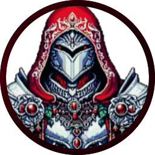
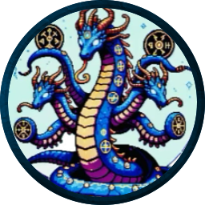
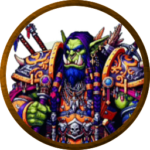

# Sylex

Sylex is a land at war. It hosts all the major biomes but has an uncertain future. Each nation is sees a different future for the land and internal conflicts makes each nation unstable.

PCs can choose how they want to play but the idea is to make a land in constant conflict with changing borders. 

## Aerolithica - Capital of the Garuda Sanctum

The  **Sanctum** is an avian worshiping holy empire with a lot of bird humanoids. Big into celestials & air ships. A lot of Paladins & Clerics

-   Focus on spreading the Phenix god and avianism. Very religious.
-   Chief export: Spell components, reagents, and Holy symbols.
-   Colors: Red and silver.
-   Internal conflict: Religious order.

|  |  |  |  |  |
| ------------------------------------------------------------ | ------------------------------------------------------------ | ------------------------------------------------------------ | ------------------------------------------------------------ | ------------------------------------------------------------ |

### Supreme Seraph of the Aetherial Flock

### The Grand Phoenix

The Grand Phoenix is a celestial entity that the Sanctum views as the ultimate expression of rebirth. It is their main object of worship.

It is a CR 20 Celestial Beast.

## Auroravale - Capital of the Sirenscale Dominion

The **Dominion** is costal and amphibious (a lot of ships). Big into hydras, lizardfolk, and using other amphibious creatures. A lot of Warlocks, Rogues, and Druids.

-   Focus on individual freedoms and mercantilism. Very democratic.
-   Chief export: Alchemical solutions and Potions.
-   Colors: Royal blue and copper.
-   Internal conflict: Lead Party

|  |  |  |  |
| ------------------------------------------------------------ | ------------------------------------------------------------ | ------------------------------------------------------------ | ------------------------------------------------------------ |

### President Thalassarix Stormfin

### The Infinity

A powerful air ship thought to be the pride of the Dominion.

It is a very large vehicle.

## Celestiora - Capital of the Silvershade Glade

The **Glade** is a forest nation that is big into golems, warfoged, and constructs. A lot of Artificers, Rangers, and Wizards.

-   Focus on technological progress and land cultivation. Very meritocratic.
-   Chief export: Building materials (wood, stone, brick, metal, ect.) and Tinkered inventions.
-   Colors: Green and gold.
-   Internal conflict: Corporate enclave.

|  |  |  |  |  |
| ------------------------------------------------------------ | ------------------------------------------------------------ | ------------------------------------------------------------ | ------------------------------------------------------------ | ------------------------------------------------------------ |

### Lord Gearhart the Mechanist

### War Machine

A custamizable construct used by the glade to intimidate rival factions.

It is a CR 20 Construct.

## Glimmerforge - Capital of Saharan

**Saharath** is a nomadic desert nation of tribes. A lot of Monks, Fighters, and Barbarians.

-   Focus on Marshal advancement and Military dominance. Very focused on lifting one's Tribe.
-   Chief export: Magic gems and Mined goods.
-   Colors: Orange & purple.
-   Internal conflict: Head Tribe.

|  |  |  |  |  |
| ------------------------------------------------------------ | ------------------------------------------------------------ | ------------------------------------------------------------ | ------------------------------------------------------------ | ------------------------------------------------------------ |

### The MythWalker

### The War Tent

The tent houses several Demi-planes as rooms. On the outside it looks like a regal 50 foot mobile 4 season tent, but on the inside there is enough space for a legion to comfortably dwell.

