# Volaris

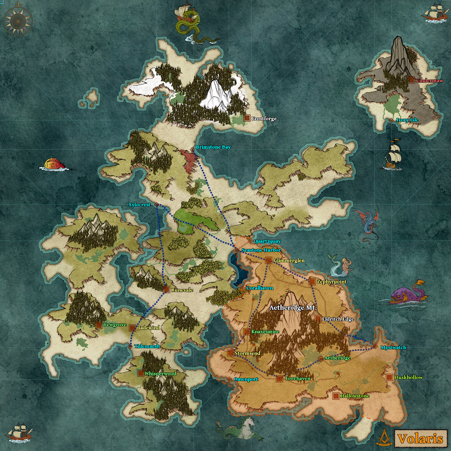

# Nirys And The Fate of Dragons

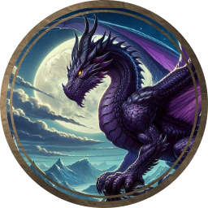

Purple dragons treat family as their greatest treasure. Nirys might not die for his children, but he will fight tooth and claw for their survival. He acts as a crime lord, dispensing others to do his dirty work.  Nirys and Nara were together for 280 years, averaging a new dragon every 2~0 years, they have 13 living children. 

Nirys hates other dragons the most for killing his wife, Nara. For this reason he killed as many dragons as he could. Dragons get stronger as they age, Nirys believes that this generational empowerment should be for his line alone. Nara was killed by a Red Dragon named Imot, The Deathlord.

Nirys hands control to his children according to their demonstrated aptitude. He recruits rogues to gather information with promises of wealth, Fighters and Barbarians with promises of magic items, and Wizards with promises of arcane lore.

Nirys provided his adult children rings enhanced with a self polymorph so they could assume long term personas. 

## Cicles of the Arcanist

Nirys loves magic—or the power to make the imagination real, as he put it ages ago. Loyalist wizards are invited to join or be promoted to higher circles. These circles are based on the level of spell slot they have attained 1-9 and a 10th circle which Nirys views as those wizards that are worthy of his time.

### 1st Circle

Wizards are invited to join the first circle at levels after level one if they demonstrate that they are loyal to Volaris. As long as you continue to show fealty to Volaris and the crown you can retain your position in this circle and recieve a weekly income of 100 GP

### 2nd Circle

After a wizard hits 3rd level they can be invited to be promoted from the 1st to 2nd circle. For every month a wizard is in this circle, they recieve an Aether Quartz for their own enhancement studies.

### 3rd Circle

After a wizard hits 5th level they can be promoted from 2nd to 3rd circle. Weekly payments increase to 200 GP. A 3rd circle mage also get a 10% discount when they shop at any shop enrolled in the program (DM's should probably assume shops in cities are loyalists enrolled and shops outside of major cities are not).

### 4th Circle

After a wizard has attained 7th level they may be advanced to 4th circle. Weekly income is increased to 300 GP. Wizards of this circle are also given a Skyfire Opal once a month in addition to an Aether Quartz

### 5th Circle

After a wizard has attained 9th level they may be advanced to 5th. Weekly income increased to 500 GP. Discount increased to 20%.

### 6th Circle

After a wizard has attained 11th level they may be advanced to 6th. Weekly income increased to 800 GP.

### 7th Circle

After a wizard has attained 13th level they may be advanced to 7th. Weekly income increased to 1200 GP. Discount increased to 30%.

### 8th Circle

After a wizard has attained 15th level they may be advanced to 8th. Weekly income increased to 2000 GP.

### 9th Circle

After a wizard has attained 17th level they may be advanced to 9th. Wizards of this circle. Every month wizards of this circle recieve a Voidstone in addition to the Skyfire Opal and Aether Quartz they recieve. Their weekly income is increased to 3000 GP.

### 10th Circle

After a wizard has attained 19th level they may be advanced to 10th. Wizards of this circle are taught the truth about Nirys and the fate of dragons. Wizards in the 10th circle are taught how to bend magic and have access to a form of meta magic. Wizards of this circle are told to guard this knowledge.

10th circle mages are recognized as exceptional masters of magic. A wizard who claims to be in the 10th circle found lying is put to death. 10th circle wizards have access to spells to transmute metals, stones, liquids, etc. They can copy spells from Nirys's library and can learn spells without spending any money.

## The Theif's Guild

Rogues, Assassins, and thieves in Volaris are an eclectic group. They are not required to join the guild, but guild membership has many perks and can be retained so long as a few simple rules are followed. 

Like the Circles of the Arcanist Nirys uses this as a way of filtering loyal members. 

### Rules:

*   **Do not steal from places of neutrality**. Marked with the theives guild insignia to avoid accidents certain places2 like shops, inns, taverns, etc. pay a protection fee to the guild to become places of neutrality.
*   **Do no harm in places of neutrality**. Locations of neutrality are considered safe, even if you have a writ to execute you should not attack a person in a place of neutrality.
*   **Protect the neutrality**. You are not expected to die, but if someone violates a place of neutrality you should fight the violator.
*   **Earn your reputation**. The theives guild will offer jobs to people based on their street rep. This means that a good theif will be approached to rob a certain home. A good assassin will be hired to kill a certain noble. A good mastermind will be recruited to plan a heist.
*   **Pay Your Debts**. It is possible to be in debt to the guild. Lighter punishments may be being stripped of membership until a debt is repaid.

### Perks:

*   **Fences**. Fences discretely move stolen goods. They do not ask questions. They usually pay a rate close to the value of the goods themselves and only take a small cut for themselves (3-10%). The fence makes money through volume of goods.
*   **Loans**. Redused interest loans. Instead of the 10-20% loans offered by most banks, low or no interest loans exist with punishments for violating terms that are beyond the bank (like losing a finger or your life).

## Fighting Order Of The Arcane Vanguard

Marshal classes (Fighters, Rangers, Barbarians, Monks, etc.) are recruited to perform jobs for the Arcane Vanguard (AV). Nirys uses this as a way of pruning skilled mercinaries into his ranks. Those who are highly renown in the AV are invited to serve as royal guards or protect nobles. 

### Initiate

The starting rank, where new members prove their dedication and loyalty. Initiates undergo rigorous training and demonstrate their combat skills. 

They get paid 10 GP per job.

### **Sentinel**

Guardians of the order. Sentinels are protectors, guards the and enforce the rules of the AV. 

They get paid 20 GP per job.

### Soldier

Stronger than sentinels, soldiers are warriors that hit hard and fight well.

They get paid 30 GP per job.

### **Blademaster**

 Elite warriors that excel in combat. 

They get paid 50 GP per job.

### Warden

Protectors of sacred sites and relics, Wardens maintain order. They oversee rituals and ceremonies.

They get paid 80 GP per job.

### Inquisitor

The role of inquisitor is usually that of investigator. An inquisitor usually surrounds themself with weaker ranks to increase their strength. Inquisitors are often hired seek out traitors and infiltrators in various organizations so must be skilled in combat as well as intellect.

They get paid 120 GP per job.

### Marshal

The supreme commander, marshals lead the order into battle. Their decisions shape the fate of the kingdom, and their valor inspires all.

They get paid 240 GP per job.

### Knight

A knight is one who has risen to the rank of marshal and is allowed to create their own order. Knights are the top combatants and should always be assumed to be strong.

They get paid 500 GP per job

# Nirys' Lair

Deep beneat the city of Aetherigde Nirys has a lair where he allows his followers to gather, learn, and perfect their crafts

## Bath House

## Bed Room

## Conservatory

## Dining Room

## Foundry

## Garden

## Great Hall

## Hallway

## Kitchen

## Laboratory

## Library

## Orrery

## Spell Forge

## Store Room

## Throne Room

## Treasury

## Workshop

# Constructs

## Arcanite Enforcer

*Medium construct, neutral*

---

**Armor Class** 17 (natural armor)
**Hit Points** 200 (24d8 + 96)
**Speed** 30 ft., fly 15 ft. (hover)

---

| STR     | DEX     | CON     | INT     | WIS     | CHA    |
| ------- | ------- | ------- | ------- | ------- | ------ |
| 18 (+4) | 18 (+4) | 20 (+5) | 19 (+4) | 12 (+1) | 8 (-1) |

---

**Saving Throws** Int +8, Wis +5
**Skills** Arcana +8, History +8
**Damage Immunities** poison, psychic
**Condition Immunities** charmed, exhaustion, frightened, paralyzed, petrified, poisoned
**Senses** darkvision 60 ft., passive Perception 11
**Languages** understands Common but can't speak
**Challenge** 12 (8,400 XP)

---

**Arcane Construct.** The Arcanite Enforcer is immune to diseases and being poisoned, and it doesn't require air, food, drink, or sleep.

**Wizard Spell List Access.** The Arcanite Enforcer has access to the wizard spell list. Intelligence is its spellcasting ability (spell save DC 17, +9 to hit with spell attacks). It has the following wizard spells prepared:

* Cantrips (at will): mage hand, prestidigitation, ray of frost, light, mending, message, shocking grasp
* 1st level (4 slots): detect magic, shield, magic missile
* 2nd level (3 slots): mirror image, web
* 3rd level (3 slots): counterspell, fireball
* 4th level (3 slots): ice storm, stoneskin
* 5th level (2 slots): cone of cold, wall of force
* 6th level (1 slot): disintegrate

**Dual Arcane Actuators.** Once per long rest, the Arcanite Enforcer can activate its dual actuators, allowing it to cast two spells with a casting time of 1 action each, as a single action. This ability can only be used once per combat encounter.

---

### Actions

**Multiattack.** The Arcanite Enforcer makes two melee attacks.

**Slam.** *Melee Weapon Attack:* +8 to hit, reach 5 ft., one target. *Hit:* 13 (2d8 + 4) bludgeoning damage.

**Spellcasting.** The Arcanite Enforcer casts one of its prepared spells. The spellcasting ability is Intelligence (spell save DC 17, +9 to hit with spell attacks).

---

### Reactions

**Arcane Retaliation.** When the Arcanite Enforcer is hit by an attack, it can cast *shield* as a reaction, increasing its AC by 5 until the start of its next turn.

# Dragons

### Artificer, Cynyr  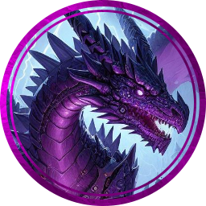

**Cynyr, the Mechanist Sage**
*Huge dragon (human), neutral good*

---

**Armor Class** 19 (natural armor, artificer infusions)
**Hit Points** 231 (22d12 + 88)
**Speed** 40 ft., fly 80 ft.

---

| STR     | DEX     | CON     | INT     | WIS     | CHA     |
| ------- | ------- | ------- | ------- | ------- | ------- |
| 23 (+6) | 14 (+2) | 23 (+6) | 20 (+5) | 15 (+2) | 18 (+4) |

---

**Saving Throws** Dex +7, Con +11, Wis +7, Cha +9
**Skills** Arcana +10, History +10, Investigation +10, Perception +7
**Damage Immunities** bludgeoning, piercing, and slashing from nonmagical attacks
**Senses** blindsight 60 ft., darkvision 90 ft., passive Perception 17
**Languages** Common, Draconic
**Challenge** 19 (22,000 XP)

---

**Shapechanger.** Cynyr can use his action to polymorph into a human or back into his true form. His statistics, other than his size, are the same in each form. Any equipment he is wearing or carrying isn't transformed.

**Artificer Knowledge.** Cynyr has a deep understanding of magical items, constructs, and mechanical devices. He can cast *identify* at will, without expending a spell slot or material components.

**Construct Companions.** Cynyr is accompanied by a number of constructs that he has created. These constructs obey his commands and can perform tasks, fight, and protect him.

**Psychic Breath (Recharge 5-6).** Exhales psychic energy in a 60-foot cone. DC 20 INT save, 56 (16d6) psychic damage on fail, half on success.

**Plasma Breath (Recharge 5-6).** Emits a 90-foot line, 5 feet wide. DC 20 DEX save, 66 (12d10) fire damage on fail, half on success.

**Frightful Presence.** Each creature of Cynyr's choice within 120 feet and aware of him must succeed on a DC 18 WIS saving throw or become frightened for 1 minute.

**Legendary Actions**

- **Detect.** Cynyr makes a Wisdom (Perception) check.
- **Tail Attack.** Cynyr makes a tail attack.
- **Wing Attack (Costs 2 Actions).** Cynyr beats his wings. Each creature within 15 feet must succeed on a DC 19 DEX saving throw or take 15 (2d6 + 8) bludgeoning damage and be knocked prone.

---

**Lore**
Cynyr is a purple dragon with an insatiable curiosity for invention and creation. Disguised as an old human artificer, he surrounds himself with mechanical constructs of his own design. His lair is said to be a labyrinth of moving parts and arcane machinery, a testament to his genius. He uses his guise to interact with other inventors and to keep an eye on the technological advancements of the world.

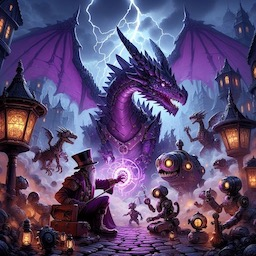

### Barbarian, Xyghat 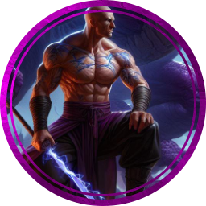 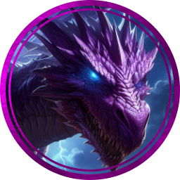

**Xyghat, the Savage Illusion**
*Huge dragon (human), chaotic neutral*

---

**Armor Class** 19 (natural armor, barbarian unarmored defense)
**Hit Points** 231 (22d12 + 88)
**Speed** 40 ft., fly 80 ft.

---

| STR     | DEX     | CON     | INT     | WIS     | CHA     |
| ------- | ------- | ------- | ------- | ------- | ------- |
| 25 (+7) | 14 (+2) | 23 (+6) | 12 (+1) | 15 (+2) | 18 (+4) |

---

**Saving Throws** Dex +7, Con +12, Wis +7
**Skills** Athletics +12, Intimidation +9, Perception +7, Survival +7
**Damage Immunities** bludgeoning, piercing, and slashing from nonmagical attacks
**Senses** blindsight 60 ft., darkvision 90 ft., passive Perception 17
**Languages** Common, Draconic
**Challenge** 19 (22,000 XP)

---

**Shapechanger.** Xyghat can use his action to polymorph into a human or back into his true form. His statistics, other than his size, are the same in each form. Any equipment he is wearing or carrying isn't transformed.

**Rage (3/day).** Xyghat can enter a rage as a bonus action. While raging, he gains the following benefits:

- Advantage on Strength checks and Strength saving throws.
- When he makes a melee weapon attack using Strength, he gains a +4 bonus to the damage roll.
- He has resistance to bludgeoning, piercing, and slashing damage.

**Reckless Attack.** At the start of his turn, Xyghat can choose to attack recklessly, giving him advantage on melee weapon attack rolls using Strength during this turn, but attack rolls against him have advantage until his next turn.

**Psychic Breath (Recharge 5-6).** Exhales psychic energy in a 60-foot cone. DC 20 INT save, 56 (16d6) psychic damage on fail, half on success.

**Plasma Breath (Recharge 5-6).** Emits a 90-foot line, 5 feet wide. DC 20 DEX save, 66 (12d10) fire damage on fail, half on success.

**Frightful Presence.** Each creature of Xyghat's choice within 120 feet and aware of him must succeed on a DC 18 WIS saving throw or become frightened for 1 minute.

**Legendary Actions**

- **Detect.** Xyghat makes a Wisdom (Perception) check.
- **Tail Attack.** Xyghat makes a tail attack.
- **Wing Attack (Costs 2 Actions).** Xyghat beats his wings. Each creature within 15 feet must succeed on a DC 19 DEX saving throw or take 15 (2d6 + 8) bludgeoning damage and be knocked prone.

---

**Lore**
Xyghat is a purple dragon with a fierce and wild spirit. He often disguises himself as a human barbarian, reveling in the thrill of battle and the freedom of the wilds. His true nature is known only to a select few, and he uses his barbarian guise to roam the lands, seeking challenges worthy of his strength and cunning.

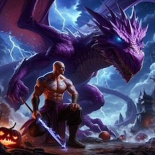

----

### Bard, Chirax  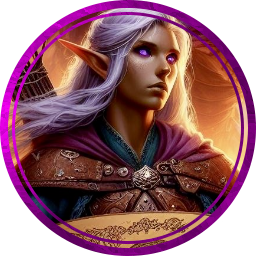 

**Chirax, the Royal Minstrel**
*Huge dragon (elf), chaotic neutral*

---

**Armor Class** 18 (natural armor, bardic flair)
**Hit Points** 212 (17d12 + 119)
**Speed** 40 ft., climb 40 ft., fly 80 ft.

---

| STR     | DEX     | CON     | INT     | WIS     | CHA     |
| ------- | ------- | ------- | ------- | ------- | ------- |
| 21 (+5) | 18 (+4) | 23 (+6) | 16 (+3) | 15 (+2) | 24 (+7) |

---

**Saving Throws** Dex +9, Con +11, Wis +7, Cha +12
**Skills** Acrobatics +9, Performance +12, Deception +12, Perception +7
**Damage Immunities** bludgeoning, piercing, and slashing from nonmagical attacks
**Senses** blindsight 30 ft., darkvision 120 ft., passive Perception 17
**Languages** Common, Draconic, Elvish
**Challenge** 18 (20,000 XP)

---

**Shapechanger.** Chirax can use her action to polymorph into an elf or back into her true form. Her statistics, other than her size, are the same in each form. Any equipment she is wearing or carrying isn't transformed.

**Bardic Inspiration (3/day).** Chirax can inspire others through stirring words or music. As a bonus action, she can choose one creature other than herself within 60 feet who can hear her. That creature gains one Bardic Inspiration die, a d10.

**Spellcasting.** Chirax is a 10th-level spellcaster. Her spellcasting ability is Charisma (spell save DC 20, +12 to hit with spell attacks). Chirax has the following bard spells prepared:

- Cantrips (at will): *dancing lights*, *vicious mockery*, *prestidigitation*
- 1st level (4 slots): *charm person*, *disguise self*, *healing word*
- 2nd level (3 slots): *invisibility*, *mirror image*
- 3rd level (3 slots): *hypnotic pattern*, *major image*
- 4th level (3 slots): *dimension door*, *freedom of movement*
- 5th level (2 slots): *dominate person*, *hold monster*

**Psychic Breath (Recharge 5-6).** Exhales psychic energy in a 60-foot cone. DC 20 INT save, 56 (16d6) psychic damage on fail, half on success.

**Plasma Breath (Recharge 5-6).** Emits a 90-foot line, 5 feet wide. DC 20 DEX save, 66 (12d10) fire damage on fail, half on success.

**Frightful Presence.** Each creature of Chirax's choice within 120 feet and aware of her must succeed on a DC 18 WIS saving throw or become frightened for 1 minute.

**Legendary Actions**

- **Detect.** Chirax makes a Wisdom (Perception) check.
- **Tail Attack.** Chirax makes a tail attack.
- **Wing Attack (Costs 2 Actions).** Chirax beats her wings. Each creature within 15 feet must succeed on a DC 19 DEX saving throw or take 15 (2d6 + 8) bludgeoning damage and be knocked prone.

---

**Lore**
Chirax is a purple dragon with a passion for music and performance. She often takes the form of an elvish bard, using her enchanting voice and instrumental prowess to captivate the courts of royalty. Her true nature is hidden behind a veil of melodies and charm, allowing her to influence the high circles of power while maintaining her mysterious allure.

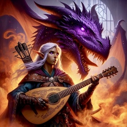

----

### Champion, Iessarth  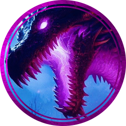

**Iessarth, the Crown's Aegis**
*Huge dragon (human), lawful neutral*

---

**Armor Class** 20 (plate mail)
**Hit Points** 256 (19d12 + 133)
**Speed** 40 ft., climb 40 ft., fly 80 ft.

---

| STR     | DEX     | CON     | INT     | WIS     | CHA     |
| ------- | ------- | ------- | ------- | ------- | ------- |
| 25 (+7) | 10 (+0) | 23 (+6) | 14 (+2) | 15 (+2) | 20 (+5) |

---

**Saving Throws** Wis +7, Cha +10
**Skills** Intimidation +10, Religion +7, Perception +7
**Damage Immunities** bludgeoning, piercing, and slashing from nonmagical attacks
**Senses** blindsight 30 ft., darkvision 120 ft., passive Perception 17
**Languages** Common, Draconic
**Challenge** 19 (22,000 XP)

---

**Shapechanger.** Iessarth can use her action to polymorph into a human or back into her true form. Her statistics, other than her size, are the same in each form. Any equipment she is wearing or carrying isn't transformed.

**Paladin's Oath.** Iessarth has taken an oath in service of the crown, granting her the following paladin abilities:

- **Divine Smite.** Iessarth can expend a spell slot to deal radiant damage to a creature she hits with a melee weapon attack.
- **Aura of Protection.** Whenever she or a friendly creature within 10 feet of her must make a saving throw, the creature gains a bonus to the saving throw equal to her Charisma modifier.

**Psychic Breath (Recharge 5-6).** Exhales psychic energy in a 60-foot cone. DC 20 INT save, 56 (16d6) psychic damage on fail, half on success.

**Plasma Breath (Recharge 5-6).** Emits a 90-foot line, 5 feet wide. DC 20 DEX save, 66 (12d10) fire damage on fail, half on success.

**Frightful Presence.** Each creature of Iessarth's choice within 120 feet and aware of her must succeed on a DC 18 WIS saving throw or become frightened for 1 minute.

**Legendary Actions**

- **Detect.** Iessarth makes a Wisdom (Perception) check.
- **Tail Attack.** Iessarth makes a tail attack.
- **Wing Attack (Costs 2 Actions).** Iessarth beats her wings. Each creature within 15 feet must succeed on a DC 19 DEX saving throw or take 15 (2d6 + 8) bludgeoning damage and be knocked prone.

---

**Lore**
Iessarth is a purple dragon who has chosen to serve the crown under the guise of a human paladin. She dons her plate mail with pride and wields her powers in defense of the realm. Her true nature is known only to the highest echelons of the crown, and she uses her disguise to uphold justice and order in the kingdom.

----

### Magus, Kirdun 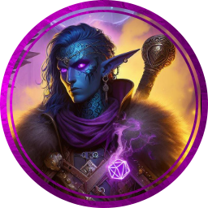 

**Kirdun, the Shadow Arcanist**
*Huge dragon (drow), chaotic neutral*

---

**Armor Class** 21 (natural armor, mage armor)
**Hit Points** 256 (19d12 + 133)
**Speed** 40 ft., climb 40 ft., fly 80 ft.

---

| STR     | DEX     | CON     | INT     | WIS     | CHA     |
| ------- | ------- | ------- | ------- | ------- | ------- |
| 25 (+7) | 16 (+3) | 23 (+6) | 18 (+4) | 15 (+2) | 20 (+5) |

---

**Saving Throws** Dex +8, Con +11, Wis +7, Cha +10
**Skills** Arcana +9, Perception +7, Stealth +8
**Damage Immunities** bludgeoning, piercing, and slashing from nonmagical attacks
**Senses** blindsight 30 ft., darkvision 120 ft., passive Perception 17
**Languages** Common, Draconic, Elvish, Undercommon
**Challenge** 19 (22,000 XP)

---

**Shapechanger.** Kirdun can use his action to polymorph into a drow or back into his true form. His statistics, other than his size, are the same in each form. Any equipment he is wearing or carrying isn't transformed.

**Drow Magic.** Kirdun has inherited the innate spellcasting ability of the drow (spell save DC 18). He can innately cast the following spells, requiring no material components:

- At will: *dancing lights*, *darkness*, *faerie fire*
- 1/day each: *levitate*, *dispel magic*, *detect magic*

**Magus Arcana.** As a magus, Kirdun has mastered several arcane secrets, granting him unique combat abilities:

- **Spellstrike.** Kirdun can deliver a spell through a weapon attack.
- **Spell Combat.** Kirdun can cast a spell and make a weapon attack in the same turn.

**Psychic Breath (Recharge 5-6).** Exhales psychic energy in a 60-foot cone. DC 20 INT save, 56 (16d6) psychic damage on fail, half on success.

**Plasma Breath (Recharge 5-6).** Emits a 90-foot line, 5 feet wide. DC 20 DEX save, 66 (12d10) fire damage on fail, half on success.

**Frightful Presence.** Each creature of Kirdun's choice within 120 feet and aware of him must succeed on a DC 18 WIS saving throw or become frightened for 1 minute.

**Legendary Actions**

- **Detect.** Kirdun makes a Wisdom (Perception) check.
- **Tail Attack.** Kirdun makes a tail attack.
- **Wing Attack (Costs 2 Actions).** Kirdun beats his wings. Each creature within 15 feet must succeed on a DC 19 DEX saving throw or take 15 (2d6 + 8) bludgeoning damage and be knocked prone.

---

**Lore**
Kirdun is a purple dragon who has taken a keen interest in the arcane arts and the ways of the drow. He often disguises himself as a drow magus, blending his natural draconic abilities with the spellcasting and martial skills of the magus to become a formidable force. His true nature is a closely guarded secret, and he uses his disguise to navigate the complex political and magical landscapes of the Underdark.

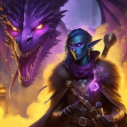

----

### Mercenary, Temra  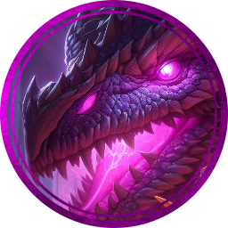

**Aydhiess, the Telekinetic Enigma**
*Huge dragon (elf), chaotic neutral*

---

**Armor Class** 19 (natural armor, mage armor)
**Hit Points** 212 (17d12 + 119)
**Speed** 40 ft., fly 80 ft. (hover)

---

| STR     | DEX     | CON     | INT     | WIS     | CHA     |
| ------- | ------- | ------- | ------- | ------- | ------- |
| 21 (+5) | 18 (+4) | 23 (+6) | 20 (+5) | 17 (+3) | 20 (+5) |

---

**Saving Throws** Dex +9, Con +11, Wis +8, Cha +10
**Skills** Arcana +10, Insight +8, Perception +8, Stealth +9
**Damage Immunities** bludgeoning, piercing, and slashing from nonmagical attacks
**Senses** blindsight 30 ft., darkvision 120 ft., passive Perception 18
**Languages** Common, Draconic, Elvish
**Challenge** 18 (20,000 XP)

---

**Shapechanger.** Aydhiess can use his action to polymorph into an elf or back into his true form. His statistics, other than his size, are the same in each form. Any equipment he is wearing or carrying isn't transformed.

**Innate Spellcasting.** Aydhiess's innate spellcasting ability is Charisma (spell save DC 18). Aydhiess can innately cast the following spells, requiring no material components:

- At will: *detect magic*, *minor illusion*
- 3/day each: *levitate*, *mage hand* (telekinesis), *shield*

**Mystic Arcanum.** Aydhiess has mastered deep mental disciplines, granting him the following abilities:

- **Telekinetic Flight.** Aydhiess can use his telekinetic power to float and move through the air, giving him a flying speed equal to his walking speed.
- **Mind Thrust (Recharge 5-6).** Aydhiess targets one creature he can see within 60 feet of him. The target must make a DC 18 Intelligence saving throw, taking 22 (4d10) psychic damage on a failed save, or half as much damage on a successful one.

**Psychic Breath (Recharge 5-6).** Exhales psychic energy in a 60-foot cone. DC 20 INT save, 56 (16d6) psychic damage on fail, half on success.

**Plasma Breath (Recharge 5-6).** Emits a 90-foot line, 5 feet wide. DC 20 DEX save, 66 (12d10) fire damage on fail, half on success.

**Frightful Presence.** Each creature of Aydhiess's choice within 120 feet and aware of him must succeed on a DC 18 WIS saving throw or become frightened for 1 minute.

**Legendary Actions**

- **Detect.** Aydhiess makes a Wisdom (Perception) check.
- **Tail Attack.** Aydhiess makes a tail attack.
- **Wing Attack (Costs 2 Actions).** Aydhiess beats his wings. Each creature within 15 feet must succeed on a DC 19 DEX saving throw or take 15 (2d6 + 8) bludgeoning damage and be knocked prone.

---

**Lore**
Aydhiess is a purple dragon who has delved into the mysteries of the mind, adopting the guise of an elvish Mystic to explore the world beyond the confines of his lair. He uses his telekinetic abilities not only to levitate but also to manipulate objects and creatures from a distance, often leaving those who encounter him in awe of his mystical powers.

----

### Mystic, Aydhiess 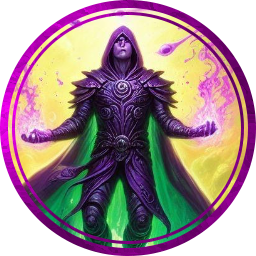 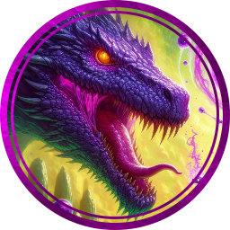

**Aydhiess, the Telekinetic Enigma**
*Huge dragon (elf), chaotic neutral*

---

**Armor Class** 19 (natural armor, mage armor)
**Hit Points** 212 (17d12 + 119)
**Speed** 40 ft., fly 80 ft. (hover)

---

| STR     | DEX     | CON     | INT     | WIS     | CHA     |
| ------- | ------- | ------- | ------- | ------- | ------- |
| 21 (+5) | 18 (+4) | 23 (+6) | 20 (+5) | 17 (+3) | 20 (+5) |

---

**Saving Throws** Dex +9, Con +11, Wis +8, Cha +10
**Skills** Arcana +10, Insight +8, Perception +8, Stealth +9
**Damage Immunities** bludgeoning, piercing, and slashing from nonmagical attacks
**Senses** blindsight 30 ft., darkvision 120 ft., passive Perception 18
**Languages** Common, Draconic, Elvish
**Challenge** 18 (20,000 XP)

---

**Shapechanger.** Aydhiess can use his action to polymorph into an elf or back into his true form. His statistics, other than his size, are the same in each form. Any equipment he is wearing or carrying isn't transformed.

**Innate Spellcasting.** Aydhiess's innate spellcasting ability is Charisma (spell save DC 18). Aydhiess can innately cast the following spells, requiring no material components:

- At will: *detect magic*, *minor illusion*
- 3/day each: *levitate*, *mage hand* (telekinesis), *shield*

**Mystic Arcanum.** Aydhiess has mastered deep mental disciplines, granting him the following abilities:

- **Telekinetic Flight.** Aydhiess can use his telekinetic power to float and move through the air, giving him a flying speed equal to his walking speed.
- **Mind Thrust (Recharge 5-6).** Aydhiess targets one creature he can see within 60 feet of him. The target must make a DC 18 Intelligence saving throw, taking 22 (4d10) psychic damage on a failed save, or half as much damage on a successful one.

**Psychic Breath (Recharge 5-6).** Exhales psychic energy in a 60-foot cone. DC 20 INT save, 56 (16d6) psychic damage on fail, half on success.

**Plasma Breath (Recharge 5-6).** Emits a 90-foot line, 5 feet wide. DC 20 DEX save, 66 (12d10) fire damage on fail, half on success.

**Frightful Presence.** Each creature of Aydhiess's choice within 120 feet and aware of him must succeed on a DC 18 WIS saving throw or become frightened for 1 minute.

**Legendary Actions**

- **Detect.** Aydhiess makes a Wisdom (Perception) check.
- **Tail Attack.** Aydhiess makes a tail attack.
- **Wing Attack (Costs 2 Actions).** Aydhiess beats his wings. Each creature within 15 feet must succeed on a DC 19 DEX saving throw or take 15 (2d6 + 8) bludgeoning damage and be knocked prone.

---

**Lore**
Aydhiess is a purple dragon who has delved into the mysteries of the mind, adopting the guise of an elvish Mystic to explore the world beyond the confines of his lair. He uses his telekinetic abilities not only to levitate but also to manipulate objects and creatures from a distance, often leaving those who encounter him in awe of his mystical powers.

----

### Rogue, Zugym 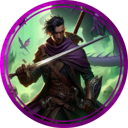 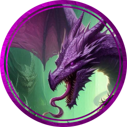

**Zugym, the Shadowscale**
*Huge dragon (elf), chaotic neutral*

---

**Armor Class** 18 (natural armor, studded leather)
**Hit Points** 212 (17d12 + 119)
**Speed** 40 ft., climb 40 ft., fly 80 ft.

---

| STR     | DEX     | CON     | INT     | WIS     | CHA     |
| ------- | ------- | ------- | ------- | ------- | ------- |
| 21 (+5) | 20 (+5) | 23 (+6) | 14 (+2) | 15 (+2) | 18 (+4) |

---

**Saving Throws** Dex +10, Con +11, Wis +7, Cha +9
**Skills** Acrobatics +10, Deception +9, Perception +7, Stealth +15
**Damage Immunities** bludgeoning, piercing, and slashing from nonmagical attacks
**Senses** blindsight 30 ft., darkvision 120 ft., passive Perception 17
**Languages** Common, Draconic, Elvish
**Challenge** 18 (20,000 XP)

---

**Shapechanger.** Zugym can use his action to polymorph into an elf or back into his true form. His statistics, other than his size, are the same in each form. Any equipment he is wearing or carrying isn't transformed.

**Cunning Action.** Zugym can take a bonus action on each of his turns to take the Dash, Disengage, or Hide action.

**Sneak Attack (1/turn).** Zugym deals an extra 7d6 damage when he hits a target with a weapon attack and has advantage on the attack roll, or when the target is within 5 feet of an ally of Zugym that isn't incapacitated and Zugym doesn't have disadvantage on the attack roll.

**Evasion.** If Zugym is subjected to an effect that allows him to make a Dexterity saving throw to take only half damage, he instead takes no damage if he succeeds on the saving throw, and only half damage if he fails.

**Psychic Breath (Recharge 5-6).** Exhales psychic energy in a 60-foot cone. DC 20 INT save, 56 (16d6) psychic damage on fail, half on success.

**Plasma Breath (Recharge 5-6).** Emits a 90-foot line, 5 feet wide. DC 20 DEX save, 66 (12d10) fire damage on fail, half on success.

**Frightful Presence.** Each creature of Zugym's choice within 120 feet and aware of him must succeed on a DC 18 WIS saving throw or become frightened for 1 minute.

**Legendary Actions**

- **Detect.** Zugym makes a Wisdom (Perception) check.
- **Tail Attack.** Zugym makes a tail attack.
- **Wing Attack (Costs 2 Actions).** Zugym beats his wings. Each creature within 15 feet must succeed on a DC 19 DEX saving throw or take 15 (2d6 + 8) bludgeoning damage and be knocked prone.

---

**Lore**
Zugym is a purple dragon who revels in the thrill of stealth and subterfuge. He often roams the lands in the guise of an elvish rogue, using his natural cunning and agility to outmaneuver his foes. His true nature is a well-kept secret, and he uses his rogue's abilities to gather information and treasures for his hoard.

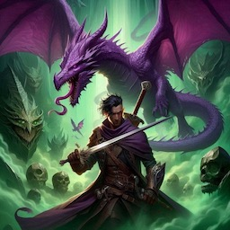

----

### Sorcerer, Orsa 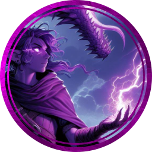 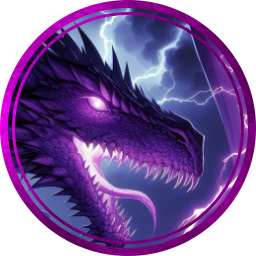

**Orsa, the Arcane Enigma**
*Huge dragon (elf), chaotic neutral*

---

**Armor Class** 19 (natural armor, mage armor)
**Hit Points** 212 (17d12 + 119)
**Speed** 40 ft., climb 40 ft., fly 80 ft.

---

| STR     | DEX     | CON     | INT     | WIS     | CHA     |
| ------- | ------- | ------- | ------- | ------- | ------- |
| 23 (+6) | 14 (+2) | 23 (+6) | 16 (+3) | 15 (+2) | 20 (+5) |

---

**Saving Throws** Dex +7, Con +11, Wis +7, Cha +10
**Skills** Arcana +8, Deception +10, Perception +7, Stealth +7
**Damage Immunities** bludgeoning, piercing, and slashing from nonmagical attacks
**Senses** blindsight 30 ft., darkvision 120 ft., passive Perception 17
**Languages** Common, Draconic, Elvish
**Challenge** 18 (20,000 XP)

---

**Shapechanger.** Orsa can use her action to polymorph into an elf or back into her true form. Her statistics, other than her size, are the same in each form. Any equipment she is wearing or carrying isn't transformed.

**Innate Spellcasting.** Orsa's innate spellcasting ability is Charisma (spell save DC 18). Orsa can innately cast the following spells, requiring no material components:

- At will: *detect magic*, *minor illusion*
- 3/day each: *shield*, *magic missile*, *misty step*

**Sorcerer Spells.** Orsa is a 9th-level spellcaster. Her spellcasting ability is Charisma (spell save DC 18, +10 to hit with spell attacks). Orsa has the following sorcerer spells prepared:

- Cantrips (at will): *fire bolt*, *light*, *ray of frost*, *shocking grasp*
- 1st level (4 slots): *burning hands*, *mage armor*, *magic missile*
- 2nd level (3 slots): *scorching ray*, *mirror image*
- 3rd level (3 slots): *counterspell*, *fireball*
- 4th level (3 slots): *ice storm*, *greater invisibility*
- 5th level (1 slot): *cone of cold*

**Psychic Breath (Recharge 5-6).** Exhales psychic energy in a 60-foot cone. DC 20 INT save, 56 (16d6) psychic damage on fail, half on success.

**Plasma Breath (Recharge 5-6).** Emits a 90-foot line, 5 feet wide. DC 20 DEX save, 66 (12d10) fire damage on fail, half on success.

**Frightful Presence.** Each creature of Orsa's choice within 120 feet and aware of her must succeed on a DC 18 WIS saving throw or become frightened for 1 minute.

**Legendary Actions**

- **Detect.** Orsa makes a Wisdom (Perception) check.
- **Tail Attack.** Orsa makes a tail attack.
- **Wing Attack (Costs 2 Actions).** Orsa beats her wings. Each creature within 15 feet must succeed on a DC 19 DEX saving throw or take 15 (2d6 + 8) bludgeoning damage and be knocked prone.

---

**Lore**
Orsa is a purple dragon with a deep connection to the arcane. She often assumes the form of an elvish sorcerer to mingle with other magic users and to pursue her insatiable curiosity for magical lore. Her true nature is a closely guarded secret, and she uses her sorcerous guise to navigate the world of elves and magic with ease.

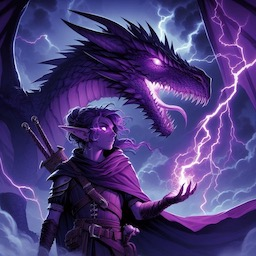

----

### SpellSword, Riogoir  

**Riogoir, the Arcane Warrior**
*Huge dragon (shapechanger), chaotic neutral*

---

**Armor Class** 20 (natural armor, mage armor)
**Hit Points** 243 (18d12 + 126)
**Speed** 40 ft., climb 40 ft., fly 80 ft.

---

| STR     | DEX     | CON     | INT     | WIS     | CHA     |
| ------- | ------- | ------- | ------- | ------- | ------- |
| 23 (+6) | 14 (+2) | 23 (+6) | 18 (+4) | 15 (+2) | 20 (+5) |

---

**Saving Throws** Dex +7, Con +11, Wis +7, Cha +10
**Skills** Arcana +9, Perception +7, Stealth +7
**Damage Immunities** bludgeoning, piercing, and slashing from nonmagical attacks
**Senses** blindsight 30 ft., darkvision 120 ft., passive Perception 17
**Languages** Common, Draconic, Elvish
**Challenge** 19 (22,000 XP)

---

**Shapechanger.** Riogoir can use his action to polymorph into a humanoid or back into his true form. His statistics, other than his size, are the same in each form. Any equipment he is wearing or carrying isn't transformed.

**Innate Spellcasting.** Riogoir's innate spellcasting ability is Charisma (spell save DC 18). Riogoir can innately cast the following spells, requiring no material components:

- At will: *detect magic*, *minor illusion*
- 3/day each: *shield*, *magic missile*, *misty step*

**Spellsword.** Riogoir has mastered the art of combining swordplay with spellcasting, gaining the following features:

- **Spell Combat.** Riogoir can make a melee attack as a bonus action immediately after casting a spell on his turn.
- **Magical Enhancement.** As a bonus action, Riogoir can imbue his weapon with magical energy, granting a +1 bonus to attack and damage rolls for 1 minute.

**Psychic Breath (Recharge 5-6).** Exhales psychic energy in a 60-foot cone. DC 20 INT save, 56 (16d6) psychic damage on fail, half on success.

**Plasma Breath (Recharge 5-6).** Emits a 90-foot line, 5 feet wide. DC 20 DEX save, 66 (12d10) fire damage on fail, half on success.

**Frightful Presence.** Each creature of Riogoir's choice within 120 feet and aware of him must succeed on a DC 18 WIS saving throw or become frightened for 1 minute.

**Legendary Actions**

- **Detect.** Riogoir makes a Wisdom (Perception) check.
- **Tail Attack.** Riogoir makes a tail attack.
- **Wing Attack (Costs 2 Actions).** Riogoir beats his wings. Each creature within 15 feet must succeed on a DC 19 DEX saving throw or take 15 (2d6 + 8) bludgeoning damage and be knocked prone.

---

**Lore**
Riogoir is a purple dragon with a unique affinity for the arcane arts. He often wanders the realms disguised as a spellsword, seeking out magical knowledge and artifacts to enhance his already formidable abilities. His true nature is a closely guarded secret, and he uses his spellsword guise to interact with other adventurers and magical practitioners.

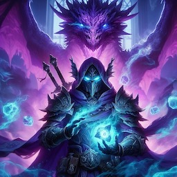

----

### Warlord, Dainur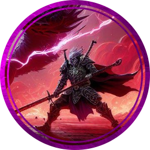 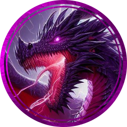

**Dainur, the Shadow Tyrant**
*Huge dragon (drow), chaotic neutral*

---

**Armor Class** 21 (natural armor, drow warlord armor)
**Hit Points** 256 (19d12 + 133)
**Speed** 40 ft., climb 40 ft., fly 80 ft.

---

| STR     | DEX     | CON     | INT     | WIS     | CHA     |
| ------- | ------- | ------- | ------- | ------- | ------- |
| 25 (+7) | 14 (+2) | 23 (+6) | 18 (+4) | 15 (+2) | 20 (+5) |

---

**Saving Throws** Dex +7, Con +11, Wis +7, Cha +10
**Skills** Intimidation +10, Perception +7, Stealth +7
**Damage Immunities** bludgeoning, piercing, and slashing from nonmagical attacks
**Senses** blindsight 30 ft., darkvision 120 ft., passive Perception 17
**Languages** Common, Draconic, Elvish, Undercommon
**Challenge** 19 (22,000 XP)

---

**Shapechanger.** Dainur can use his action to polymorph into a drow or back into his true form. His statistics, other than his size, are the same in each form. Any equipment he is wearing or carrying isn't transformed.

**Sunlight Sensitivity.** While in sunlight, Dainur has disadvantage on attack rolls, as well as on Wisdom (Perception) checks that rely on sight.

**Drow Magic.** Dainur has inherited the innate spellcasting ability of the drow (spell save DC 18). He can innately cast the following spells, requiring no material components:

- At will: *dancing lights*, *darkness*, *faerie fire*
- 1/day each: *levitate*, *dispel magic*, *detect magic*

**Warlord Tactics.** Dainur can issue commands to his allies, granting them tactical advantages on the battlefield.

**Psychic Breath (Recharge 5-6).** Exhales psychic energy in a 60-foot cone. DC 20 INT save, 56 (16d6) psychic damage on fail, half on success.

**Plasma Breath (Recharge 5-6).** Emits a 90-foot line, 5 feet wide. DC 20 DEX save, 66 (12d10) fire damage on fail, half on success.

**Frightful Presence.** Each creature of Dainur's choice within 120 feet and aware of him must succeed on a DC 18 WIS saving throw or become frightened for 1 minute.

**Legendary Actions**

- **Detect.** Dainur makes a Wisdom (Perception) check.
- **Tail Attack.** Dainur makes a tail attack.
- **Wing Attack (Costs 2 Actions).** Dainur beats his wings. Each creature within 15 feet must succeed on a DC 19 DEX saving throw or take 15 (2d6 + 8) bludgeoning damage and be knocked prone.

---

**Lore**
Dainur is a purple dragon with a penchant for the dark and intricate politics of the drow society. He often masquerades as a drow warlord, manipulating events from the shadows to serve his inscrutable ends. His true nature is known to very few, and he uses his considerable powers to maintain his disguise and position of influence among the drow.

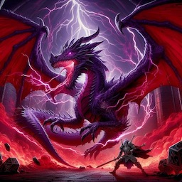

----

### Warrior, Seit 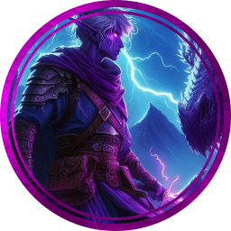 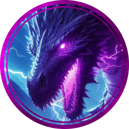

**Seit, the Elven Blade**
*Huge dragon (elf), chaotic neutral*

---

**Armor Class** 19 (natural armor, elven chain)
**Hit Points** 212 (17d12 + 102)
**Speed** 40 ft., climb 40 ft., fly 80 ft.

---

| STR     | DEX     | CON     | INT     | WIS     | CHA     |
| ------- | ------- | ------- | ------- | ------- | ------- |
| 23 (+6) | 18 (+4) | 22 (+6) | 14 (+2) | 15 (+2) | 20 (+5) |

---

**Saving Throws** Dex +9, Con +11, Wis +7, Cha +10
**Skills** Athletics +11, Acrobatics +9, Perception +7, Stealth +9
**Damage Immunities** bludgeoning, piercing, and slashing from nonmagical attacks
**Senses** blindsight 30 ft., darkvision 120 ft., passive Perception 17
**Languages** Common, Draconic, Elvish
**Challenge** 18 (20,000 XP)

---

**Shapechanger.** Seit can use his action to polymorph into an elf or back into his true form. His statistics, other than his size, are the same in each form. Any equipment he is wearing or carrying isn't transformed.

**Innate Spellcasting.** Seit's innate spellcasting ability is Charisma (spell save DC 18). Seit can innately cast the following spells, requiring no components:

- At will: *detect magic*, *minor illusion*
- 3/day each: *invisibility*, *mirror image*, *misty step*

**Martial Prowess.** As an elvish warrior, Seit is proficient with all martial weapons and has the following features:

- **Fighting Style: Dueling.** When wielding a melee weapon in one hand and no other weapons, Seit gains a +2 bonus to damage rolls with that weapon.
- **Second Wind (1/day).** On his turn, Seit can use a bonus action to regain 1d10+17 hit points.

**Psychic Breath (Recharge 5-6).** Exhales psychic energy in a 60-foot cone. DC 20 INT save, 56 (16d6) psychic damage on fail, half on success.

**Plasma Breath (Recharge 5-6).** Emits a 90-foot line, 5 feet wide. DC 20 DEX save, 66 (12d10) fire damage on fail, half on success[.

**Frightful Presence.** Each creature of Seit's choice within 120 feet and aware of him must succeed on a DC 18 WIS saving throw or become frightened for 1 minute.

**Legendary Actions**

- **Detect.** Seit makes a Wisdom (Perception) check.
- **Tail Attack.** Seit makes a tail attack.
- **Wing Attack (Costs 2 Actions).** Seit beats his wings. Each creature within 15 feet must succeed on a DC 19 DEX saving throw or take 15 (2d6 + 8) bludgeoning damage and be knocked prone.

---

**Lore**
Seit is a purple dragon known for his love of the elvish way of life. He often roams the lands in the guise of an elven warrior, honing his combat skills and seeking honor in battle. His true nature is a closely guarded secret, and he uses his formidable abilities to protect it.

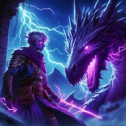

----

### Wizard, Frorve  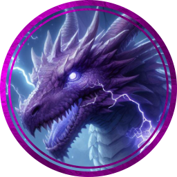

**Frorve, the Elusive Enchanter**
*Huge dragon (elf), chaotic neutral*

---

**Armor Class** 18 (natural armor, mage armor)
**Hit Points** 178 (17d10 + 85)
**Speed** 40 ft., climb 40 ft., fly 80 ft.

---

| STR     | DEX     | CON     | INT     | WIS     | CHA     |
| ------- | ------- | ------- | ------- | ------- | ------- |
| 23 (+6) | 14 (+2) | 21 (+5) | 18 (+4) | 15 (+2) | 20 (+5) |

---

**Saving Throws** Dex +5, Con +10, Wis +6, Cha +9
**Skills** Deception +9, Insight +6, Perception +6, Stealth +5
**Damage Immunities** bludgeoning, piercing, and slashing from nonmagical attacks
**Senses** blindsight 30 ft., darkvision 120 ft., passive Perception 16
**Languages** Common, Draconic, Elvish
**Challenge** 17 (18,000 XP)

---

**Shapechanger.** Frorve can use his action to polymorph into an elf or back into his true form. His statistics, other than his size, are the same in each form. Any equipment he is wearing or carrying isn't transformed.

**Spellcasting.** Frorve is a 9th-level spellcaster. His spellcasting ability is Intelligence (spell save DC 16, +8 to hit with spell attacks). Frorve has the following wizard spells prepared:

- Cantrips (at will): *mage hand*, *prestidigitation*, *ray of frost*
- 1st level (4 slots): *detect magic*, *mage armor*, *magic missile*
- 2nd level (3 slots): *invisibility*, *mirror image*
- 3rd level (3 slots): *counterspell*, *fireball*
- 4th level (3 slots): *dimension door*, *greater invisibility*
- 5th level (1 slot): *teleportation circle*

**Psychic Breath (Recharge 5-6).** Exhales psychic energy in a 60-foot cone. DC 20 INT save, 56 (16d6) psychic damage on fail, half on success.

**Plasma Breath (Recharge 5-6).** Emits a 90-foot line, 5 feet wide. DC 20 DEX save, 66 (12d10) fire damage on fail, half on success.

**Frightful Presence.** Each creature of Frorve's choice within 120 feet and aware of him must succeed on a DC 18 WIS saving throw or become frightened for 1 minute.

**Legendary Actions**

- **Detect.** Frorve makes a Wisdom (Perception) check.
- **Tail Attack.** Frorve makes a tail attack.
- **Wing Attack (Costs 2 Actions).** Frorve beats his wings. Each creature within 15 feet must succeed on a DC 19 DEX saving throw or take 15 (2d6 + 8) bludgeoning damage and be knocked prone.

---

**Lore**
Frorve is a cunning purple dragon who enjoys the subtleties of arcane magic. He often wanders the lands in the guise of an elvish wizard, seeking knowledge and artifacts to expand his already formidable magical prowess. His true nature is a well-kept secret, and he uses his abilities to ensure it remains so.

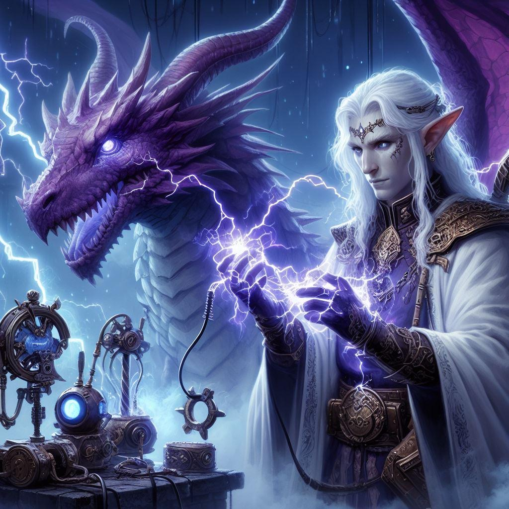

----

### Nirys, Ancient Purple Dragon  

*Gargantuan Dragon, Chaotic Evil*

**Armor Class** 25 (natural armor)

**Hit Points** 800

**Speed** walk 60 ft., burrow 60 ft., climb 60 ft., fly 120 ft.

**STR** 30 (+10)  **DEX** 16 (+3)  **CON** 30 (+10) **INT** 25 (+7) **WIS** 23 (+6) **CHA** 30 (+10)

**Saving Throws** STR +20, DEX +13, CON +20, INT +17, WIS +16, CHA +20

**Skills** Arcana +17, Perception +27, Religion +17, Deception +30, Persuasion +30, Insight +27, Stealth +23

**Damage Immunities** Fire, Lightning, Poison; Bludgeoning, Piercing, and Slashing from Nonmagical Attacks

**Condition Immunities** Blinded, Charmed, Deafened, Frightened, Poisoned, Stunned

**Senses** Darkvision 360 ft., Truesight 120 ft., Passive Perception 37

**Languages** All

**Challenge** 30 (155,000 XP)

**Proficiency Bonus** +10

------

**Arcane Mastery**. Nirys can ignore one component (material, somatic, verbal) when casting a spell.

**Arcane Recovery (8/day)**. Nirys restore all spent spell slots as if he had taken a long rest.

**Breath Control**. The dragon has exceptional control over its ability to breathe searing plasma. The Plasma Breath and Plasma Spear actions both use the dragon’s shored up plasma reserve, so if one ability is used, it must recharge before the other can be used.

**Charismatic Arcanist**. Nirys may draw on any spell from the wizard spell list as though he were a 20th level wizard but may use his Charisma modifier instead of his Intelligence (DC 28, +20 to hit).

**Legendary Resistance (6/Day)**. If the dragon fails a saving throw, it can choose to succeed instead

**Magical Immunity**. Nirys can optionally ignore any verbal, somatic, or material components required by the spell.

**Magic Weapons**. Nirys's weapon attacks are magical.

**MetaMagic Mastery**. Any spell Nirys casts can have its range doubled, cast time halved, damage maxed, resistance (but not immunity) ignored, and / or allies automatically succeed saving throws.

**Regeneration**. Nirys regains 42 (4d20) hit points at the start of his turn

------

### Actions

**Multiattack**. The dragon can use its Frightful Presence. It then makes four attacks: one with its bite, two with its claws, and once with its tail, it then casts a spell of 7th level or lower without using a spell slot.

**Bite**. Melee Weapon Attack: +20 to hit, reach 15 ft., one creature. Hit: 23 (2d12 + 10) piercing damage plus 18 (4d8) fire damage.

**Claw**. Melee Weapon Attack: +20 to hit, reach 10 ft., one creature. Hit: 19 (2d8 + 10) slashing damage.

**Frightful Presence**. Each creature of the dragon's choice that is within 240 ft. of the dragon and aware of it must succeed on a DC 22 Wisdom saving throw or become frightened for 1 minute. A creature can repeat the saving throw at the end of each of its turns, ending the effect on itself on a success. If a creature's saving throw is successful or the effect ends for it, the creature is immune to the dragon's Frightful Presence for the next 24 hours.

**Plasma Breath (Recharge 3-6)**. The dragon exhales crackling energy in a 120-foot cone, or a 240-foot line. Each creature in that area must make a DC 25 Dexterity saving throw, taking 140 (40d6) fire damage on a failed save, or half as much damage on a successful one. Fire damage dealt by the dragon’s breath bypasses fire resistance, but not immunity. All creatures within 90 feet of the dragon that can see it must succeed on a DC 25 Constitution saving throw or be blinded for 1d6 rounds.

**Plasma Spear (Recharge 3-6)**. Ranged Spell Attack: +20 to hit, reach 600/1,200 ft., one creature. Hit: 140 (40d6) fire damage. Fire damage dealt by the dragon’s breath bypasses fire resistance, but not immunity. This attack ignores any cover bonus to AC benefiting the target except for cover bonuses granted by objects made of adamantine. The target must succeed on a DC 25 Constitution saving throw or its hit point maximum is reduced by an amount equal to the damage taken. This reduction is permanent unless undone with magic such as the Greater Restoration spell. On a critical hit, this attack severs one of the target’s limbs, if it has any.

**Tail**. Melee Weapon Attack: +20 to hit, reach 20 ft., one creature. Hit: 21 (2d10 + 10) bludgeoning damage.

------

### Legendary Actions

Nirys can take up to 8 legendary actions, choosing from the options below. Only one legendary action option can be used at a time and only at the end of another creature’s turn. The dragon regains spent legendary actions at the start of their turn.

**Command**. The dragon bellows a command to one of its allies within 360 feet. The chosen creature can immediately take one action.

**Detect**. The dragon makes a Wisdom (Perception) check.

**Tail Attack**. The dragon makes a tail attack.

**Plasma Breath (Costs 3 Actions)**. Nirys exhales crackling energy in a 120-foot cone, or a 240-foot line. Each creature in that area must make a DC 25 Dexterity saving throw, taking 140 (40d6) fire damage on a failed save, or half as much damage on a successful one. Fire damage dealt by the dragon’s breath bypasses fire resistance, but not immunity. All creatures within 90 feet of the dragon that can see it must succeed on a DC 25 Constitution saving throw or be blinded for 1d6 rounds.

**Plasma Spear (Costs 3 Actions)**. Ranged Spell Attack: +20 to hit, reach 600/1,200 ft., one creature. Hit: 140 (40d6) fire damage. Fire damage dealt by the dragon’s breath bypasses fire resistance, but not immunity. This attack ignores any cover bonus to AC benefiting the target except for cover bonuses granted by objects made of adamantine. The target must succeed on a DC 25 Constitution saving throw or its hit point maximum is reduced by an amount equal to the damage taken. This reduction is permanent unless undone with magic such as the Greater Restoration spell. On a critical hit, this attack severs one of the target’s limbs, if it has any.

**Spell**. Nirys casts a spell ignoring the time requirement and without using a spell slot.